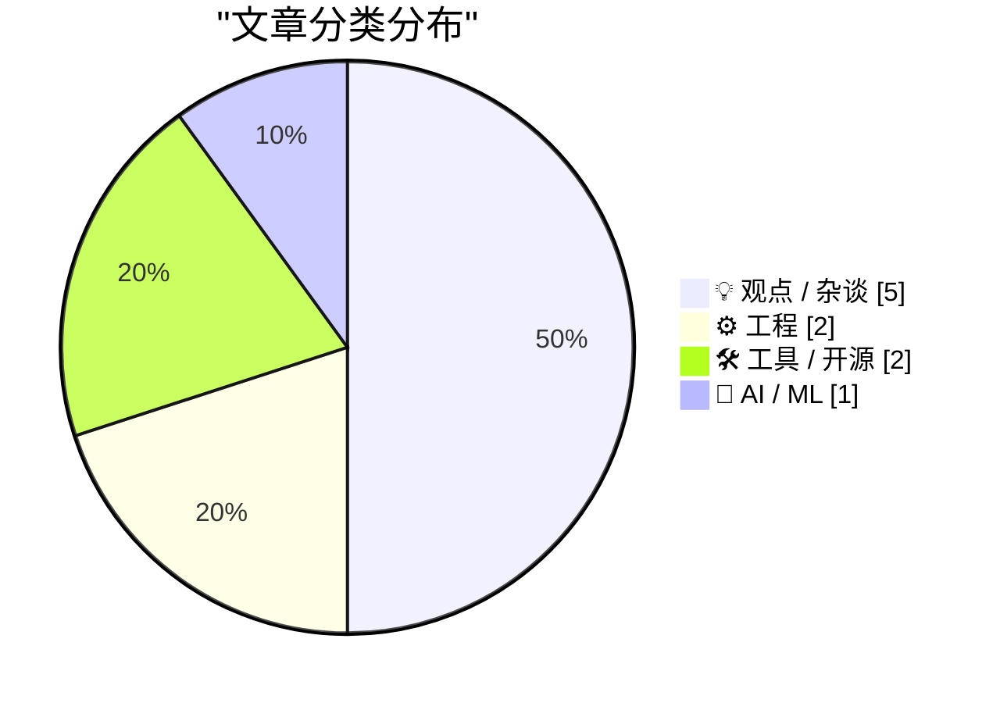
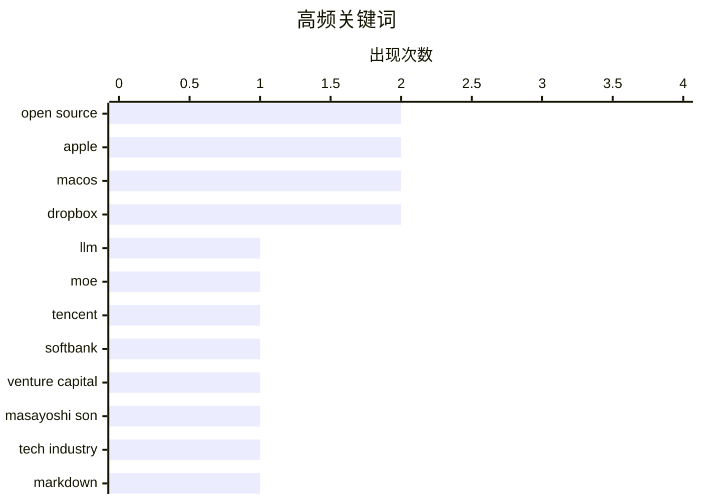

# 📰 AI 博客每日精选 — 2026-07-07

> 来自 Karpathy 推荐的 92 个顶级技术博客，AI 精选 Top 10

## 📝 今日看点

今日技术圈呈现出AI大模型持续演进与行业反思并存的态势，腾讯发布超大规模开源模型Hy3的同时，舆论对AI愿景的审美疲劳与理性批判正显著升温。苹果生态迎来重要标准化进展，Markdown正式获得系统级标识符，但其固化的设计规范与资深媒体人的离去也引发了关于创新边界的讨论。此外，云存储服务策略的变动与部分开源工具的停更，正迫使开发者与用户重新审视数据备份的可靠性与工具维护的长期稳定性。

---

## 🏆 今日必读

🥇 **腾讯发布 Hy3：2950 亿参数的开源混合专家模型**

[tencent/Hy3](https://simonwillison.net/2026/Jul/6/hy3/#atom-everything) — simonwillison.net · 8 小时前 · 🤖 AI / ML

> 腾讯正式发布采用 Apache 2.0 协议开源的 Hy3 模型。该模型是一个拥有 2950 亿参数的混合专家（MoE）架构，其中激活参数为 210 亿，并包含 38 亿 MTP 层参数。研发团队在 Hy3 预览版基础上收集了 50 多个产品的反馈，通过更高质量的数据进行了大规模后训练。实测结果显示，Hy3 的性能超越了同等规模的其他主流模型。这一发布标志着腾讯在高性能开源大模型领域的进一步深耕。

💡 **为什么值得读**: 了解腾讯最新开源的大规模 MoE 模型架构及其在性能上的突破。

🏷️ LLM, MoE, Tencent, Open Source

🥈 **软银黑粉指南：孙正义的“失控”愿景**

[Premium: The Hater's Guide To SoftBank](https://www.wheresyoured.at/premium-the-haters-guide-to-softbank/) — wheresyoured.at · 18 小时前 · 💡 观点 / 杂谈

> 文章对软银第 46 届年度股东大会及孙正义的演讲进行了深度讽刺与分析。重点抨击了孙正义展示的那些被戏称为“失控的大鹅游戏”的幻灯片，认为其愿景脱离现实。通过回顾软银过往的投资逻辑，揭示了其在人工智能浪潮中过度包装与投机倾向。作者认为软银目前的战略更多是基于宏大叙事而非扎实的商业逻辑。这种尖锐的批评反映了市场对软银激进投资风格的质疑。

💡 **为什么值得读**: 以辛辣视角审视软银的投资策略及其在 AI 时代的激进表态。

🏷️ SoftBank, Venture Capital, Masayoshi Son, Tech Industry

🥉 **苹果系统正式为 Markdown 引入统一类型标识符 (UTI)**

[Markdown Now Has a UTI in Apple’s Version 27 OSes](https://developer.apple.com/documentation/uniformtypeidentifiers/uttype-swift.struct/markdown) — daringfireball.net · 11 小时前 · ⚙️ 工程

> 苹果在最新的第 27 版操作系统开发者测试版中，正式为 Markdown 数据内置了统一类型标识符（UTI）。该标识符被定义为 net.daringfireball.markdown，并遵循 public.utf8-plain-text 标准。这一变动解决了长期以来 Markdown 文件缺乏系统级标准识别的问题，确保了跨应用的兼容性。开发者应更新其应用配置，从通用的纯文本标识符迁移到这一专用的 Markdown 标识符。这对于提升 macOS 和 iOS 平台上的文本处理体验具有重要意义。

💡 **为什么值得读**: Markdown 开发者必读，了解苹果系统级支持 Markdown 的最新标准规范。

🏷️ Markdown, Apple, UTI, macOS

---

## 📊 数据概览

| 扫描源 | 抓取文章 | 时间范围 | 精选 |
|:---:|:---:|:---:|:---:|
| 77/92 | 2020 篇 → 16 篇 | 24h | **10 篇** |

### 分类分布



### 高频关键词



<details>
<summary>📈 纯文本关键词图（终端友好）</summary>

```
open source     │ ████████████████████ 2
apple           │ ████████████████████ 2
macos           │ ████████████████████ 2
dropbox         │ ████████████████████ 2
llm             │ ██████████░░░░░░░░░░ 1
moe             │ ██████████░░░░░░░░░░ 1
tencent         │ ██████████░░░░░░░░░░ 1
softbank        │ ██████████░░░░░░░░░░ 1
venture capital │ ██████████░░░░░░░░░░ 1
masayoshi son   │ ██████████░░░░░░░░░░ 1
```

</details>

### 🏷️ 话题标签

**open source**(2) · **apple**(2) · **macos**(2) · dropbox(2) · llm(1) · moe(1) · tencent(1) · softbank(1) · venture capital(1) · masayoshi son(1) · tech industry(1) · markdown(1) · uti(1) · software retirement(1) · ai fatigue(1) · hype cycle(1) · industry trends(1) · windows api(1) · file system(1) · win32(1)

---

## 💡 观点 / 杂谈

### 1. 软银黑粉指南：孙正义的“失控”愿景

[Premium: The Hater's Guide To SoftBank](https://www.wheresyoured.at/premium-the-haters-guide-to-softbank/) — **wheresyoured.at** · 18 小时前 · ⭐ 25/30

> 文章对软银第 46 届年度股东大会及孙正义的演讲进行了深度讽刺与分析。重点抨击了孙正义展示的那些被戏称为“失控的大鹅游戏”的幻灯片，认为其愿景脱离现实。通过回顾软银过往的投资逻辑，揭示了其在人工智能浪潮中过度包装与投机倾向。作者认为软银目前的战略更多是基于宏大叙事而非扎实的商业逻辑。这种尖锐的批评反映了市场对软银激进投资风格的质疑。

🏷️ SoftBank, Venture Capital, Masayoshi Son, Tech Industry

---

### 2. 我对 AI 话题已经感到极度审美疲劳

[I'm just so bored of AI](https://shkspr.mobi/blog/2026/07/im-just-so-bored-of-ai/) — **shkspr.mobi** · 21 小时前 · ⭐ 22/30

> 作者表达了对当前泛滥的 AI 讨论的强烈厌倦感，将其比作听瘾君子喋喋不休地谈论幻觉。文章批评现在的 AI 话题充斥着重复的陈词滥调，缺乏实质性的新意。作者认为，看着人们为电脑自动拨打电话等小功能而欢呼雀跃，就像在看初次尝试新鲜事物的人大惊小怪。这种情绪反映了技术圈内一部分人对 AI 泡沫化讨论的抵触心理。文章呼吁回归更有深度和实际意义的技术探讨，而非盲目跟风。

🏷️ AI fatigue, hype cycle, industry trends

---

### 3. 写那些你尚未完全理解的主题

[Blog about things you don't understand yet](https://seangoedecke.com/blog-about-things-you-dont-understand-yet/) — **seangoedecke.com** · 8 小时前 · ⭐ 19/30

> 文章提倡通过写作来驱动学习，建议博主去写那些自己还没彻底搞懂的技术。作者认为，如果写作过程中没有学到新东西，那么这篇文章就不值得发布。通过将模糊的想法转化为文字，作者在撰写关于 o3 模型等文章时发现了原本忽略的逻辑漏洞。这种“以写促学”的方法能让博主从单纯的信息传播者转变为深度思考者。写作被视为一种强迫自己理清思路并填补知识空白的有效工具。

🏷️ learning, writing, career development

---

### 4. Jason Snell 结束在 Macworld 长达 28 年的专栏生涯

[Jason Snell Ends His Column, and 28-Year Run, at Macworld](https://www.macworld.com/article/3175482) — **daringfireball.net** · 18 小时前 · ⭐ 19/30

> 资深科技媒体人 Jason Snell 宣布结束他在《Macworld》杂志长达 28 年的专栏写作。回顾 1997 年入职之初，苹果公司正处于破产边缘，史蒂夫·乔布斯刚刚回归且尚未推出任何新产品。Snell 见证了苹果从“生死一线”到成为全球科技巨头的完整历程。他的离职标志着一个科技评论时代的终结，也反映了传统科技媒体生态的变迁。这段职业生涯几乎完整覆盖了现代苹果公司的复兴史。

🏷️ Apple history, tech journalism, Macworld

---

### 5. 苹果应该打破应用图标的“圆角矩形牢笼”

[★ Apple Should Eliminate the App Icon ‘Squircle Jail’](https://daringfireball.net/2026/07/eliminate_app_icon_squircle_jail) — **daringfireball.net** · 10 小时前 · ⭐ 18/30

> 文章尖锐批评了苹果公司强制所有应用图标必须遵循统一圆角矩形（Squircle）设计的政策。作者认为，形状曾经是图标最具辨识度的特征，而现在的统一化设计扼杀了创意和视觉区分度。这种“图标牢笼”让所有应用在主屏幕上看起来千篇一律，降低了用户寻找特定应用的效率。作者呼吁苹果放开限制，允许开发者回归更具个性和形状多样性的图标设计。这一观点挑战了当前主流的扁平化与一致性设计准则。

🏷️ UI design, Apple, icons

---

## ⚙️ 工程

### 6. 苹果系统正式为 Markdown 引入统一类型标识符 (UTI)

[Markdown Now Has a UTI in Apple’s Version 27 OSes](https://developer.apple.com/documentation/uniformtypeidentifiers/uttype-swift.struct/markdown) — **daringfireball.net** · 11 小时前 · ⭐ 24/30

> 苹果在最新的第 27 版操作系统开发者测试版中，正式为 Markdown 数据内置了统一类型标识符（UTI）。该标识符被定义为 net.daringfireball.markdown，并遵循 public.utf8-plain-text 标准。这一变动解决了长期以来 Markdown 文件缺乏系统级标准识别的问题，确保了跨应用的兼容性。开发者应更新其应用配置，从通用的纯文本标识符迁移到这一专用的 Markdown 标识符。这对于提升 macOS 和 iOS 平台上的文本处理体验具有重要意义。

🏷️ Markdown, Apple, UTI, macOS

---

### 7. 使用“关闭时删除”标志打开文件后如何反悔？

[I opened a file with FILE_FLAG_DELETE_ON_CLOSE, but now I changed my mind](https://devblogs.microsoft.com/oldnewthing/20260706-00/?p=112506) — **devblogs.microsoft.com/oldnewthing** · 18 小时前 · ⭐ 21/30

> 在 Windows 开发中，使用 FILE_FLAG_DELETE_ON_CLOSE 标志打开的文件无法在句柄打开期间直接撤销删除指令。文章指出，一旦该标志生效，系统就会在最后一个句柄关闭时强制删除文件。如果开发者改变主意，唯一的办法是使用 SetFileInformationByHandle 函数并传入 FileDispositionInfo 来尝试清除删除状态。但这要求文件最初打开时必须具有 DELETE 访问权限，否则操作将失败。这为处理复杂的文件生命周期管理提供了关键的技术细节。

🏷️ Windows API, File System, Win32, C++

---

## 🛠 工具 / 开源

### 8. 开源 Mac 版 Dropbox 客户端 Maestral 宣布停止维护

[Maestral, the Open Source Splendidly Simple Mac Dropbox Client, Has Been Retired](https://maestral.app/) — **daringfireball.net** · 15 小时前 · ⭐ 22/30

> 知名开源轻量级 Dropbox 客户端 Maestral 开发者 Sam Schott 宣布该项目正式进入归档状态。由于开发者个人精力有限且已不再使用 Dropbox，项目自 2026 年 6 月起停止更新。现有版本在证书过期前仍可继续使用，但未来将不再有功能更新或漏洞修复。这标志着这款以简洁高效著称、曾是官方客户端最佳替代品的工具走向终结。用户需要开始考虑迁移到官方客户端或其他第三方同步方案。

🏷️ open source, Dropbox, macOS, software retirement

---

### 9. Backblaze 与 Dropbox 的备份之争

[Backblaze Versus Dropbox](https://mjtsai.com/blog/2025/12/19/backblaze-no-longer-backs-up-dropbox/) — **daringfireball.net** · 14 小时前 · ⭐ 19/30

> 在线备份服务 Backblaze 近期停止支持对 iCloud Drive、Dropbox、Google Drive 等云存储服务本地同步文件夹的备份。这一变动引发了用户的广泛担忧，因为这意味着存储在云端但在本地有副本的数据失去了“二次备份”的保障。Backblaze 的理由是这些服务的文件系统底层实现导致备份变得复杂且不可靠。用户现在必须在便捷的云同步与数据安全性之间寻找新的平衡点。文章探讨了这种策略调整对个人数据备份方案的深远影响。

🏷️ backup, cloud storage, Backblaze, Dropbox

---

## 🤖 AI / ML

### 10. 腾讯发布 Hy3：2950 亿参数的开源混合专家模型

[tencent/Hy3](https://simonwillison.net/2026/Jul/6/hy3/#atom-everything) — **simonwillison.net** · 8 小时前 · ⭐ 25/30

> 腾讯正式发布采用 Apache 2.0 协议开源的 Hy3 模型。该模型是一个拥有 2950 亿参数的混合专家（MoE）架构，其中激活参数为 210 亿，并包含 38 亿 MTP 层参数。研发团队在 Hy3 预览版基础上收集了 50 多个产品的反馈，通过更高质量的数据进行了大规模后训练。实测结果显示，Hy3 的性能超越了同等规模的其他主流模型。这一发布标志着腾讯在高性能开源大模型领域的进一步深耕。

🏷️ LLM, MoE, Tencent, Open Source

---

*生成于 2026-07-07 08:36 | 扫描 77 源 → 获取 2020 篇 → 精选 10 篇*
*基于 [Hacker News Popularity Contest 2025](https://refactoringenglish.com/tools/hn-popularity/) RSS 源列表，由 [Andrej Karpathy](https://x.com/karpathy) 推荐*
*由「懂点儿AI」制作，欢迎关注同名微信公众号获取更多 AI 实用技巧 💡*
