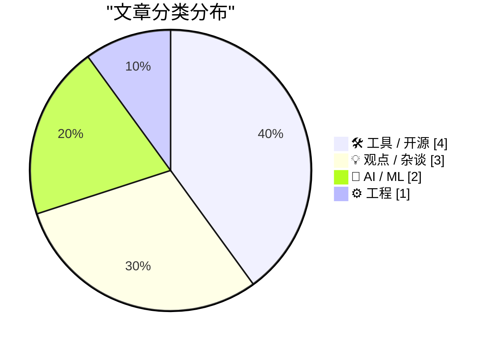
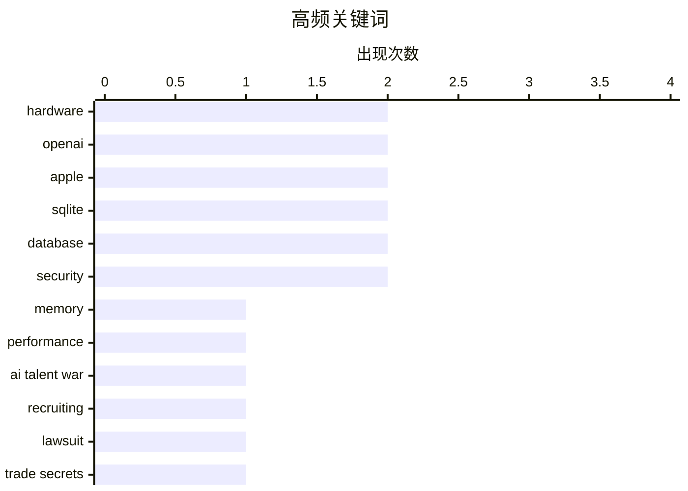

# 📰 AI 博客每日精选 — 2026-07-12

> 来自 Karpathy 推荐的 92 个顶级技术博客，AI 精选 Top 10

## 📝 今日看点

今日技术圈围绕两大核心议题展开激烈碰撞。一方面，AI巨头间的人才与知识产权争夺战白热化，OpenAI对苹果关键部门的挖角已引发严厉的法律反制。另一方面，基础架构领域持续聚焦性能与可靠性，从内存技术的瓶颈突破到数据库工具链的严谨性升级，都体现了对底层效能的深度优化。同时，关于AI伦理的讨论试图超越“机器人权利”的浮夸叙事，转而关注技术背后真实的人类劳动与资本控制问题。

---

## 🏆 今日必读

🥇 **高级版：厌恶者指南之内存危机**

[Premium: The Hater's Guide To The Memory Crisis](https://www.wheresyoured.at/premium-the-haters-guide-to-the-memory-crisis/) — wheresyoured.at · 1 天前 · ⚙️ 工程

> 文章主题是当前科技行业面临的内存技术挑战与市场现状。作者剖析了DRAM与NAND闪存市场的周期性波动、技术瓶颈以及主要供应商的竞争格局。文中指出，尽管新存储技术（如CXL、HBM）不断涌现，但成本、功耗和供应链集中度仍是主要制约因素。结论认为，内存危机不仅是技术问题，更是经济结构和市场垄断共同作用的结果，短期内难以彻底解决。

💡 **为什么值得读**: 本文提供了对复杂内存产业生态的批判性视角，帮助读者超越技术参数，理解市场动态背后的深层逻辑。

🏷️ memory, performance, hardware

🥈 **Gurman谈Tang Tan与Paul Meade：OpenAI挖角引发苹果警觉**

[Gurman on Tang Tan and Paul Meade](https://www.bloomberg.com/news/articles/2026-07-11/openai-engineer-s-lol-moment-set-stage-for-legal-fight-with-apple) — daringfireball.net · 10 小时前 · 💡 观点 / 杂谈

> 报道聚焦于OpenAI从苹果大规模挖角硬件与设计高管所引发的紧张关系。OpenAI的招募行动持续到2026年6月，甚至挖走了苹果智能眼镜部门负责人Paul Meade。苹果对此反应迅速且强硬，立即终止了Meade的职务且未给予过渡期。此事凸显了AI巨头与传统硬件公司在人才争夺上的激烈冲突，并为后续的法律纠纷埋下伏笔。

💡 **为什么值得读**: 通过内部人士爆料，揭示了科技巨头间人才战的白热化状态及其可能引发的商业与法律后果。

🏷️ AI talent war, OpenAI, Apple, recruiting

🥉 **苹果起诉OpenAI、io及前员工，指控窃取商业机密**

[Apple Sues OpenAI, io, and Former Employees, Alleging Theft of Trade Secrets](https://9to5mac.com/2026/07/10/apple-sues-openai-trade-secret-theft/) — daringfireball.net · 1 天前 · 🤖 AI / ML

> 苹果正式对OpenAI、io Products及多名前员工提起法律诉讼，指控其窃取商业机密。被告包括前苹果产品设计副总裁Tang Tan（曾负责iPhone和Apple Watch设计）以及前高级系统电气工程师Chang Liu。诉讼指控这些员工在离职加入竞争对手时带走了敏感技术信息。此案标志着苹果与OpenAI在硬件人才争夺上的矛盾已升级为正式法律对抗。

💡 **为什么值得读**: 这是AI领军企业与消费电子巨头之间一场具有风向标意义的法律对决，关乎知识产权保护与人才流动的边界。

🏷️ Apple, OpenAI, lawsuit, trade secrets

---

## 📊 数据概览

| 扫描源 | 抓取文章 | 时间范围 | 精选 |
|:---:|:---:|:---:|:---:|
| 76/92 | 2376 篇 → 33 篇 | 48h | **10 篇** |

### 分类分布



### 高频关键词



<details>
<summary>📈 纯文本关键词图（终端友好）</summary>

```
hardware      │ ████████████████████ 2
openai        │ ████████████████████ 2
apple         │ ████████████████████ 2
sqlite        │ ████████████████████ 2
database      │ ████████████████████ 2
security      │ ████████████████████ 2
memory        │ ██████████░░░░░░░░░░ 1
performance   │ ██████████░░░░░░░░░░ 1
ai talent war │ ██████████░░░░░░░░░░ 1
recruiting    │ ██████████░░░░░░░░░░ 1
```

</details>

### 🏷️ 话题标签

**hardware**(2) · **openai**(2) · **apple**(2) · sqlite(2) · database(2) · security(2) · memory(1) · performance(1) · ai talent war(1) · recruiting(1) · lawsuit(1) · trade secrets(1) · python(1) · tools(1) · software engineering(1) · codebase(1) · productivity(1) · ai ethics(1) · regulation(1) · philosophy(1)

---

## 🛠 工具 / 开源

### 1. sqlite-utils 4.1版本发布

[sqlite-utils 4.1](https://simonwillison.net/2026/Jul/11/sqlite-utils/#atom-everything) — **simonwillison.net** · 4 小时前 · ⭐ 23/30

> 文章宣布了sqlite-utils命令行工具4.1版本的发布。此次更新是4.0版本后的首个点版本，引入了一系列细微但实用的新功能。主要改进包括为`sqlite-utils insert`和`upsert`命令新增了`--code`选项，允许通过Python代码预处理数据。这些增强旨在提升数据处理流程的灵活性和自动化程度。

🏷️ sqlite, python, database, tools

---

### 2. 在SQLite中推荐使用STRICT表

[Prefer STRICT tables in SQLite](https://evanhahn.com/prefer-strict-tables-in-sqlite/) — **evanhahn.com** · 1 天前 · ⭐ 22/30

> 文章主张在SQLite中优先使用STRICT表模式，以增强数据类型的严格性。STRICT表能防止常见的数据类型错误，例如将文本意外插入整数列。创建STRICT表只需在`CREATE TABLE`语句后添加`STRICT`关键字。作者认为这一特性被低估，它能以极小的代价提升数据完整性，避免因SQLite灵活的亲和类型系统而导致的潜在数据质量问题。

🏷️ SQLite, database, schema

---

### 3. 包管理周报：2026年7月11日

[This Week in Package Management: 11 July 2026](https://nesbitt.io/2026/07/11/this-week-in-package-management.html) — **nesbitt.io** · 18 小时前 · ⭐ 22/30

> 这是一份关于软件包管理领域的周期性行业动态汇总。内容涵盖了过去一周内各类包管理器（如npm、pip、Cargo等）的重要版本发布、安全通告以及相关技术文章。周报旨在为开发者和系统维护者提供一个快速了解生态系统关键更新的渠道。其核心价值在于信息的集中与过滤，帮助读者高效跟踪依赖管理领域的变化。

🏷️ package management, security, ecosystem

---

### 4. QuadRF能探测无人机并透视墙后的WiFi信号

[QuadRF can spot drones and see WiFi through my wall](https://www.jeffgeerling.com/blog/2026/quadrf-can-spot-drones-and-see-wifi-through-my-wall/) — **jeffgeerling.com** · 1 天前 · ⭐ 21/30

> 文章介绍了QuadRF这款基于树莓派5和FPGA板构建的相控阵无线电设备。该设备具备皮秒级定时精度，能进行高级信号处理和波束成形。其实测功能包括穿透墙壁探测WiFi信号分布、追踪无人机飞行轨迹以及分析各类射频信号。QuadRF展示了低成本开源硬件在高级无线电应用方面的巨大潜力，将以往昂贵的研究级能力带入了爱好者领域。

🏷️ RF, SDR, security, hardware

---

## 💡 观点 / 杂谈

### 5. Gurman谈Tang Tan与Paul Meade：OpenAI挖角引发苹果警觉

[Gurman on Tang Tan and Paul Meade](https://www.bloomberg.com/news/articles/2026-07-11/openai-engineer-s-lol-moment-set-stage-for-legal-fight-with-apple) — **daringfireball.net** · 10 小时前 · ⭐ 24/30

> 报道聚焦于OpenAI从苹果大规模挖角硬件与设计高管所引发的紧张关系。OpenAI的招募行动持续到2026年6月，甚至挖走了苹果智能眼镜部门负责人Paul Meade。苹果对此反应迅速且强硬，立即终止了Meade的职务且未给予过渡期。此事凸显了AI巨头与传统硬件公司在人才争夺上的激烈冲突，并为后续的法律纠纷埋下伏笔。

🏷️ AI talent war, OpenAI, Apple, recruiting

---

### 6. 为“不理解你的代码库”辩护

[In defense of not understanding your codebase](https://seangoedecke.com/in-defense-of-not-understanding-your-codebase/) — **seangoedecke.com** · 1 天前 · ⭐ 23/30

> 文章探讨了在大型、高流动率的软件项目中，工程师是否必须完全理解整个代码库才能有效工作。作者指出，在像Redis或《见证者》游戏这类小而稳定的项目中，完全理解是可行的；但在谷歌或亚马逊等巨头的大型复杂系统中，任何人都不可能掌握全部细节。核心论点是，现代软件工程更依赖抽象、模块化、清晰的接口和良好的工具，而非对代码的全局性深度理解。

🏷️ software engineering, codebase, productivity

---

### 7. 多元主义：“机器人权利”与AI奴隶制幻想

[Pluralistic: "Rights for robots" and the AI slavery fantasy (10 Jul 2026)](https://pluralistic.net/2026/07/10/posthuman-as-in-no-humans/) — **pluralistic.net** · 1 天前 · ⭐ 23/30

> 文章批判了关于赋予AI或机器人“权利”的讨论，并将其斥为一种分散注意力的“AI奴隶制幻想”。作者认为，这种叙事掩盖了AI技术背后真实的人类劳动剥削（如数据标注、内容审核）和资本控制问题。真正的危机不是机器人的“权利”，而是人类工人权利的侵蚀和权力的集中。结论呼吁关注技术背后的政治经济现实，而非陷入拟人化的伦理陷阱。

🏷️ AI ethics, regulation, philosophy

---

## 🤖 AI / ML

### 8. 苹果起诉OpenAI、io及前员工，指控窃取商业机密

[Apple Sues OpenAI, io, and Former Employees, Alleging Theft of Trade Secrets](https://9to5mac.com/2026/07/10/apple-sues-openai-trade-secret-theft/) — **daringfireball.net** · 1 天前 · ⭐ 24/30

> 苹果正式对OpenAI、io Products及多名前员工提起法律诉讼，指控其窃取商业机密。被告包括前苹果产品设计副总裁Tang Tan（曾负责iPhone和Apple Watch设计）以及前高级系统电气工程师Chang Liu。诉讼指控这些员工在离职加入竞争对手时带走了敏感技术信息。此案标志着苹果与OpenAI在硬件人才争夺上的矛盾已升级为正式法律对抗。

🏷️ Apple, OpenAI, lawsuit, trade secrets

---

### 9. 建立关于LLM参数数量的直觉

[Building intuition about LLM parameter counts](https://www.gilesthomas.com/2026/07/llm-parameter-counts) — **gilesthomas.com** · 1 天前 · ⭐ 23/30

> 作者通过亲手在JAX中实现GPT-2小型模型的经历，分享了对大语言模型参数规模的理解。一个仅包含输入词嵌入层和输出头（未使用权重绑定）的极简模型，参数量就达到了7700万。这揭示了LLM海量参数的主要来源并非Transformer块，而是词嵌入矩阵，其大小与词汇表尺寸和嵌入维度直接相关。建立这种直觉有助于更理性地评估不同规模模型的能力与需求。

🏷️ LLM, GPT-2, JAX, parameters

---

## ⚙️ 工程

### 10. 高级版：厌恶者指南之内存危机

[Premium: The Hater's Guide To The Memory Crisis](https://www.wheresyoured.at/premium-the-haters-guide-to-the-memory-crisis/) — **wheresyoured.at** · 1 天前 · ⭐ 25/30

> 文章主题是当前科技行业面临的内存技术挑战与市场现状。作者剖析了DRAM与NAND闪存市场的周期性波动、技术瓶颈以及主要供应商的竞争格局。文中指出，尽管新存储技术（如CXL、HBM）不断涌现，但成本、功耗和供应链集中度仍是主要制约因素。结论认为，内存危机不仅是技术问题，更是经济结构和市场垄断共同作用的结果，短期内难以彻底解决。

🏷️ memory, performance, hardware

---

*生成于 2026-07-12 04:05 | 扫描 76 源 → 获取 2376 篇 → 精选 10 篇*
*基于 [Hacker News Popularity Contest 2025](https://refactoringenglish.com/tools/hn-popularity/) RSS 源列表，由 [Andrej Karpathy](https://x.com/karpathy) 推荐*
*由「懂点儿AI」制作，欢迎关注同名微信公众号获取更多 AI 实用技巧 💡*
