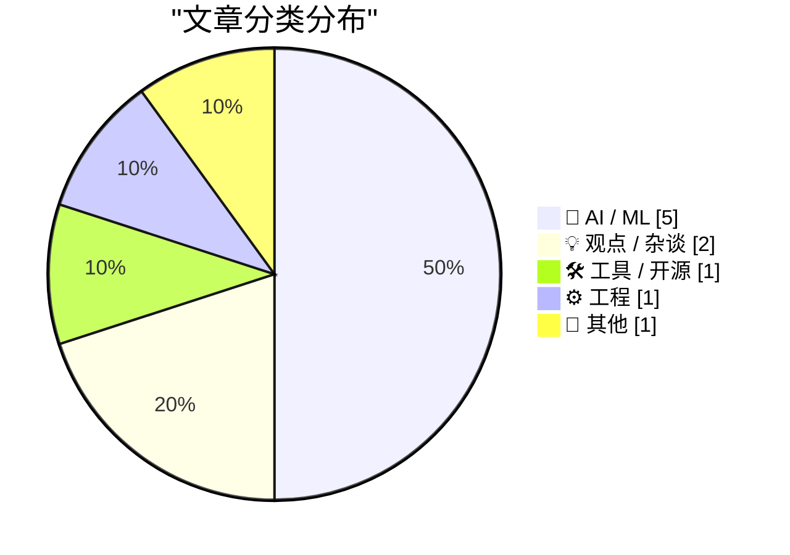
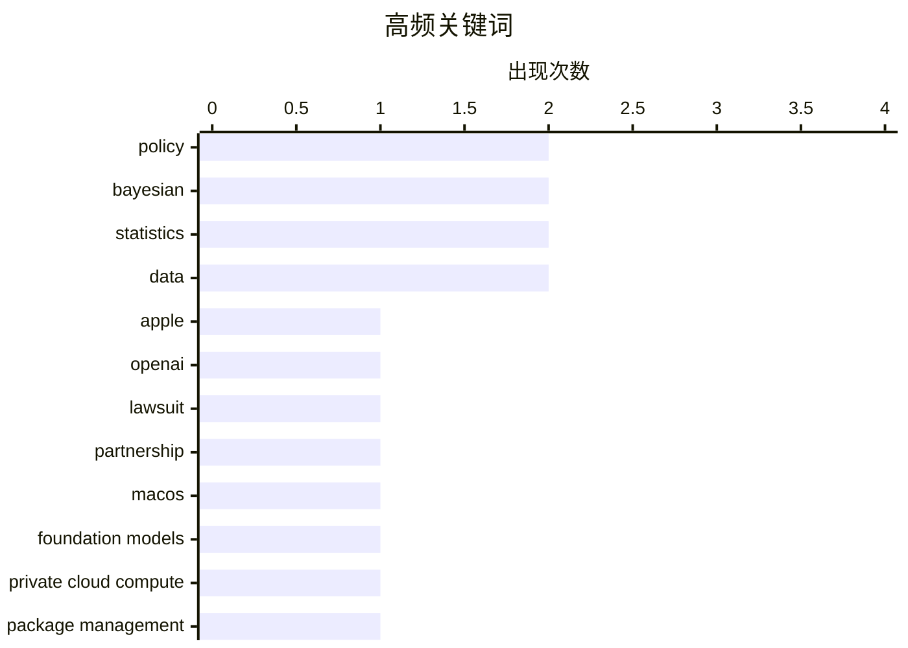

# 📰 AI 博客每日精选 — 2026-07-13

> 来自 Karpathy 推荐的 92 个顶级技术博客，AI 精选 Top 10

## 📝 今日看点

今日技术圈聚焦于人工智能领域的激烈竞合与治理。苹果与OpenAI的合作关系破裂并诉诸法律，凸显了巨头间在AI生态主导权与商业秘密上的尖锐矛盾。与此同时，技术主权与自主性成为关键议题，从荷兰政府的政策转向到开发者对本地及私有云模型工具的探索，都体现了对可控技术的追求。此外，关于贝叶斯统计的深入讨论和项目管理责任的思考，则反映了业界对技术方法论与组织效能的持续关注。

---

## 🏆 今日必读

🥇 **冰冷回应：苹果高管对OpenAI合作态度冷淡，随后提起诉讼**

[Ice Cold](https://www.threads.com/@alexheath/post/DaoI2jaEioX) — daringfireball.net · 1 天前 · 🤖 AI / ML

> 苹果与OpenAI的合作关系近期出现重大裂痕。记者在WWDC期间询问苹果高管关于与OpenAI的合作时，遭遇了“冰冷”的回避态度。随后，苹果正式起诉OpenAI，指控其窃取与消费硬件相关的商业秘密。双方高层本周正在太阳谷会面，使得局势更加紧张。这表明苹果与OpenAI的合作伙伴关系可能已陷入严重的法律与信任危机。

💡 **为什么值得读**: 该文揭示了科技巨头间战略合作背后突发的法律冲突与紧张关系，对理解AI行业竞争动态具有即时参考价值。

🏷️ Apple, OpenAI, lawsuit, partnership

🥈 **TwoMillionKit：无需授权在macOS 27中调用私有云计算基础模型**

[TwoMillionKit: Use Private Cloud Compute in MacOS 27 Foundation Models Without an Entitlement](https://github.com/insidegui/TwoMillionKit) — daringfireball.net · 7 小时前 · 🤖 AI / ML

> 该项目提供了一个让Mac应用便捷调用苹果本地及云端大模型能力的Swift包。macOS 27内置了`fm`命令行工具，可用于在终端或脚本中运行本地系统模型或私有云计算（Private Cloud Compute）的推理。TwoMillionKit封装了`fm`工具，为任何Mac应用提供了统一的LanguageModel接口。开发者无需特殊授权即可利用此能力，这降低了集成苹果大模型技术的门槛。

💡 **为什么值得读**: 对于希望在应用中集成苹果最新AI能力的Mac开发者而言，这是一个极具实用价值的开源工具和逆向工程示例。

🏷️ macOS, Foundation Models, Private Cloud Compute

🥉 **包管理周报：2026年7月11日**

[This Week in Package Management: 11 July 2026](https://nesbitt.io/2026/07/11/this-week-in-package-management.html) — nesbitt.io · 1 天前 · 🛠 工具 / 开源

> 这是一份关于软件包管理生态的周期性汇总报告。内容涵盖了该领域内最新的版本发布、安全通告及相关文章。报告旨在为开发者提供包管理工具和依赖管理方面的最新动态与洞察。

💡 **为什么值得读**: 适合需要紧跟包管理安全更新、工具演进和行业最佳实践的开发者和技术决策者快速浏览。

🏷️ package management, security, ecosystem

---

## 📊 数据概览

| 扫描源 | 抓取文章 | 时间范围 | 精选 |
|:---:|:---:|:---:|:---:|
| 78/92 | 2420 篇 → 35 篇 | 48h | **10 篇** |

### 分类分布



### 高频关键词



<details>
<summary>📈 纯文本关键词图（终端友好）</summary>

```
policy            │ ████████████████████ 2
bayesian          │ ████████████████████ 2
statistics        │ ████████████████████ 2
data              │ ████████████████████ 2
apple             │ ██████████░░░░░░░░░░ 1
openai            │ ██████████░░░░░░░░░░ 1
lawsuit           │ ██████████░░░░░░░░░░ 1
partnership       │ ██████████░░░░░░░░░░ 1
macos             │ ██████████░░░░░░░░░░ 1
foundation models │ ██████████░░░░░░░░░░ 1
```

</details>

### 🏷️ 话题标签

**policy**(2) · **bayesian**(2) · **statistics**(2) · data(2) · apple(1) · openai(1) · lawsuit(1) · partnership(1) · macos(1) · foundation models(1) · private cloud compute(1) · package management(1) · security(1) · ecosystem(1) · claude(1) · model(1) · availability(1) · dri(1) · management(1) · process(1)

---

## 🤖 AI / ML

### 1. 冰冷回应：苹果高管对OpenAI合作态度冷淡，随后提起诉讼

[Ice Cold](https://www.threads.com/@alexheath/post/DaoI2jaEioX) — **daringfireball.net** · 1 天前 · ⭐ 24/30

> 苹果与OpenAI的合作关系近期出现重大裂痕。记者在WWDC期间询问苹果高管关于与OpenAI的合作时，遭遇了“冰冷”的回避态度。随后，苹果正式起诉OpenAI，指控其窃取与消费硬件相关的商业秘密。双方高层本周正在太阳谷会面，使得局势更加紧张。这表明苹果与OpenAI的合作伙伴关系可能已陷入严重的法律与信任危机。

🏷️ Apple, OpenAI, lawsuit, partnership

---

### 2. TwoMillionKit：无需授权在macOS 27中调用私有云计算基础模型

[TwoMillionKit: Use Private Cloud Compute in MacOS 27 Foundation Models Without an Entitlement](https://github.com/insidegui/TwoMillionKit) — **daringfireball.net** · 7 小时前 · ⭐ 23/30

> 该项目提供了一个让Mac应用便捷调用苹果本地及云端大模型能力的Swift包。macOS 27内置了`fm`命令行工具，可用于在终端或脚本中运行本地系统模型或私有云计算（Private Cloud Compute）的推理。TwoMillionKit封装了`fm`工具，为任何Mac应用提供了统一的LanguageModel接口。开发者无需特殊授权即可利用此能力，这降低了集成苹果大模型技术的门槛。

🏷️ macOS, Foundation Models, Private Cloud Compute

---

### 3. Fable模型访问期限再次延长

[Fable gets another bump](https://simonwillison.net/2026/Jul/12/bump/#atom-everything) — **simonwillison.net** · 3 小时前 · ⭐ 22/30

> 由于GPT-5.6 Sol被明确归类为Fable/Mythos级别的模型，Anthropic再次延长了其顶级模型Fable的访问期限。该公司宣布，在所有付费计划中，Claude Fable 5的访问权限将延长至7月19日。同时，Claude Code的每周使用限额将继续保持提高50%的状态。用户最多可将一半的周使用额度用于Fable 5。

🏷️ Claude, model, availability

---

### 4. 后验方差

[Posterior variance](https://www.johndcook.com/blog/2026/07/12/posterior-variance/) — **johndcook.com** · 5 小时前 · ⭐ 20/30

> 本文探讨了贝叶斯统计中一个反直觉的问题：增加数据是否总能减少后验方差？答案是否定的，并非总是如此。这是对作者前一篇关于后验均值文章的延续，该文展示了后验均值是先验均值与数据均值的加权平均。本文则深入分析了后验方差在特定条件下可能不会减少的情况。

🏷️ Bayesian, statistics, variance, data

---

### 5. 后验均值

[Posterior mean](https://www.johndcook.com/blog/2026/07/12/posterior-mean/) — **johndcook.com** · 7 小时前 · ⭐ 20/30

> 文章阐释了贝叶斯推断中后验均值的核心逻辑。常识认为，看到新数据后的信念应是先验信念与新数据信息之间的某种折衷。后验均值正是先验均值与数据均值的加权平均值。关键在于如何平衡新旧信息，权重取决于对先验判断和新数据可靠性的评估。

🏷️ Bayesian, statistics, inference, data

---

## 💡 观点 / 杂谈

### 6. 多元视角：职场“灵活性”的真相（2026年7月11日）

[Pluralistic: Workplace "flexibility" isn't (11 Jul 2026)](https://pluralistic.net/2026/07/11/your-risk/) — **pluralistic.net** · 1 天前 · ⭐ 20/30

> 文章核心批判了零工经济所鼓吹的“灵活性”本质。作者指出，这种所谓的灵活性实际上是将经营风险从企业转移给了劳动者。文章链接了一系列相关主题的评论，包括服务条款的谎言、苏联笑话、法律案件等。其核心观点是，当前的灵活工作模式掩盖了权力与风险的不平等分配。

🏷️ gig economy, workplace, labor, policy

---

### 7. 关于数字自主性的积极信号

[Goede geluiden over digitale autonomie](https://berthub.eu/articles/posts/goede-geluiden-over-digitale-autonomie/) — **berthub.eu** · 1 天前 · ⭐ 20/30

> 文章指出荷兰政府近期在数字自主性政策上出现了显著转向。经过长达十年的忽视后，政府发布的各类文件开始大量出现关于数字自主性和技术主权的积极论述。这些文本不仅言辞有力，而且包含了具体的良好意愿和计划。这表明在政策层面，对减少技术依赖、掌握数字主权的认识正在加强。

🏷️ digital autonomy, policy, Europe

---

## 🛠 工具 / 开源

### 8. 包管理周报：2026年7月11日

[This Week in Package Management: 11 July 2026](https://nesbitt.io/2026/07/11/this-week-in-package-management.html) — **nesbitt.io** · 1 天前 · ⭐ 23/30

> 这是一份关于软件包管理生态的周期性汇总报告。内容涵盖了该领域内最新的版本发布、安全通告及相关文章。报告旨在为开发者提供包管理工具和依赖管理方面的最新动态与洞察。

🏷️ package management, security, ecosystem

---

## ⚙️ 工程

### 9. 直接责任人制度

[Directly Responsible Individuals (DRI)](https://simonwillison.net/2026/Jul/12/directly-responsible-individuals/#atom-everything) — **simonwillison.net** · 1 小时前 · ⭐ 21/30

> 文章探讨了“直接责任人”这一项目管理概念及其起源。该术语源于苹果公司，用于指代对特定项目、倡议或活动的成败负最终责任的人。GitLab手册中提供了对此概念的清晰定义。作者正在思考这一制度在技术项目管理中的实践与应用价值。

🏷️ DRI, management, process

---

## 📝 其他

### 10. 阅读清单 2026年7月11日

[Reading List 07/11/26](https://www.construction-physics.com/p/reading-list-071126) — **construction-physics.com** · 1 天前 · ⭐ 17/30

> 这是一份跨领域的精选阅读推荐清单。涵盖的主题包括成年人与其父母同住现象、三星公司的利润、美洲原住民数据中心、波多黎各电网等多元内容。清单旨在为读者提供具有洞察力的文章和报告链接。

🏷️ industry, data centers, infrastructure

---

*生成于 2026-07-13 01:07 | 扫描 78 源 → 获取 2420 篇 → 精选 10 篇*
*基于 [Hacker News Popularity Contest 2025](https://refactoringenglish.com/tools/hn-popularity/) RSS 源列表，由 [Andrej Karpathy](https://x.com/karpathy) 推荐*
*由「懂点儿AI」制作，欢迎关注同名微信公众号获取更多 AI 实用技巧 💡*
