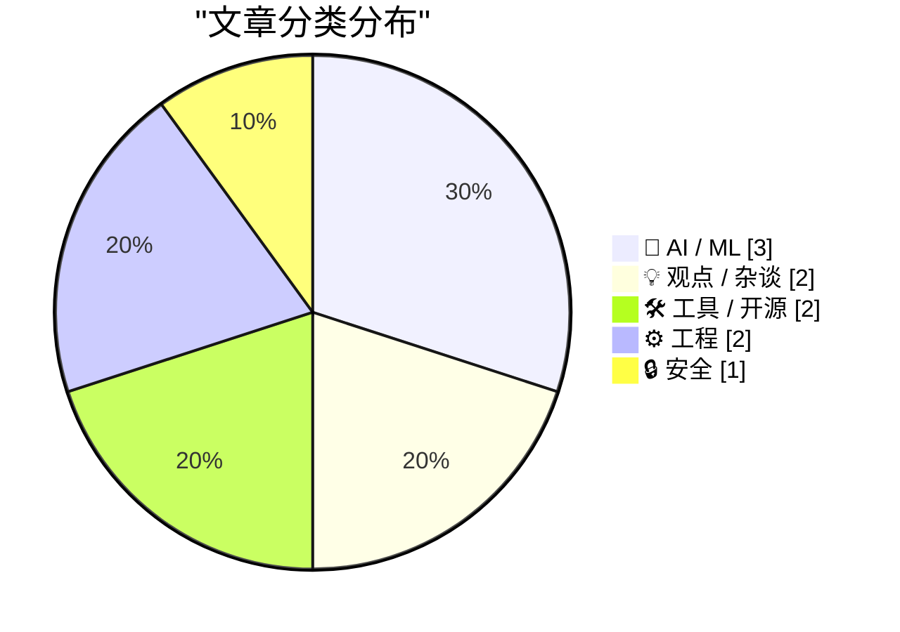
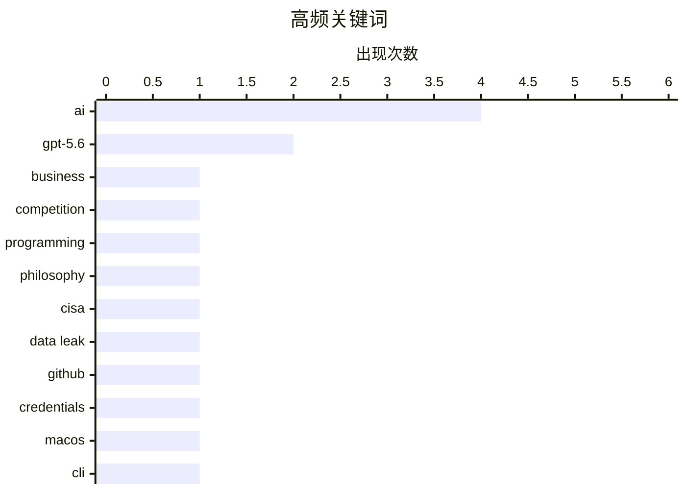

# 📰 AI 博客每日精选 — 2026-07-14

> 来自 Karpathy 推荐的 92 个顶级技术博客，AI 精选 Top 10

## 📝 今日看点

今日技术圈聚焦于AI生态的深层变革与安全实践的严峻挑战。一方面，行业领袖与开发者正激烈探讨AI时代开发范式的根本性转变，核心从代码实现转向解决方案的构思与掌控。另一方面，重大安全事件再次敲响警钟，暴露了顶级机构在凭证管理与供应链安全上的致命疏忽。与此同时，技术极客们正以前沿实验不断突破工具与架构的想象边界，从用数据库制作游戏到在本地调用强大模型，展现了旺盛的创造力。

---

## 🏆 今日必读

🥇 **多元视角：为何AI公司不直接与客户竞争？**

[Pluralistic: Why aren't AI companies competing directly with their customers? (13 Jul 2026)](https://pluralistic.net/2026/07/13/go-meta-meta/) — pluralistic.net · 16 小时前 · 🤖 AI / ML

> 文章探讨了AI行业一个根本性的商业模式矛盾：AI巨头为何选择向开发者出售基础设施（“卖铲子”），而非直接利用这些技术打造面向消费者的应用（“自己挖金”）。核心论点是，这种“赋能而非竞争”的策略能让AI公司（如OpenAI、Anthropic）最大化市场覆盖和利润，同时将应用层的风险和竞争转移给第三方开发者。作者指出，这实质上是将创新风险外包，而自身坐收平台租金。结论认为，这种模式虽对AI公司有利，但可能抑制终端应用的多样性和创新活力。

💡 **为什么值得读**: 该文从商业模式底层逻辑切入，犀利地揭示了当前AI繁荣背后巨头与开发者之间微妙的共生与博弈关系，有助于理解整个生态的运作和未来走向。

🏷️ AI, business, competition

🥈 **掌控思想，而非代码**

[Control the ideas, not the code](http://antirez.com/news/169) — antirez.com · 13 小时前 · 💡 观点 / 杂谈

> Redis创始人antirez分享了他对AI编程的深刻见解，核心观点是程序员的核心价值应从编写代码转向掌控和构思解决方案（“思想”）。他结合自身持续使用AI编程的经验指出，AI能极大提升代码实现效率，但高层设计、问题分解和创意构思仍需人类主导。文章强调，未来的优秀程序员将是那些能清晰定义问题、设计系统架构并指导AI实现的“思想者”。结论是，拥抱AI作为强大工具，将人类创造力集中于更高层次的抽象，是程序员保持相关性的关键。

💡 **为什么值得读**: 来自资深开源领袖的实践思考，为在AI时代重新定位程序员的价值提供了清晰而富有启发的框架，超越了工具使用的层面。

🏷️ AI, programming, philosophy

🥉 **从CISA近期GitHub泄漏事件中吸取的教训**

[Lessons Learned from CISA’s Recent GitHub Leak](https://krebsonsecurity.com/2026/07/lessons-learned-from-cisas-recent-github-leak/) — krebsonsecurity.com · 10 小时前 · 🔒 安全

> 文章分析了美国网络安全和基础设施安全局（CISA）一次严重的凭证泄露事件，其中承包商将包含AWS Govcloud密钥在内的数十个内部凭证误传到公共GitHub仓库长达近六个月。事件暴露了CISA在初始响应中的关键漏洞，包括缺乏对第三方代码仓库的主动监控、内部凭证生命周期管理不善以及事件响应流程的延迟。安全专家指出，此事件为所有安全团队敲响警钟，必须加强对供应链和第三方开发者的安全管控。核心教训是：任何组织都不能假设其代码或凭证不会意外公开，必须建立主动的外部威胁监测机制。

💡 **为什么值得读**: 通过剖析顶级安全机构的真实失误案例，提供了极具操作性的安全改进建议，对任何涉及代码和凭证管理的团队都具有普适的警示意义。

🏷️ CISA, data leak, GitHub, credentials

---

## 📊 数据概览

| 扫描源 | 抓取文章 | 时间范围 | 精选 |
|:---:|:---:|:---:|:---:|
| 77/92 | 2052 篇 → 27 篇 | 48h | **10 篇** |

### 分类分布



### 高频关键词



<details>
<summary>📈 纯文本关键词图（终端友好）</summary>

```
ai          │ ████████████████████ 4
gpt-5.6     │ ██████████░░░░░░░░░░ 2
business    │ █████░░░░░░░░░░░░░░░ 1
competition │ █████░░░░░░░░░░░░░░░ 1
programming │ █████░░░░░░░░░░░░░░░ 1
philosophy  │ █████░░░░░░░░░░░░░░░ 1
cisa        │ █████░░░░░░░░░░░░░░░ 1
data leak   │ █████░░░░░░░░░░░░░░░ 1
github      │ █████░░░░░░░░░░░░░░░ 1
credentials │ █████░░░░░░░░░░░░░░░ 1
```

</details>

### 🏷️ 话题标签

**ai**(4) · **gpt-5.6**(2) · **business**(1) · competition(1) · programming(1) · philosophy(1) · cisa(1) · data leak(1) · github(1) · credentials(1) · macos(1) · cli(1) · inference(1) · llm(1) · hype(1) · technology critique(1) · ui(1) · quality(1) · trust(1) · sqlite(1)

---

## 🤖 AI / ML

### 1. 多元视角：为何AI公司不直接与客户竞争？

[Pluralistic: Why aren't AI companies competing directly with their customers? (13 Jul 2026)](https://pluralistic.net/2026/07/13/go-meta-meta/) — **pluralistic.net** · 16 小时前 · ⭐ 27/30

> 文章探讨了AI行业一个根本性的商业模式矛盾：AI巨头为何选择向开发者出售基础设施（“卖铲子”），而非直接利用这些技术打造面向消费者的应用（“自己挖金”）。核心论点是，这种“赋能而非竞争”的策略能让AI公司（如OpenAI、Anthropic）最大化市场覆盖和利润，同时将应用层的风险和竞争转移给第三方开发者。作者指出，这实质上是将创新风险外包，而自身坐收平台租金。结论认为，这种模式虽对AI公司有利，但可能抑制终端应用的多样性和创新活力。

🏷️ AI, business, competition

---

### 2. Fable模型访问期限再次延长

[Fable gets another bump](https://simonwillison.net/2026/Jul/12/bump/#atom-everything) — **simonwillison.net** · 1 天前 · ⭐ 22/30

> 由于GPT-5.6 Sol被明确归类为与Claude Fable/Mythos同级别的顶级模型，Anthropic公司再次推迟了Fable模型在Claude Max付费计划中的下线日期，延长至7月19日。付费用户仍可将每周使用额度的一半用于Fable 5，并且Claude Code的周调用限额也保持提高50%的状态。这已是Anthropic第二次因竞争对手（OpenAI）发布强大模型而延长其顶级模型的访问期限。此事反映了顶级AI模型之间激烈的市场竞争和产品策略的快速调整，巨头们通过保留王牌模型来维持用户粘性和竞争力。

🏷️ GPT-5.6, Anthropic, Claude, Fable

---

### 3. 后验方差

[Posterior variance](https://www.johndcook.com/blog/2026/07/12/posterior-variance/) — **johndcook.com** · 1 天前 · ⭐ 16/30

> 本文是John D. Cook关于贝叶斯统计中后验方差特性的延续讨论。它直接切入核心问题：增加数据是否总能降低后验方差？答案是否定的。文章通过数学模型和推理，阐述了在特定条件下，更多的观测数据反而可能导致后验不确定性的增加。这挑战了“数据越多，估计越准”的直觉。作者旨在澄清贝叶斯推断中的一个微妙之处，强调先验分布与似然函数相互作用的重要性。结论是，对后验方差的影响取决于模型结构和先验信息，不能一概而论。

🏷️ Bayesian, posterior variance, statistics

---

## 💡 观点 / 杂谈

### 4. 掌控思想，而非代码

[Control the ideas, not the code](http://antirez.com/news/169) — **antirez.com** · 13 小时前 · ⭐ 26/30

> Redis创始人antirez分享了他对AI编程的深刻见解，核心观点是程序员的核心价值应从编写代码转向掌控和构思解决方案（“思想”）。他结合自身持续使用AI编程的经验指出，AI能极大提升代码实现效率，但高层设计、问题分解和创意构思仍需人类主导。文章强调，未来的优秀程序员将是那些能清晰定义问题、设计系统架构并指导AI实现的“思想者”。结论是，拥抱AI作为强大工具，将人类创造力集中于更高层次的抽象，是程序员保持相关性的关键。

🏷️ AI, programming, philosophy

---

### 5. 我爱大语言模型，我讨厌炒作

[I love LLMs, I hate hype](https://geohot.github.io//blog/jekyll/update/2026/07/12/i-love-llms.html) — **geohot.github.io** · 1 天前 · ⭐ 25/30

> 知名黑客George Hotz（geohot）表达了对AI技术真实进展的狂热与对行业过度炒作的厌恶。他分享了自己在本地GLM-5.2模型上运行opencode智能体的体验，惊叹于其自然语言完成复杂任务（如配置tmux）的能力，并戏称“Linux桌面之年终于到来”。文章核心在于区分真正的技术进步与浮夸的宣传，Hotz认为像能理解上下文并执行命令的智能体才是实在的突破。他呼吁关注AI带来的实际生产力变革，而非空谈。结论是，AI正在切实地改变计算交互范式，但需要避开炒作迷雾看清本质。

🏷️ AI, LLM, hype, technology critique

---

## 🛠 工具 / 开源

### 6. TwoMillionKit：在MacOS 27中无授权使用私有云计算基础模型

[TwoMillionKit: Use Private Cloud Compute in MacOS 27 Foundation Models Without an Entitlement](https://github.com/insidegui/TwoMillionKit) — **daringfireball.net** · 1 天前 · ⭐ 25/30

> 开发者Guilherme Rambo利用GPT-5.6 Sol创建了一个名为TwoMillionKit的Swift工具包。该工具包的核心是绕过了macOS 27中`fm`命令行工具的使用限制，使任何Mac应用都能间接调用苹果的本地系统模型或Private Cloud Compute（PCC）进行推理。实现方式是通过Swift包封装`fm`命令，为应用提供了一个简单的`LanguageModel`接口。这相当于为开发者打开了在非授权应用中集成苹果先进AI模型的一扇“后门”。此举展示了利用系统现有工具和AI代码生成能力进行快速工具开发的潜力。

🏷️ macOS, AI, CLI, inference

---

### 7. DOOMQL

[DOOMQL](https://simonwillison.net/2026/Jul/13/doomql/#atom-everything) — **simonwillison.net** · 2 小时前 · ⭐ 22/30

> Peter Gostev利用GPT-5.6 Sol创建了一个实验性项目DOOMQL，它颠覆了传统游戏架构，将SQLite作为核心游戏引擎，而非仅用于数据存储。在这个类Doom游戏中，所有游戏逻辑——包括角色移动、碰撞检测、敌人AI、战斗系统和像素渲染——都通过SQL查询来驱动和实现。该项目是对“SQL能做什么”的极端探索，展示了将声明式查询语言用于实时交互系统的创造性可能。DOOMQL是一个概念验证，旨在挑战关于技术选型和系统设计的常规思维。

🏷️ SQLite, game engine, GPT-5.6

---

## ⚙️ 工程

### 8. 每一帧都完美

[‘Every Frame Perfect’](https://tonsky.me/blog/every-frame-perfect/) — **daringfireball.net** · 1 天前 · ⭐ 24/30

> 开发者Nikita Prokopov提出了一项严格的UI设计原则：应用的每一帧截图都应该是可解释且精致的。他认为，完美的UI是高质量代码的可靠启发式指标，因为精心打磨的界面反映了开发者对细节的重视，这种态度很可能也延伸到了代码层面。文章详细阐述了这一原则在实践中的含义，包括避免临时的视觉瑕疵、确保状态一致性以及将UI视为与用户建立信任的桥梁。核心观点是，对视觉完美的追求直接关联到软件的可靠性和开发团队的严谨性。UI不仅是外观，更是内在质量的外在体现。

🏷️ UI, quality, trust

---

### 9. 我们为什么不把整个栈都用守护页（guard pages）来构建？

[Why don’t we just make the entire stack out of guard pages?](https://devblogs.microsoft.com/oldnewthing/20260713-00/?p=112528) — **devblogs.microsoft.com/oldnewthing** · 11 小时前 · ⭐ 18/30

> 这篇来自微软《Old New Thing》博客的文章，以幽默反问的形式探讨了一个极端的技术构想：用内存守护页（guard pages）来构建整个软件栈的可行性。守护页通常用于检测内存访问越界，但文章会深入分析将其作为普遍性基础设施所面临的性能和实用性挑战。预计会通过剖析内存管理、硬件支持和系统设计的原理，解释为何这种“全是守护页”的方案在现实中不可行。核心在于阐述工程设计中需要在安全、性能和复杂度之间取得平衡，而非追求单一机制的极端应用。

🏷️ memory, guard pages, stack, operating systems

---

## 🔒 安全

### 10. 从CISA近期GitHub泄漏事件中吸取的教训

[Lessons Learned from CISA’s Recent GitHub Leak](https://krebsonsecurity.com/2026/07/lessons-learned-from-cisas-recent-github-leak/) — **krebsonsecurity.com** · 10 小时前 · ⭐ 25/30

> 文章分析了美国网络安全和基础设施安全局（CISA）一次严重的凭证泄露事件，其中承包商将包含AWS Govcloud密钥在内的数十个内部凭证误传到公共GitHub仓库长达近六个月。事件暴露了CISA在初始响应中的关键漏洞，包括缺乏对第三方代码仓库的主动监控、内部凭证生命周期管理不善以及事件响应流程的延迟。安全专家指出，此事件为所有安全团队敲响警钟，必须加强对供应链和第三方开发者的安全管控。核心教训是：任何组织都不能假设其代码或凭证不会意外公开，必须建立主动的外部威胁监测机制。

🏷️ CISA, data leak, GitHub, credentials

---

*生成于 2026-07-14 01:06 | 扫描 77 源 → 获取 2052 篇 → 精选 10 篇*
*基于 [Hacker News Popularity Contest 2025](https://refactoringenglish.com/tools/hn-popularity/) RSS 源列表，由 [Andrej Karpathy](https://x.com/karpathy) 推荐*
*由「懂点儿AI」制作，欢迎关注同名微信公众号获取更多 AI 实用技巧 💡*
