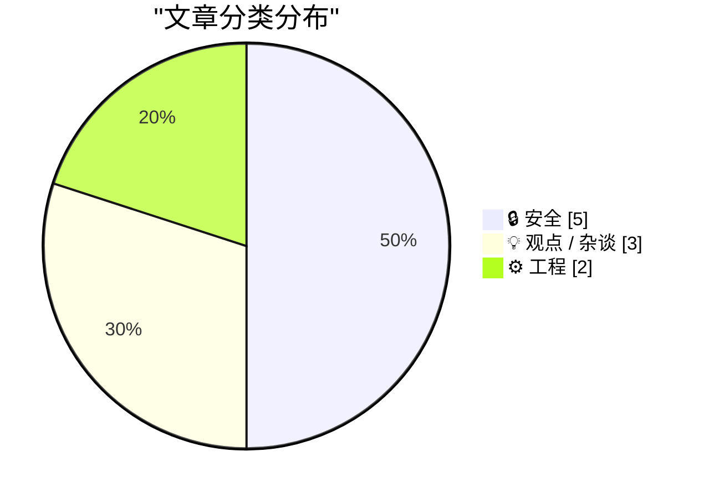
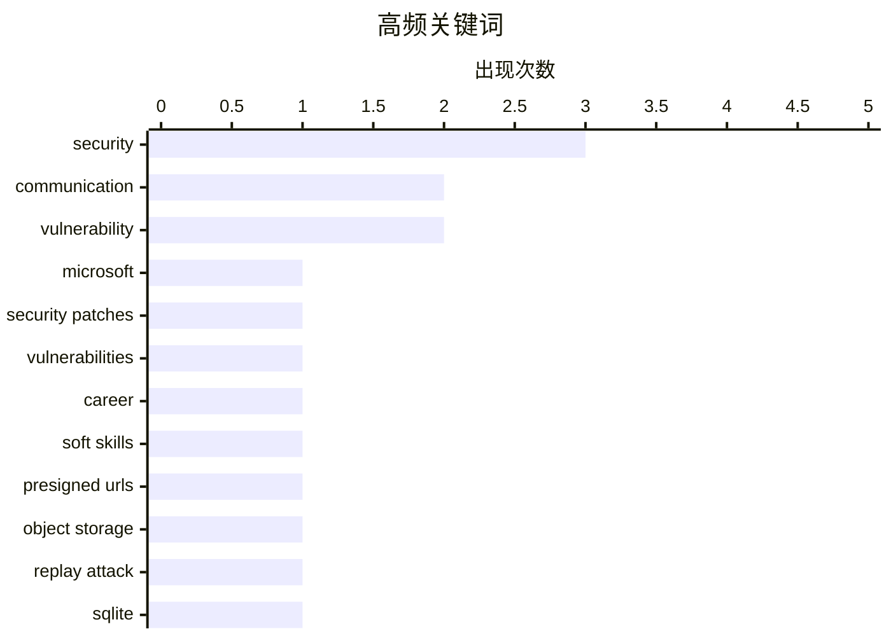

# 📰 AI 博客每日精选 — 2026-07-15

> 来自 Karpathy 推荐的 92 个顶级技术博客，AI 精选 Top 10

## 📝 今日看点

今日技术圈聚焦于两大核心议题。安全领域警报频传，从微软创纪录的漏洞修复到物联网设备与预签名URL的固有风险，凸显了在AI时代与万物互联背景下，安全防护面临前所未有的规模与复杂性挑战。与此同时，软件工程实践呈现回归简约与注重协作的趋势，知名社区成功迁移至轻量级数据库，而关于职场政治的讨论则倡导将影响力构建于有效沟通与跨团队协作之上。

---

## 🏆 今日必读

🥇 **微软创纪录修复570个安全漏洞**

[Microsoft Patches a Record 570 Security Flaws](https://krebsonsecurity.com/2026/07/microsoft-patches-a-record-570-security-flaws/) — krebsonsecurity.com · 5 小时前 · 🔒 安全

> 微软在7月的“补丁星期二”一次性修复了至少570个安全漏洞，数量几乎是上个月破纪录补丁发布的三倍。此次修复的漏洞涉及Windows操作系统及其他软件产品。微软将漏洞数量的激增归因于人工智能辅助的漏洞发现技术。这表明AI正在显著提升安全漏洞的挖掘效率，但也给企业的补丁管理带来了前所未有的压力。

💡 **为什么值得读**: 了解AI如何重塑漏洞发现格局，以及企业面临的最新安全补丁管理挑战。

🏷️ Microsoft, security patches, vulnerabilities

🥈 **对软件工程师而言，“玩转职场政治”意味着什么？**

[What does "playing politics" mean for software engineers?](https://seangoedecke.com/playing-politics/) — seangoedecke.com · 1 天前 · 💡 观点 / 杂谈

> 文章旨在澄清软件工程师对“玩转职场政治”的普遍误解，指出其并非《权力的游戏》式的权谋斗争。真正的“职场政治”是关于有效沟通、理解组织决策流程、建立信任和影响力，以推动项目和技术决策。它涉及跨团队协作、管理利益相关者期望，以及在复杂组织中为好的技术方案争取资源和支持。核心观点是，掌握建设性的“政治”技能是工程师推动变革和实现职业发展的关键，而非勾心斗角。

💡 **为什么值得读**: 为技术从业者提供一套务实、建设性的框架，将“职场政治”转化为推动工作和职业发展的有效工具。

🏷️ career, soft skills, communication

🥉 **预签名URL本质上是一种安全漏洞**

[Presigned URLs are technically a security vuln](https://www.tigrisdata.com/blog/presigned-urls-security-vuln/) — xeiaso.net · 1 天前 · 🔒 安全

> 文章提出一个鲜明观点：预签名URL本质上是一种“有意为之的重放攻击”。它指出，像Tigris和所有主流对象存储系统都将可重放的身份验证令牌（即预签名URL）作为一等特性提供。作者承认重放攻击确实是真实问题，而传统的修复方案（如短期令牌）体验很差。结论是，预签名URL是将一个安全弱点（重放攻击）转化为实用功能的典型案例，是在安全性与易用性之间做出的权衡。

💡 **为什么值得读**: 以颠覆性的视角重新审视一个被广泛使用的云存储特性，引发对安全与便利性根本权衡的思考。

🏷️ presigned URLs, security, object storage, replay attack

---

## 📊 数据概览

| 扫描源 | 抓取文章 | 时间范围 | 精选 |
|:---:|:---:|:---:|:---:|
| 76/92 | 2378 篇 → 31 篇 | 48h | **10 篇** |

### 分类分布



### 高频关键词



<details>
<summary>📈 纯文本关键词图（终端友好）</summary>

```
security         │ ████████████████████ 3
communication    │ █████████████░░░░░░░ 2
vulnerability    │ █████████████░░░░░░░ 2
microsoft        │ ███████░░░░░░░░░░░░░ 1
security patches │ ███████░░░░░░░░░░░░░ 1
vulnerabilities  │ ███████░░░░░░░░░░░░░ 1
career           │ ███████░░░░░░░░░░░░░ 1
soft skills      │ ███████░░░░░░░░░░░░░ 1
presigned urls   │ ███████░░░░░░░░░░░░░ 1
object storage   │ ███████░░░░░░░░░░░░░ 1
```

</details>

### 🏷️ 话题标签

**security**(3) · **communication**(2) · **vulnerability**(2) · microsoft(1) · security patches(1) · vulnerabilities(1) · career(1) · soft skills(1) · presigned urls(1) · object storage(1) · replay attack(1) · sqlite(1) · database(1) · migration(1) · iot(1) · smart-home(1) · software engineering(1) · project management(1) · iot security(1) · smart appliances(1)

---

## 🔒 安全

### 1. 微软创纪录修复570个安全漏洞

[Microsoft Patches a Record 570 Security Flaws](https://krebsonsecurity.com/2026/07/microsoft-patches-a-record-570-security-flaws/) — **krebsonsecurity.com** · 5 小时前 · ⭐ 27/30

> 微软在7月的“补丁星期二”一次性修复了至少570个安全漏洞，数量几乎是上个月破纪录补丁发布的三倍。此次修复的漏洞涉及Windows操作系统及其他软件产品。微软将漏洞数量的激增归因于人工智能辅助的漏洞发现技术。这表明AI正在显著提升安全漏洞的挖掘效率，但也给企业的补丁管理带来了前所未有的压力。

🏷️ Microsoft, security patches, vulnerabilities

---

### 2. 预签名URL本质上是一种安全漏洞

[Presigned URLs are technically a security vuln](https://www.tigrisdata.com/blog/presigned-urls-security-vuln/) — **xeiaso.net** · 1 天前 · ⭐ 25/30

> 文章提出一个鲜明观点：预签名URL本质上是一种“有意为之的重放攻击”。它指出，像Tigris和所有主流对象存储系统都将可重放的身份验证令牌（即预签名URL）作为一等特性提供。作者承认重放攻击确实是真实问题，而传统的修复方案（如短期令牌）体验很差。结论是，预签名URL是将一个安全弱点（重放攻击）转化为实用功能的典型案例，是在安全性与易用性之间做出的权衡。

🏷️ presigned URLs, security, object storage, replay attack

---

### 3. 每周更新512：物联网门锁的失效窘境

[Weekly Update 512: IoT Lockout Fail](https://www.troyhunt.com/weekly-update-512/) — **troyhunt.com** · 37 分钟前 · ⭐ 24/30

> 作者Troy Hunt分享了一次因物联网智能门锁电池耗尽而被锁在家门外的亲身经历。在长途旅行33小时后，他在深夜发现门锁因电量耗尽完全失效。这一事件暴露了物联网设备在可靠性上的致命缺陷：其核心功能（如开锁）依赖于持续电力，一旦断电将导致灾难性后果。文章以此为例，对智能家居设备的实际可用性和风险提出了尖锐质疑。

🏷️ IoT, security, smart-home, vulnerability

---

### 4. 你最好检查一下你的智能家电

[You should probably check on your smart appliances](https://xeiaso.net/notes/2026/check-your-smart-tv/) — **xeiaso.net** · 1 天前 · ⭐ 22/30

> 文章以一句玩笑式的TL;DR（“你的冰箱在运行恶意软件吗？如果是，你最好抓住它！”）作为核心警示。它提醒用户关注智能电视、冰箱等联网家电可能存在的安全风险。这些设备通常安全更新支持周期短，甚至从未更新，容易成为恶意软件的攻击目标或僵尸网络的一部分。作者呼吁用户应定期检查并关注智能设备的安全状态。

🏷️ IoT security, smart appliances, malware

---

### 5. 红色代码蠕虫：2001年7月13日

[Code Red worm, July 13, 2001](https://dfarq.homeip.net/code-red-worm-july-13-2001/?utm_source=rss&#038;utm_medium=rss&#038;utm_campaign=code-red-worm-july-13-2001) — **dfarq.homeip.net** · 1 天前 · ⭐ 18/30

> 文章回顾了2001年7月13日爆发的“红色代码”计算机蠕虫。该蠕虫利用了微软IIS服务器中的一个缓冲区溢出漏洞，这是早期最臭名昭著的微软漏洞之一。“红色代码”被认为是首次针对企业网络的大规模混合威胁攻击，影响极为广泛。它标志着网络攻击从个人电脑转向关键企业基础设施的一个重要转折点，对后来的网络安全态势产生了深远影响。

🏷️ Code Red, computer worm, cybersecurity history, vulnerability

---

## 💡 观点 / 杂谈

### 6. 对软件工程师而言，“玩转职场政治”意味着什么？

[What does "playing politics" mean for software engineers?](https://seangoedecke.com/playing-politics/) — **seangoedecke.com** · 1 天前 · ⭐ 25/30

> 文章旨在澄清软件工程师对“玩转职场政治”的普遍误解，指出其并非《权力的游戏》式的权谋斗争。真正的“职场政治”是关于有效沟通、理解组织决策流程、建立信任和影响力，以推动项目和技术决策。它涉及跨团队协作、管理利益相关者期望，以及在复杂组织中为好的技术方案争取资源和支持。核心观点是，掌握建设性的“政治”技能是工程师推动变革和实现职业发展的关键，而非勾心斗角。

🏷️ career, soft skills, communication

---

### 7. 引用Armin Ronacher的观点

[Quoting Armin Ronacher](https://simonwillison.net/2026/Jul/14/armin-ronacher/#atom-everything) — **simonwillison.net** · 7 小时前 · ⭐ 23/30

> 文章引用了Armin Ronacher关于软件项目“共同语言”的核心观点。他指出，一个软件项目的共同语言不是英语或编程语言，而是对其概念、边界、重要不变性、所有权和系统形态的共同理解。这种语言很少被完整记录，它分散在文档、代码、代码评审、对话、争论以及解释系统的经验中。Ronacher强调，建立和维护这种“共同语言”是项目健康和发展的基石，其重要性远超具体的代码语法。

🏷️ software engineering, communication, project management

---

### 8. 分布差异的直观理解

[Intuition for distribution differences](https://entropicthoughts.com/distribution-differences) — **entropicthoughts.com** · 1 天前 · ⭐ 18/30

> 文章通过一个假设情境（一个国家为每个人分配一个“分数”）来探讨如何直观理解两个群体之间的分布差异。作者虽然未透露“分数”的具体含义，但指出数据来自政府机构的人口层面收集。核心内容是展示并比较“我国人口”与另一个未指明群体的分数分布图。目的是教会读者如何超越简单的平均值比较，通过观察分布形状（如偏度、峰度、重叠区域）来获得更深刻的洞察。

🏷️ data analysis, statistics, distribution

---

## ⚙️ 工程

### 9. 技术社区网站lobste.rs现已运行在SQLite上

[lobste.rs is now running on SQLite](https://simonwillison.net/2026/Jul/14/lobsters-sqlite/#atom-everything) — **simonwillison.net** · 5 小时前 · ⭐ 24/30

> 技术社区网站Lobsters成功将其数据库从MariaDB迁移至SQLite。该迁移计划始于2018年，最初目标是PostgreSQL，但团队在去年决定评估SQLite。迁移成功证明了SQLite能够支撑一个活跃的、生产级别的Web社区平台。这一案例挑战了“SQLite仅适用于小型应用”的传统观念，展示了其在高并发Web场景下的可行性。

🏷️ SQLite, database, migration

---

### 10. 为什么我们不把整个栈都用守护页（Guard Pages）来构建？

[Why don’t we just make the entire stack out of guard pages?](https://devblogs.microsoft.com/oldnewthing/20260713-00/?p=112528) — **devblogs.microsoft.com/oldnewthing** · 1 天前 · ⭐ 19/30

> 文章探讨了一个看似极端的想法：用守护页（一种用于检测内存越界访问的特殊内存页）来构建整个软件栈是否可行。这源于对内存安全性的终极追求。然而，作者从The Old New Thing博客的角度，预计会深入分析这种方案在性能、内存消耗和实际效用上的巨大代价。核心论点可能是，虽然守护页是有效的安全工具，但将其普遍化会带来不可接受的开销，工程上需要更平衡的解决方案。

🏷️ memory, guard pages, operating systems, security

---

*生成于 2026-07-15 01:12 | 扫描 76 源 → 获取 2378 篇 → 精选 10 篇*
*基于 [Hacker News Popularity Contest 2025](https://refactoringenglish.com/tools/hn-popularity/) RSS 源列表，由 [Andrej Karpathy](https://x.com/karpathy) 推荐*
*由「懂点儿AI」制作，欢迎关注同名微信公众号获取更多 AI 实用技巧 💡*
