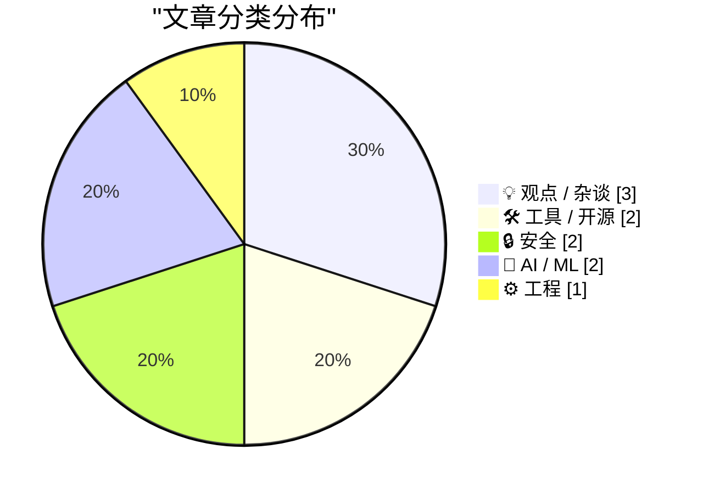
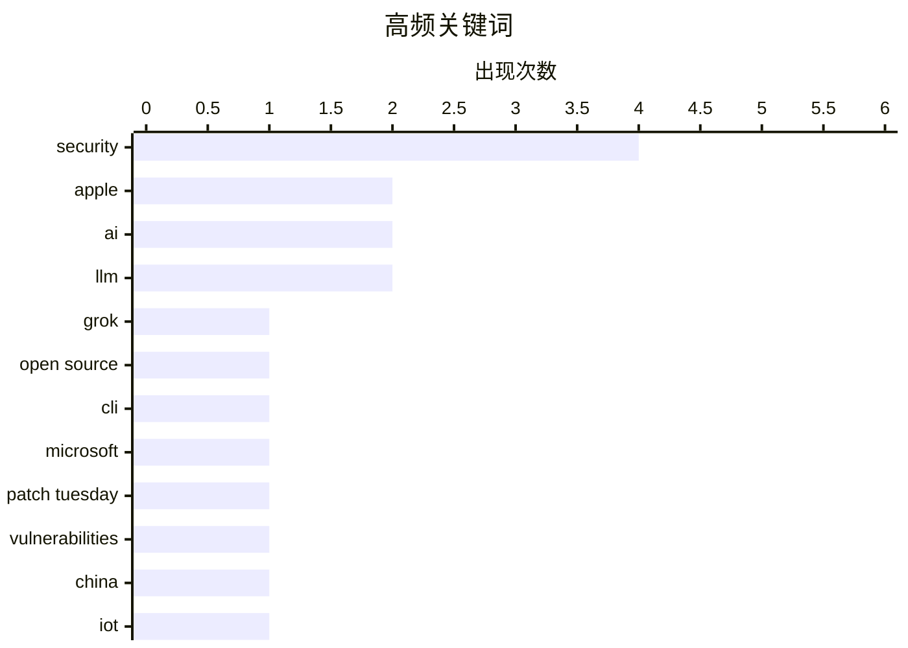

# 📰 AI 博客每日精选 — 2026-07-16

> 来自 Karpathy 推荐的 92 个顶级技术博客，AI 精选 Top 10

## 📝 今日看点

今日技术圈聚焦于安全与人工智能两大核心议题。一方面，从微软创纪录的漏洞修复到AI工具的数据泄露风险，安全警钟再次敲响；另一方面，AI领域则呈现市场狂热与本土化落地并存的态势，既有对行业泡沫的冷静审视，也有苹果AI服务借道中国模型入华的务实进展。同时，对物联网设备可靠性的反思，也揭示了技术深度融入生活后带来的新型风险。

---

## 🏆 今日必读

🥇 **xAI的Grok构建工具现已开源**

[xai-org/grok-build, now open source](https://simonwillison.net/2026/Jul/15/grok-build/#atom-everything) — simonwillison.net · 1 小时前 · 🛠 工具 / 开源

> xAI的`grok` CLI工具因存在严重数据泄露风险而引发社区强烈反对。该工具在运行时，会将其所在目录的完整内容（包括SSH密钥、密码管理器数据等敏感文件）上传至xAI的Google Cloud存储桶。这一设计缺陷暴露了巨大的安全隐患，迫使xAI将该项目开源以应对危机。事件凸显了AI工具在权限和数据安全设计上的严重疏忽。

💡 **为什么值得读**: 该事件是AI工具安全设计失误的典型案例，对开发者和安全从业者具有重要的警示意义。

🏷️ Grok, open source, security, CLI

🥈 **微软修复创纪录的570个安全漏洞**

[Microsoft Patches a Record 570 Security Flaws](https://krebsonsecurity.com/2026/07/microsoft-patches-a-record-570-security-flaws/) — krebsonsecurity.com · 1 天前 · 🔒 安全

> 微软在7月的“补丁星期二”修复了其软件产品中至少570个安全漏洞，数量几乎是上月创纪录补丁数量的三倍。此次修复的漏洞涉及Windows操作系统及其他广泛使用的软件。微软将漏洞数量的激增归因于人工智能技术辅助的漏洞发现效率提升。这反映了当前软件安全面临日益严峻的自动化攻击挑战。

💡 **为什么值得读**: 了解当前软件安全漏洞的规模、趋势以及AI在攻防两端的影响，对IT管理者和安全专家至关重要。

🏷️ Microsoft, Patch Tuesday, vulnerabilities, security

🥉 **苹果智能（Apple Intelligence）获准在中国推出，采用百度与阿里巴巴的AI模型**

[Apple Intelligence OK’d to Launch in China, Using AI Models from Baidu and Alibaba](https://www.scmp.com/tech/policy/article/3360685/china-approves-apple-intelligence-phones-alibaba-baidu-emerging-partners) — daringfireball.net · 2 小时前 · 🤖 AI / ML

> 中国监管部门已批准苹果在中国大陆的iPhone上推出其AI服务“苹果智能（Apple Intelligence）”。该服务将通过与本土科技巨头百度和阿里巴巴合作，使用后者的AI模型来提供邮件摘要、报告起草、图片编辑等功能。此举是苹果为遵守中国数据本地化和内容监管法规而采取的关键合规措施。这意味着中国用户将使用由本土合作伙伴驱动的“苹果智能”服务。

💡 **为什么值得读**: 此事件揭示了全球科技巨头在中国市场运营时，在技术、合规与地缘政治之间必须做出的关键权衡。

🏷️ Apple, AI, China, LLM

---

## 📊 数据概览

| 扫描源 | 抓取文章 | 时间范围 | 精选 |
|:---:|:---:|:---:|:---:|
| 78/92 | 2069 篇 → 26 篇 | 48h | **10 篇** |

### 分类分布



### 高频关键词



<details>
<summary>📈 纯文本关键词图（终端友好）</summary>

```
security        │ ████████████████████ 4
apple           │ ██████████░░░░░░░░░░ 2
ai              │ ██████████░░░░░░░░░░ 2
llm             │ ██████████░░░░░░░░░░ 2
grok            │ █████░░░░░░░░░░░░░░░ 1
open source     │ █████░░░░░░░░░░░░░░░ 1
cli             │ █████░░░░░░░░░░░░░░░ 1
microsoft       │ █████░░░░░░░░░░░░░░░ 1
patch tuesday   │ █████░░░░░░░░░░░░░░░ 1
vulnerabilities │ █████░░░░░░░░░░░░░░░ 1
```

</details>

### 🏷️ 话题标签

**security**(4) · **apple**(2) · **ai**(2) · llm(2) · grok(1) · open source(1) · cli(1) · microsoft(1) · patch tuesday(1) · vulnerabilities(1) · china(1) · iot(1) · smart home(1) · failure(1) · prompt injection(1) · claude(1) · openai(1) · bubble(1) · industry(1) · advertising(1)

---

## 💡 观点 / 杂谈

### 1. OpenAI泡沫

[The OpenAI Bubble](https://www.wheresyoured.at/the-openai-bubble/) — **wheresyoured.at** · 8 小时前 · ⭐ 24/30

> 本文探讨了当前围绕OpenAI及其引领的生成式AI浪潮可能存在的市场过热与“泡沫”现象。作者分析了高估值、巨额投资与尚未完全清晰的商业化路径之间的反差。文章旨在引发读者对AI行业当前发展阶段进行批判性思考，质疑其可持续性。核心观点是提醒人们警惕技术狂热中可能滋生的非理性繁荣。

🏷️ OpenAI, bubble, AI, industry

---

### 2. Eric Seufert：苹果是否暗示将扩展第三方广告业务？

[Eric Seufert: ‘Did Apple Just Signal a Third-Party Expansion of Apple Ads?’](https://mobiledevmemo.com/did-apple-just-signal-a-third-party-expansion-of-apple-ads/) — **daringfireball.net** · 2 小时前 · ⭐ 23/30

> 分析师Eric Seufert解读了苹果服务条款中新增的“其他资产”这一宽泛表述。他认为，这可能是苹果计划将其广告网络（Apple Ads）大幅扩张至自有生态系统（如App Store、Apple News）之外的信号。新的条款语言为苹果在第三方网站、应用乃至设备上投放广告提供了合同依据。此举若成真，将显著扩大苹果的广告业务规模，并可能重塑移动广告格局。

🏷️ Apple, Advertising, Policy, Analysis

---

### 3. 他们更喜欢应用（App）

[They Prefer the App](https://idiallo.com/blog/they-prefer-the-app) — **idiallo.com** · 1 天前 · ⭐ 18/30

> 作者对比了网站（Web）与原生移动应用（App）在开发与用户体验上的差异。文章指出，许多功能简单的信息展示类应用（如学校应用）完全可以用网站替代，且网站具有开发维护更简单、跨平台、无需安装等优势。然而，用户和市场却普遍表现出对“应用”形式的强烈偏好，即使这有时并不符合技术效率最优的原则。这反映了用户习惯、平台生态和市场认知对技术形态选择的深刻影响。

🏷️ Web, Apps, Development, Trends

---

## 🛠 工具 / 开源

### 4. xAI的Grok构建工具现已开源

[xai-org/grok-build, now open source](https://simonwillison.net/2026/Jul/15/grok-build/#atom-everything) — **simonwillison.net** · 1 小时前 · ⭐ 25/30

> xAI的`grok` CLI工具因存在严重数据泄露风险而引发社区强烈反对。该工具在运行时，会将其所在目录的完整内容（包括SSH密钥、密码管理器数据等敏感文件）上传至xAI的Google Cloud存储桶。这一设计缺陷暴露了巨大的安全隐患，迫使xAI将该项目开源以应对危机。事件凸显了AI工具在权限和数据安全设计上的严重疏忽。

🏷️ Grok, open source, security, CLI

---

### 5. 我是一个USB-C极端拥护者

[I'm a USB-C Maximalist](https://shkspr.mobi/blog/2026/07/im-a-usb-c-maximalist/) — **shkspr.mobi** · 1 天前 · ⭐ 18/30

> 作者通过一次为期7周的欧洲旅行经历，阐述了全面采用USB-C接口带来的巨大便利。旅行中，他仅靠一个多功能充电头，就通过其USB-C PD（电力传输）端口为手机、笔记本电脑等多种设备快速充电。文章盛赞USB-C在统一充电标准、减少线缆负担、支持高功率快充方面的优势。作者认为，全面转向USB-C是提升数字生活便携性和简洁性的关键一步。

🏷️ USB-C, Charging, Travel, Gadgets

---

## 🔒 安全

### 6. 微软修复创纪录的570个安全漏洞

[Microsoft Patches a Record 570 Security Flaws](https://krebsonsecurity.com/2026/07/microsoft-patches-a-record-570-security-flaws/) — **krebsonsecurity.com** · 1 天前 · ⭐ 25/30

> 微软在7月的“补丁星期二”修复了其软件产品中至少570个安全漏洞，数量几乎是上月创纪录补丁数量的三倍。此次修复的漏洞涉及Windows操作系统及其他广泛使用的软件。微软将漏洞数量的激增归因于人工智能技术辅助的漏洞发现效率提升。这反映了当前软件安全面临日益严峻的自动化攻击挑战。

🏷️ Microsoft, Patch Tuesday, vulnerabilities, security

---

### 7. 周报512：物联网门锁的锁定故障

[Weekly Update 512: IoT Lockout Fail](https://www.troyhunt.com/weekly-update-512/) — **troyhunt.com** · 1 天前 · ⭐ 25/30

> 作者分享了一次因物联网（IoT）智能门锁故障导致的糟糕个人经历。在长途旅行33小时后回到家，发现智能门锁因电池耗尽而无法开启，使其被锁在自家门外。这一事件引发了对智能家居设备可靠性和依赖风险的深刻反思。它尖锐地指出，过度依赖联网设备可能在关键时刻带来反效果。

🏷️ IoT, security, smart home, failure

---

## 🤖 AI / ML

### 8. 苹果智能（Apple Intelligence）获准在中国推出，采用百度与阿里巴巴的AI模型

[Apple Intelligence OK’d to Launch in China, Using AI Models from Baidu and Alibaba](https://www.scmp.com/tech/policy/article/3360685/china-approves-apple-intelligence-phones-alibaba-baidu-emerging-partners) — **daringfireball.net** · 2 小时前 · ⭐ 25/30

> 中国监管部门已批准苹果在中国大陆的iPhone上推出其AI服务“苹果智能（Apple Intelligence）”。该服务将通过与本土科技巨头百度和阿里巴巴合作，使用后者的AI模型来提供邮件摘要、报告起草、图片编辑等功能。此举是苹果为遵守中国数据本地化和内容监管法规而采取的关键合规措施。这意味着中国用户将使用由本土合作伙伴驱动的“苹果智能”服务。

🏷️ Apple, AI, China, LLM

---

### 9. 我是如何诱骗Claude泄露你最深层、最黑暗的秘密的

[How I tricked Claude into leaking your deepest, darkest secrets](https://simonwillison.net/2026/Jul/15/claude-web-fetch-exfiltration/#atom-everything) — **simonwillison.net** · 10 小时前 · ⭐ 24/30

> 文章披露了Anthropic的Claude AI模型中`web_fetch`工具存在的一个数据外泄攻击漏洞。尽管该工具在设计上旨在防止此类攻击，但研究者Ayush Paul发现并利用了一种巧妙的方法绕过了其安全机制。攻击的核心在于诱使Claude通过`web_fetch`工具将本应保密的对话上下文或系统提示发送到攻击者控制的服务器。这暴露了当前大语言模型在工具调用安全边界上仍存在被突破的风险。

🏷️ LLM, security, prompt injection, Claude

---

## ⚙️ 工程

### 10. 傅里叶变换笔记

[Notes on the Fourier Transform](https://eli.thegreenplace.net/2026/notes-on-the-fourier-transform/) — **eli.thegreenplace.net** · 22 小时前 · ⭐ 23/30

> 这是一篇关于傅里叶变换的技术讲解文章。文章从傅里叶级数分析周期函数入手，引出其对非周期函数分析的局限性。核心内容是阐述傅里叶变换如何通过积分将时域信号转换到频域，从而分析任意函数的频率成分。文中可能涉及连续傅里叶变换（CTFT）的数学定义、性质及其与傅里叶级数的联系。目的是为读者建立从傅里叶级数到傅里叶变换的清晰概念过渡。

🏷️ Fourier, Transform, math, signal

---

*生成于 2026-07-16 01:06 | 扫描 78 源 → 获取 2069 篇 → 精选 10 篇*
*基于 [Hacker News Popularity Contest 2025](https://refactoringenglish.com/tools/hn-popularity/) RSS 源列表，由 [Andrej Karpathy](https://x.com/karpathy) 推荐*
*由「懂点儿AI」制作，欢迎关注同名微信公众号获取更多 AI 实用技巧 💡*
