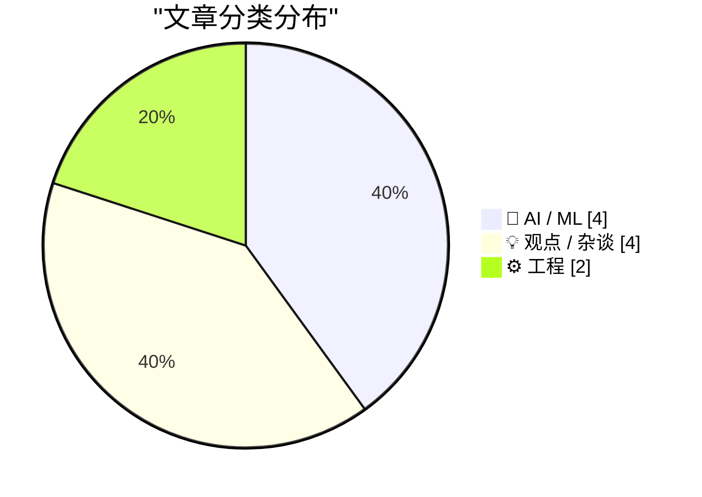
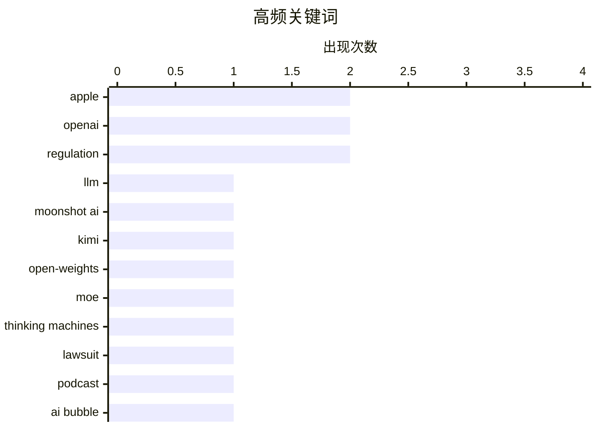

# 📰 AI 博客每日精选 — 2026-07-17

> 来自 Karpathy 推荐的 92 个顶级技术博客，AI 精选 Top 10

## 📝 今日看点

今日技术圈聚焦于AI领域的激烈竞争与战略调整。一方面，大模型军备竞赛持续升级，国内外厂商相继发布万亿参数级别的开源模型，推动技术边界与可及性。另一方面，巨头生态博弈加剧，苹果通过本土化合作进军中国市场，而OpenAI则面临法律与市场泡沫化的双重审视。此外，工程师文化中关于系统冗余与复杂性的反思，也提示着技术发展需兼顾简洁与可控。

---

## 🏆 今日必读

🥇 **Kimi K3 模型发布，以及我们仍能从“鹈鹕”基准测试中学到什么**

[Kimi K3, and what we can still learn from the pelican benchmark](https://simonwillison.net/2026/Jul/16/kimi-k3/#atom-everything) — simonwillison.net · 4 小时前 · 🤖 AI / ML

> Moonshot AI 发布了迄今为止能力最强的 Kimi K3 模型，参数量达 2.8 万亿。该模型被宣称为首个“开源的 3T 级别模型”，计划在 2026 年 7 月 27 日前发布开源权重。文章通过对比 DeepSeek 等模型，探讨了“鹈鹕”基准测试在评估超大规模模型时可能面临的挑战。作者认为，随着模型规模突破万亿参数，传统的基准测试方法可能需要更新。

💡 **为什么值得读**: 本文不仅介绍了最新的万亿参数开源模型，还深入探讨了当前大模型评估体系的局限性，对关注 AI 前沿进展和基准测试的读者具有启发意义。

🏷️ LLM, Moonshot AI, Kimi

🥈 **Inkling：我们的开源权重模型**

[Inkling: Our open-weights model](https://simonwillison.net/2026/Jul/16/inkling/#atom-everything) — simonwillison.net · 9 小时前 · 🤖 AI / ML

> Thinking Machines Lab 发布了其首个开源权重模型 Inkling。这是一个采用 Apache-2.0 许可证的多模态混合专家模型，总参数量为 9750 亿，激活参数量为 410 亿，在 45 万亿个包含文本、图像、音频和视频的令牌上训练而成。团队还预告了正在测试中的更小版本 Inkling-Small。该发布标志着又一个重量级多模态模型加入开源阵营。

💡 **为什么值得读**: 了解这个由 Mira Murati 团队推出的、规模庞大且完全开源的多模态模型，对于追踪开源 AI 生态的最新竞争格局至关重要。

🏷️ open-weights, MoE, Thinking Machines

🥉 **Dithering 播客：‘苹果起诉 OpenAI’**

[Dithering: ‘Apple Sues OpenAI’](https://dithering.passport.online/member/episode/apple-sues-open-ai) — daringfireball.net · 1 小时前 · 💡 观点 / 杂谈

> 本期 Dithering 播客免费公开讨论了苹果公司起诉 OpenAI 这一事件。主播提供了与主流观点不同的独特见解。播客通常为每周两期、每期15分钟的付费内容，此次将单集解除了付费墙。文章暗示了对该法律纠纷的深度分析。

💡 **为什么值得读**: 如果你想获得关于苹果与 OpenAI 这场重磅法律纠纷的独家、深入分析，这期播客提供了不同于普遍报道的视角。

🏷️ Apple, OpenAI, lawsuit, podcast

---

## 📊 数据概览

| 扫描源 | 抓取文章 | 时间范围 | 精选 |
|:---:|:---:|:---:|:---:|
| 76/92 | 2030 篇 → 30 篇 | 48h | **10 篇** |

### 分类分布



### 高频关键词



<details>
<summary>📈 纯文本关键词图（终端友好）</summary>

```
apple             │ ████████████████████ 2
openai            │ ████████████████████ 2
regulation        │ ████████████████████ 2
llm               │ ██████████░░░░░░░░░░ 1
moonshot ai       │ ██████████░░░░░░░░░░ 1
kimi              │ ██████████░░░░░░░░░░ 1
open-weights      │ ██████████░░░░░░░░░░ 1
moe               │ ██████████░░░░░░░░░░ 1
thinking machines │ ██████████░░░░░░░░░░ 1
lawsuit           │ ██████████░░░░░░░░░░ 1
```

</details>

### 🏷️ 话题标签

**apple**(2) · **openai**(2) · **regulation**(2) · llm(1) · moonshot ai(1) · kimi(1) · open-weights(1) · moe(1) · thinking machines(1) · lawsuit(1) · podcast(1) · ai bubble(1) · investment(1) · ai(1) · china(1) · regulations(1) · legacy(1) · systems(1) · complexity(1) · maintenance(1)

---

## 🤖 AI / ML

### 1. Kimi K3 模型发布，以及我们仍能从“鹈鹕”基准测试中学到什么

[Kimi K3, and what we can still learn from the pelican benchmark](https://simonwillison.net/2026/Jul/16/kimi-k3/#atom-everything) — **simonwillison.net** · 4 小时前 · ⭐ 25/30

> Moonshot AI 发布了迄今为止能力最强的 Kimi K3 模型，参数量达 2.8 万亿。该模型被宣称为首个“开源的 3T 级别模型”，计划在 2026 年 7 月 27 日前发布开源权重。文章通过对比 DeepSeek 等模型，探讨了“鹈鹕”基准测试在评估超大规模模型时可能面临的挑战。作者认为，随着模型规模突破万亿参数，传统的基准测试方法可能需要更新。

🏷️ LLM, Moonshot AI, Kimi

---

### 2. Inkling：我们的开源权重模型

[Inkling: Our open-weights model](https://simonwillison.net/2026/Jul/16/inkling/#atom-everything) — **simonwillison.net** · 9 小时前 · ⭐ 25/30

> Thinking Machines Lab 发布了其首个开源权重模型 Inkling。这是一个采用 Apache-2.0 许可证的多模态混合专家模型，总参数量为 9750 亿，激活参数量为 410 亿，在 45 万亿个包含文本、图像、音频和视频的令牌上训练而成。团队还预告了正在测试中的更小版本 Inkling-Small。该发布标志着又一个重量级多模态模型加入开源阵营。

🏷️ open-weights, MoE, Thinking Machines

---

### 3. OpenAI 泡沫

[The OpenAI Bubble](https://www.wheresyoured.at/the-openai-bubble/) — **wheresyoured.at** · 1 天前 · ⭐ 24/30

> 这是一篇来自付费通讯《Where’s Your Ed At》的免费文章。作者预告本周将休假，因此周五不会有付费内容更新。文章标题暗示其内容可能探讨 OpenAI 或其相关生态是否存在估值或发展过热的风险。

🏷️ OpenAI, AI bubble, investment

---

### 4. 苹果智能（Apple Intelligence）获准在中国推出，将使用百度和阿里巴巴的 AI 模型

[Apple Intelligence OK’d to Launch in China, Using AI Models from Baidu and Alibaba](https://www.scmp.com/tech/policy/article/3360685/china-approves-apple-intelligence-phones-alibaba-baidu-emerging-partners) — **daringfireball.net** · 1 天前 · ⭐ 23/30

> 中国网信办已批准苹果在中国大陆的 iPhone 上推出其 AI 服务“苹果智能”。苹果将与中国本土科技公司百度和阿里巴巴集团合作，由后者提供底层 AI 模型技术支持。该服务包括邮件摘要、报告起草、图像编辑等生成式 AI 功能。此举解决了苹果在中国面临的数据合规与模型落地难题。

🏷️ Apple, AI, China, regulations

---

## 💡 观点 / 杂谈

### 5. Dithering 播客：‘苹果起诉 OpenAI’

[Dithering: ‘Apple Sues OpenAI’](https://dithering.passport.online/member/episode/apple-sues-open-ai) — **daringfireball.net** · 1 小时前 · ⭐ 24/30

> 本期 Dithering 播客免费公开讨论了苹果公司起诉 OpenAI 这一事件。主播提供了与主流观点不同的独特见解。播客通常为每周两期、每期15分钟的付费内容，此次将单集解除了付费墙。文章暗示了对该法律纠纷的深度分析。

🏷️ Apple, OpenAI, lawsuit, podcast

---

### 6. 多元化：疯狂的亿万富翁及其综合征（2026年7月16日）

[Pluralistic: Deranged billionaires and their syndromes (16 Jul 2026)](https://pluralistic.net/2026/07/16/lucky-orifices/) — **pluralistic.net** · 6 小时前 · ⭐ 19/30

> 本期通讯链接集的主题是“疯狂的亿万富翁及其综合征”，讽刺了所谓“疯狂之王”们偏爱的推理逻辑。内容包含多个领域的简短评论，涉及《宝可梦GO》与强制仲裁、特朗普的竞选、公共利益互联网、科技回忆录《接近机器》等多元话题。文末还列出了作者近期的公开活动安排和著作信息。

🏷️ tech industry, billionaires, regulation

---

### 7. 让信息亭回归

[Bring Back The Kiosk](https://feed.tedium.co/link/15204/17381035/edos-disk-copying-system-history) — **tedium.co** · 1 天前 · ⭐ 17/30

> 在索尼主导实体游戏市场、《侠盗猎车手6》完全放弃光盘的当下，文章怀念起一种曾经在英国真实存在的商业模式：能够按需刻录光盘的信息亭。这种模式解决了物理媒介的即时生产和分发问题。

🏷️ physical media, gaming, distribution

---

### 8. 法律有多可预测？

[How Predictable Are Laws?](https://www.construction-physics.com/p/how-predictable-are-laws) — **construction-physics.com** · 13 小时前 · ⭐ 16/30

> 文章聚焦于遵守《国家环境政策法》所面临的考验与磨难。NEPA 是一部重要的美国环境法，其合规过程以复杂、耗时和不可预测著称。作者旨在探讨法律条文在实际执行中的确定性问题，以及这种不确定性对项目规划和建设的影响。

🏷️ regulation, policy, NEPA

---

## ⚙️ 工程

### 9. 删除你不理解的系统

[Deleting Systems You Don't Understand](https://idiallo.com/blog/deleting-systems-you-dont-understand) — **idiallo.com** · 18 小时前 · ⭐ 21/30

> 作者通过童年时敢于在珍贵的家庭电脑上安装游戏，而其他人却不敢触碰的往事，引出一个核心观点：我们对今天廉价且充裕的存储空间习以为常。文章进而探讨了在技术环境中，出于敬畏或无知而不敢删除或修改“黑盒”系统的普遍现象。主张对不了解的系统应持有更积极的管理和探索态度。

🏷️ legacy, systems, complexity, maintenance

---

### 10. 傅里叶变换笔记

[Notes on the Fourier Transform](https://eli.thegreenplace.net/2026/notes-on-the-fourier-transform/) — **eli.thegreenplace.net** · 1 天前 · ⭐ 20/30

> 文章探讨如何将用于分析周期函数的傅里叶级数工具，扩展到处理非周期函数。核心在于，对于定义在有限区间上的非周期函数，只要不关心区间外的行为，仍然可以计算其傅里叶级数。这自然引出了对傅里叶变换的讨论，傅里叶变换是处理整个实轴上非周期函数的关键工具。文章配有交互式演示，帮助可视化相关概念。

🏷️ Fourier Transform, signal processing, mathematics

---

*生成于 2026-07-17 01:07 | 扫描 76 源 → 获取 2030 篇 → 精选 10 篇*
*基于 [Hacker News Popularity Contest 2025](https://refactoringenglish.com/tools/hn-popularity/) RSS 源列表，由 [Andrej Karpathy](https://x.com/karpathy) 推荐*
*由「懂点儿AI」制作，欢迎关注同名微信公众号获取更多 AI 实用技巧 💡*
