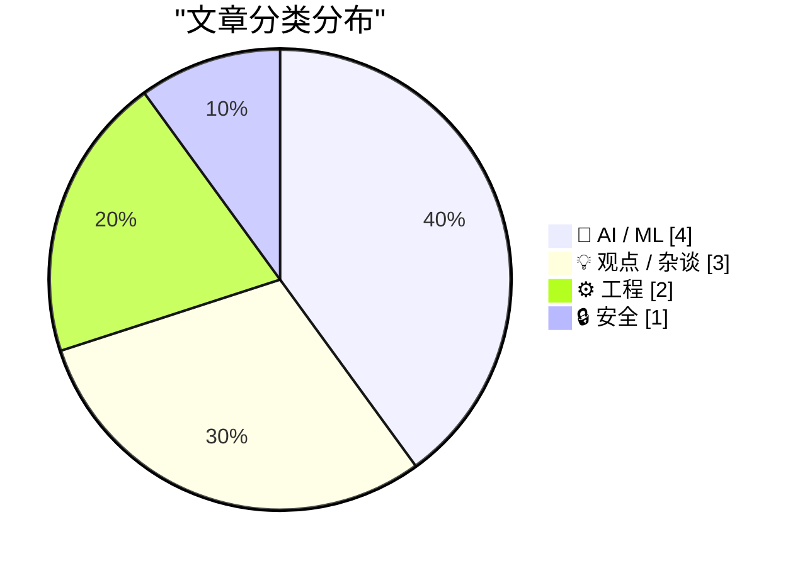
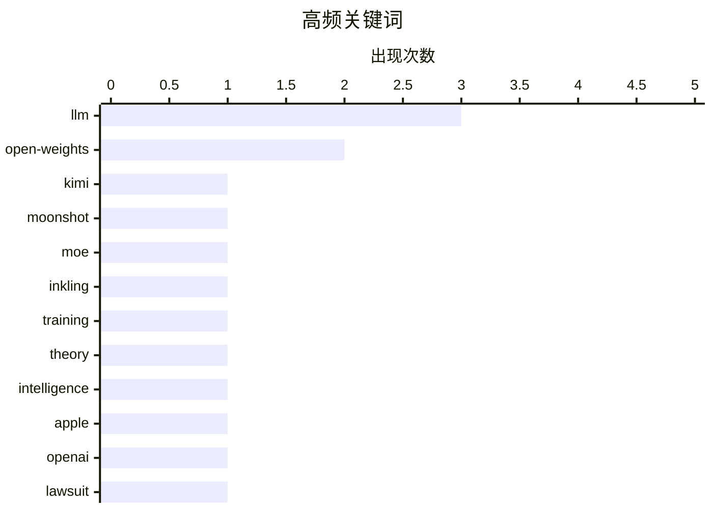

# 📰 AI 博客每日精选 — 2026-07-18

> 来自 Karpathy 推荐的 92 个顶级技术博客，AI 精选 Top 10

## 📝 今日看点

今日技术圈聚焦于人工智能的极限突破与行业反思。大模型军备竞赛持续升级，开源与超大规模成为关键词，同时业界也在深入探讨AI能力的理论边界及其对艺术等人类独特领域的冲击。此外，科技巨头的监管困境与工程师对复杂系统本质的思考，共同勾勒出一个既狂热又自省的技术图景。

---

## 🏆 今日必读

🥇 **Kimi K3 模型发布，以及我们仍能从“鹈鹕”基准测试中学到什么**

[Kimi K3, and what we can still learn from the pelican benchmark](https://simonwillison.net/2026/Jul/16/kimi-k3/#atom-everything) — simonwillison.net · 1 天前 · 🤖 AI / ML

> 月之暗面（Moonshot AI）发布了迄今为止能力最强的模型 Kimi K3，参数量达 2.8 万亿。该模型被宣称为首个“开源的 3T 级别模型”，计划于 2026 年 7 月 27 日前开放权重。文章将 Kimi K3 与 DeepSeek 等其他大型模型进行了对比。作者认为，尽管模型规模不断刷新，但像“鹈鹕”（Pelican）这样设计巧妙的轻量级基准测试，对于评估模型的实际推理和代码能力仍然具有重要价值。

💡 **为什么值得读**: 本文不仅报道了顶级大模型的最新进展，还提供了独特的视角，提醒从业者关注高效、精准的模型评估方法。

🏷️ LLM, Kimi, open-weights, Moonshot

🥈 **Inkling：我们的开源权重模型**

[Inkling: Our open-weights model](https://simonwillison.net/2026/Jul/16/inkling/#atom-everything) — simonwillison.net · 1 天前 · 🤖 AI / ML

> Thinking Machines Lab 发布了其首个开源权重模型 Inkling。这是一个采用 Apache-2.0 许可证的多模态混合专家（MoE）模型，总参数量 9750 亿，激活参数量 410 亿，在 45 万亿 token 的文本、图像、音频和视频数据上训练而成。团队还预告了正在测试中的较小版本 Inkling-Small。该发布标志着在开源大规模多模态模型领域迈出了重要一步，为研究和应用提供了新的强大工具。

💡 **为什么值得读**: 了解这个新发布的、规模庞大且完全开源的多模态模型，对于关注 AI 开源生态和前沿技术的研究者与开发者至关重要。

🏷️ LLM, open-weights, MoE, Inkling

🥉 **过度训练：通往类人 AI 之路**

[Overtraining as the path to human-like AI](https://seangoedecke.com/overtraining-as-the-path-to-human-like-ai/) — seangoedecke.com · 1 小时前 · 🤖 AI / ML

> 文章围绕博主 Gwern 提出的一个激进理论展开，该理论解释了当前大语言模型为何缺乏真正灵活的人类智能。核心论点是，通过远超常规的“过度训练”（overtraining），即投入远超模型参数所需的数据量，模型可能产生“质变”，涌现出更接近人类的推理和泛化能力。这一观点挑战了当前主流的训练数据配比范式，并引用了相关的实验观察作为佐证。作者认为，尽管该理论看似非常规，但因提出者 Gwern 的严谨性而值得认真对待。

💡 **为什么值得读**: 它介绍了一个可能颠覆当前 AI 训练范式的前沿思想，为思考 AI 能力突破提供了全新角度。

🏷️ LLM, training, theory, intelligence

---

## 📊 数据概览

| 扫描源 | 抓取文章 | 时间范围 | 精选 |
|:---:|:---:|:---:|:---:|
| 77/92 | 2060 篇 → 44 篇 | 48h | **10 篇** |

### 分类分布



### 高频关键词



<details>
<summary>📈 纯文本关键词图（终端友好）</summary>

```
llm          │ ████████████████████ 3
open-weights │ █████████████░░░░░░░ 2
kimi         │ ███████░░░░░░░░░░░░░ 1
moonshot     │ ███████░░░░░░░░░░░░░ 1
moe          │ ███████░░░░░░░░░░░░░ 1
inkling      │ ███████░░░░░░░░░░░░░ 1
training     │ ███████░░░░░░░░░░░░░ 1
theory       │ ███████░░░░░░░░░░░░░ 1
intelligence │ ███████░░░░░░░░░░░░░ 1
apple        │ ███████░░░░░░░░░░░░░ 1
```

</details>

### 🏷️ 话题标签

**llm**(3) · **open-weights**(2) · **kimi**(1) · moonshot(1) · moe(1) · inkling(1) · training(1) · theory(1) · intelligence(1) · apple(1) · openai(1) · lawsuit(1) · podcast(1) · google(1) · antitrust(1) · eu(1) · regulation(1) · ai art(1) · ethics(1) · creativity(1)

---

## 🤖 AI / ML

### 1. Kimi K3 模型发布，以及我们仍能从“鹈鹕”基准测试中学到什么

[Kimi K3, and what we can still learn from the pelican benchmark](https://simonwillison.net/2026/Jul/16/kimi-k3/#atom-everything) — **simonwillison.net** · 1 天前 · ⭐ 27/30

> 月之暗面（Moonshot AI）发布了迄今为止能力最强的模型 Kimi K3，参数量达 2.8 万亿。该模型被宣称为首个“开源的 3T 级别模型”，计划于 2026 年 7 月 27 日前开放权重。文章将 Kimi K3 与 DeepSeek 等其他大型模型进行了对比。作者认为，尽管模型规模不断刷新，但像“鹈鹕”（Pelican）这样设计巧妙的轻量级基准测试，对于评估模型的实际推理和代码能力仍然具有重要价值。

🏷️ LLM, Kimi, open-weights, Moonshot

---

### 2. Inkling：我们的开源权重模型

[Inkling: Our open-weights model](https://simonwillison.net/2026/Jul/16/inkling/#atom-everything) — **simonwillison.net** · 1 天前 · ⭐ 27/30

> Thinking Machines Lab 发布了其首个开源权重模型 Inkling。这是一个采用 Apache-2.0 许可证的多模态混合专家（MoE）模型，总参数量 9750 亿，激活参数量 410 亿，在 45 万亿 token 的文本、图像、音频和视频数据上训练而成。团队还预告了正在测试中的较小版本 Inkling-Small。该发布标志着在开源大规模多模态模型领域迈出了重要一步，为研究和应用提供了新的强大工具。

🏷️ LLM, open-weights, MoE, Inkling

---

### 3. 过度训练：通往类人 AI 之路

[Overtraining as the path to human-like AI](https://seangoedecke.com/overtraining-as-the-path-to-human-like-ai/) — **seangoedecke.com** · 1 小时前 · ⭐ 25/30

> 文章围绕博主 Gwern 提出的一个激进理论展开，该理论解释了当前大语言模型为何缺乏真正灵活的人类智能。核心论点是，通过远超常规的“过度训练”（overtraining），即投入远超模型参数所需的数据量，模型可能产生“质变”，涌现出更接近人类的推理和泛化能力。这一观点挑战了当前主流的训练数据配比范式，并引用了相关的实验观察作为佐证。作者认为，尽管该理论看似非常规，但因提出者 Gwern 的严谨性而值得认真对待。

🏷️ LLM, training, theory, intelligence

---

### 4. Dithering 播客：‘苹果起诉 OpenAI’

[Dithering: ‘Apple Sues OpenAI’](https://dithering.passport.online/member/episode/apple-sues-open-ai) — **daringfireball.net** · 1 天前 · ⭐ 24/30

> 本期《Dithering》播客免费开放了关于“苹果起诉 OpenAI”话题的讨论。主持人 John Gruber 提出了一个与主流观点不同的见解。播客通常每周更新两期，每期时长 15 分钟，以观点犀利、信息密度高著称。此免费集为听众提供了一个了解其独特分析风格和内容质量的机会。

🏷️ Apple, OpenAI, lawsuit, podcast

---

## 💡 观点 / 杂谈

### 5. 谷歌用尽上诉途径，必须支付欧盟创纪录的 47 亿美元反垄断罚款

[Google Runs Out of Appeals, Must Pay Record $4.7 Billion EU Antitrust Fine](https://www.cnbc.com/2026/07/02/alphabet-google-android-eu-antitrust-fine-4-1-billion-euro-appeal.html) — **daringfireball.net** · 1 小时前 · ⭐ 23/30

> 欧盟最高法院于 2026 年 7 月 2 日最终维持了对谷歌约 41 亿欧元（合 47 亿美元）的反垄断罚款。这项创纪录的罚款源于欧盟委员会 2018 年的裁定，认定谷歌滥用其在安卓移动操作系统的主导地位，通过与手机制造商的预装协议为其自家应用提供不公平优势。谷歌历经多年上诉，现已用尽所有法律途径。此案标志着欧盟在遏制科技巨头反竞争行为上的一个里程碑式胜利。

🏷️ Google, antitrust, EU, regulation

---

### 6. 艺术无法规模化

[Art Doesn't Scale](https://matduggan.com/art-doesnt-scale/) — **matduggan.com** · 14 小时前 · ⭐ 23/30

> 作者在哥本哈根咖啡馆目睹了一场关于“AI 艺术是否是艺术”的常见争论。文章的核心论点是，艺术的核心价值在于其独特的人类情感、意图和不可复制的创作过程，而这些本质上是无法被算法规模化生产的。AI 可以生成具有美学价值的图像，但这与人类通过艺术进行的表达和沟通存在根本区别。作者最终认为，将 AI 生成物称为“艺术”是对“艺术”一词的稀释。

🏷️ AI art, ethics, creativity, scale

---

### 7.  Pluralistic：疯狂的亿万富翁及其综合征（2026年7月16日）

[Pluralistic: Deranged billionaires and their syndromes (16 Jul 2026)](https://pluralistic.net/2026/07/16/lucky-orifices/) — **pluralistic.net** · 1 天前 · ⭐ 16/30

> 这是博主 Cory Doctorow 每日链接合集“Pluralistic”的目录页。本期主题聚焦于“疯狂的亿万富翁及其综合征”，批判了科技寡头们的逻辑谬误与权力滥用。内容还涵盖了科技政策（如宝可梦GO与强制仲裁）、公共利益互联网、版权争议（猴子自拍照版权案）等多个领域的短评和链接。文章以杂文风格，提供了对当日科技与社会新闻的批判性视角。

🏷️ billionaires, society, critique

---

## ⚙️ 工程

### 8. 删除你不理解的系统

[Deleting Systems You Don't Understand](https://idiallo.com/blog/deleting-systems-you-dont-understand) — **idiallo.com** · 1 天前 · ⭐ 20/30

> 作者通过童年时敢于在家庭电脑上安装游戏，而大人只敢远观的对比，引出一个核心观点：我们对现代复杂技术系统（如云服务、自动化脚本）常常抱有类似的敬畏和盲从。他建议，通过有意识地删除或重建那些你并不真正理解的系统，是获得深度理解和掌控力的最佳途径。这种“破坏性学习”能打破对技术黑盒的依赖，培养真正的运维能力和安全感。

🏷️ legacy systems, complexity, maintenance

---

### 9. 正则表达式的速度与错误率

[Regular expression speed and error rates](https://www.johndcook.com/blog/2026/07/17/regex-speed-error/) — **johndcook.com** · 13 小时前 · ⭐ 18/30

> 文章基于七年前一个匹配诊断代码的正则表达式项目，重新审视了正则表达式的性能与准确性权衡。核心发现是，正则表达式很少能完美匹配目标且毫无差错，总会存在假阳性和假阴性错误。然而，其优势在于开发速度快、易于实现。作者通过具体数据对比了不同正则表达式模式在速度和错误率上的差异。结论是，在选择使用正则表达式时，必须根据上下文明确评估其对速度和错误率的容忍度。

🏷️ regex, performance, error, matching

---

## 🔒 安全

### 10. 将 Homebrew 接入漏洞生态系统的“管道工程”

[Plumbing Homebrew into the vulnerability ecosystem](https://nesbitt.io/2026/07/17/plumbing-homebrew-into-the-vulnerability-ecosystem.html) — **nesbitt.io** · 15 小时前 · ⭐ 22/30

> 文章揭示了为 macOS 包管理器 Homebrew 构建漏洞监控流程背后的复杂基础设施。这项工作涉及协调六个代码仓库、遵循三个标准机构的规范、对接一个安全通告数据库，甚至还需要用一个“错误”的编程语言重写版本比较器。整个过程通过一条命令封装，凸显了将开源软件供应链安全流程化的艰巨性和技术债。

🏷️ Homebrew, vulnerability, security, packages

---

*生成于 2026-07-18 01:07 | 扫描 77 源 → 获取 2060 篇 → 精选 10 篇*
*基于 [Hacker News Popularity Contest 2025](https://refactoringenglish.com/tools/hn-popularity/) RSS 源列表，由 [Andrej Karpathy](https://x.com/karpathy) 推荐*
*由「懂点儿AI」制作，欢迎关注同名微信公众号获取更多 AI 实用技巧 💡*
