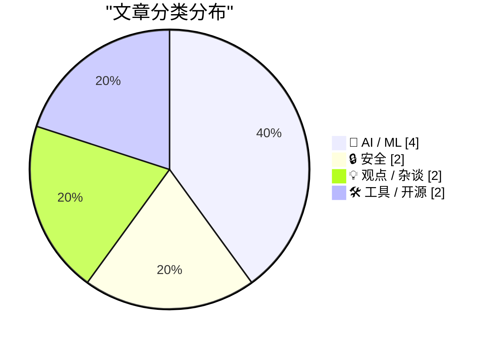
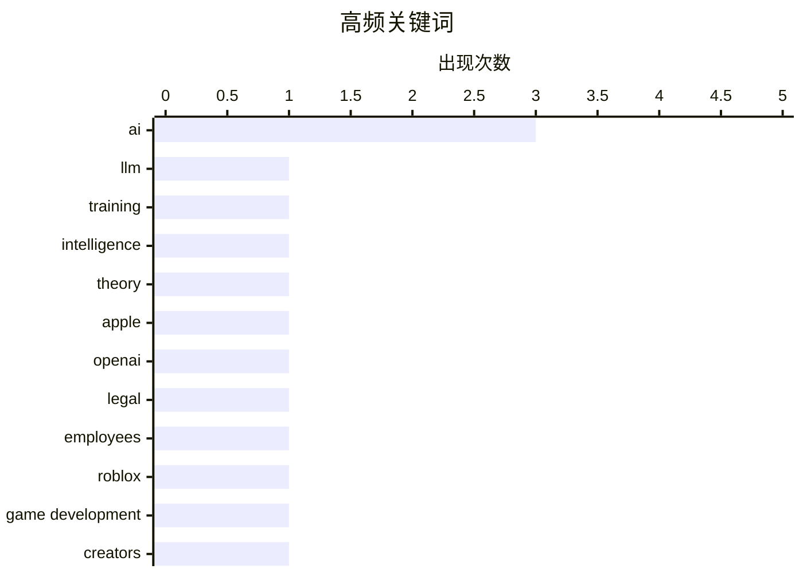

# 📰 AI 博客每日精选 — 2026-07-19

> 来自 Karpathy 推荐的 92 个顶级技术博客，AI 精选 Top 10

## 📝 今日看点

今日技术圈聚焦于AI发展的深度博弈与行业震荡。一方面，关于AI智能本质的探讨持续升温，从突破训练范式到游戏创作平民化，行业正追求能力与应用的“双重进化”。另一方面，巨头间的法律冲突与资源争夺日趋白热化，凸显了人才与知识产权已成为竞争核心。同时，工具生态正致力于在便利与安全之间寻找平衡，推动开发者体验的系统性提升。

---

## 🏆 今日必读

🥇 **过度训练：通往类人AI之路**

[Overtraining as the path to human-like AI](https://seangoedecke.com/overtraining-as-the-path-to-human-like-ai/) — seangoedecke.com · 1 天前 · 🤖 AI / ML

> 文章围绕大型语言模型为何缺乏真正灵活、类人的智能这一核心问题展开。匿名博主Gwern在其长篇论述中提出，当前LLMs的局限源于训练范式，并主张通过“弹射”式的过度训练来突破瓶颈。该理论认为，在特定规模上持续进行远超常规的过度训练，可能激发模型产生类似人类认知的涌现能力。作者的核心观点是，通往类人AI的关键路径可能不在于盲目扩大模型规模，而在于对现有规模模型进行深度、极致的训练。

💡 **为什么值得读**: 该文提供了一个反直觉且极具争议性的AI发展视角，挑战了“规模至上”的主流叙事，对于思考AI技术瓶颈与未来方向有启发意义。

🏷️ LLM, training, intelligence, theory

🥈 **苹果向数十名跳槽至OpenAI的前员工发送法律函件**

[Apple Sends Letters to Dozens of Former Employees Now at OpenAI](https://www.ft.com/content/1b8c9d52-88a9-426b-ba47-f1811f859166?syn-25a6b1a6=1) — daringfireball.net · 2 小时前 · 🔒 安全

> 文章报道了苹果公司针对前员工发起的法律行动。约40名现已加入OpenAI的前苹果员工收到了苹果律师发出的函件，要求他们保存文件、通信记录并安排会面。此举是苹果上周对OpenAI提起重磅诉讼后的后续激进策略，旨在为潜在的法律对抗收集证据。苹果与OpenAI双方均拒绝就此置评。事件凸显了科技巨头在人才竞争与知识产权保护上的激烈冲突已进入白热化阶段。

💡 **为什么值得读**: 此文揭示了AI领域顶级公司之间围绕核心人才与商业机密展开的隐秘法律战，是观察行业竞争态势的关键案例。

🏷️ Apple, OpenAI, legal, employees

🥉 **Roblox即将推出AI游戏构建功能，并支持iOS平台**

[Roblox Set to Introduce AI Game-Building Feature, Including on iOS](https://about.roblox.com/newsroom/2026/07/build-without-limits-on-roblox) — daringfireball.net · 1 天前 · 🤖 AI / ML

> Roblox宣布将引入AI驱动的游戏创建功能，旨在将其“人人皆可创造”的理念推向新高度。该功能将允许其1.32亿日活跃用户中的任何人，利用AI工具更轻松地构思和构建下一个热门游戏体验。此举延续了Roblox二十年来降低创作门槛的核心理念，将创作权从专业工作室进一步下放给广大用户。公司高管表示，这是面向未来、让创造力不受限制的关键一步。

💡 **为什么值得读**: 通过了解Roblox如何将AI集成到其庞大的UGC生态中，可以窥见未来游戏开发与社交平台融合的新范式。

🏷️ Roblox, AI, Game Development, Creators

---

## 📊 数据概览

| 扫描源 | 抓取文章 | 时间范围 | 精选 |
|:---:|:---:|:---:|:---:|
| 77/92 | 2395 篇 → 35 篇 | 48h | **10 篇** |

### 分类分布



### 高频关键词



<details>
<summary>📈 纯文本关键词图（终端友好）</summary>

```
ai           │ ████████████████████ 3
llm          │ ███████░░░░░░░░░░░░░ 1
training     │ ███████░░░░░░░░░░░░░ 1
intelligence │ ███████░░░░░░░░░░░░░ 1
theory       │ ███████░░░░░░░░░░░░░ 1
apple        │ ███████░░░░░░░░░░░░░ 1
openai       │ ███████░░░░░░░░░░░░░ 1
legal        │ ███████░░░░░░░░░░░░░ 1
employees    │ ███████░░░░░░░░░░░░░ 1
roblox       │ ███████░░░░░░░░░░░░░ 1
```

</details>

### 🏷️ 话题标签

**ai**(3) · **llm**(1) · **training**(1) · intelligence(1) · theory(1) · apple(1) · openai(1) · legal(1) · employees(1) · roblox(1) · game development(1) · creators(1) · ai art(1) · creativity(1) · scale(1) · debate(1) · agents(1) · quota(1) · platforms(1) · package management(1)

---

## 🤖 AI / ML

### 1. 过度训练：通往类人AI之路

[Overtraining as the path to human-like AI](https://seangoedecke.com/overtraining-as-the-path-to-human-like-ai/) — **seangoedecke.com** · 1 天前 · ⭐ 25/30

> 文章围绕大型语言模型为何缺乏真正灵活、类人的智能这一核心问题展开。匿名博主Gwern在其长篇论述中提出，当前LLMs的局限源于训练范式，并主张通过“弹射”式的过度训练来突破瓶颈。该理论认为，在特定规模上持续进行远超常规的过度训练，可能激发模型产生类似人类认知的涌现能力。作者的核心观点是，通往类人AI的关键路径可能不在于盲目扩大模型规模，而在于对现有规模模型进行深度、极致的训练。

🏷️ LLM, training, intelligence, theory

---

### 2. Roblox即将推出AI游戏构建功能，并支持iOS平台

[Roblox Set to Introduce AI Game-Building Feature, Including on iOS](https://about.roblox.com/newsroom/2026/07/build-without-limits-on-roblox) — **daringfireball.net** · 1 天前 · ⭐ 24/30

> Roblox宣布将引入AI驱动的游戏创建功能，旨在将其“人人皆可创造”的理念推向新高度。该功能将允许其1.32亿日活跃用户中的任何人，利用AI工具更轻松地构思和构建下一个热门游戏体验。此举延续了Roblox二十年来降低创作门槛的核心理念，将创作权从专业工作室进一步下放给广大用户。公司高管表示，这是面向未来、让创造力不受限制的关键一步。

🏷️ Roblox, AI, Game Development, Creators

---

### 3. 近期AI智能体的每周配额为何总是随机重置？

[What's the deal with all the random weekly quota resets for agents lately?](https://minimaxir.com/2026/07/agent-quota-reset/) — **minimaxir.com** · 6 小时前 · ⭐ 22/30

> 作者针对多家AI公司（如Anthropic、Google等）为其AI智能体服务设置的“每周免费配额随机重置”策略提出质疑。文章指出，这种不透明、不可预测的配额管理方式，表面上提供了免费额度，实则严重破坏了开发者构建稳定应用的工作流。核心问题在于，随机重置使得开发者无法进行可靠的测试、预算规划或向用户做出稳定承诺。这反映了AI服务在从研究项目转向可靠平台过程中，在运营和开发者体验方面存在的成熟度缺失。

🏷️ AI, agents, quota, platforms

---

### 4. Claude宣布将Fable 5模型永久化

[Claude make Fable 5 permanent](https://simonwillison.net/2026/Jul/18/claude-make-fable-5-permanent/#atom-everything) — **simonwillison.net** · 19 小时前 · ⭐ 20/30

> Anthropic公司宣布了其Claude AI模型产品线的重大更新。自7月20日起，最强的Fable 5模型将被永久纳入Max和Team Premium订阅计划，但使用限额为原版的50%。对于Pro和Team Standard用户，则可通过使用额度积分来访问Fable 5，并获得一次性100美元的积分赠送。这一调整标志着Fable 5从限时体验转变为付费计划中的常驻高级选项，改变了不同层级用户访问顶级模型的方式。

🏷️ Claude, AI, model, pricing

---

## 🔒 安全

### 5. 苹果向数十名跳槽至OpenAI的前员工发送法律函件

[Apple Sends Letters to Dozens of Former Employees Now at OpenAI](https://www.ft.com/content/1b8c9d52-88a9-426b-ba47-f1811f859166?syn-25a6b1a6=1) — **daringfireball.net** · 2 小时前 · ⭐ 24/30

> 文章报道了苹果公司针对前员工发起的法律行动。约40名现已加入OpenAI的前苹果员工收到了苹果律师发出的函件，要求他们保存文件、通信记录并安排会面。此举是苹果上周对OpenAI提起重磅诉讼后的后续激进策略，旨在为潜在的法律对抗收集证据。苹果与OpenAI双方均拒绝就此置评。事件凸显了科技巨头在人才竞争与知识产权保护上的激烈冲突已进入白热化阶段。

🏷️ Apple, OpenAI, legal, employees

---

### 6. 将Homebrew接入漏洞生态系统的工程实践

[Plumbing Homebrew into the vulnerability ecosystem](https://nesbitt.io/2026/07/17/plumbing-homebrew-into-the-vulnerability-ecosystem.html) — **nesbitt.io** · 1 天前 · ⭐ 21/30

> 文章详细阐述了将macOS包管理器Homebrew整合到软件漏洞披露与处理生态系统的复杂工程过程。实现“一键漏洞检查”功能，背后需要连接六个代码仓库、遵循三个标准机构的规定、对接一个安全通告数据库，并集成一个用“错误语言”编写的版本比较器。这个过程揭示了在现代软件供应链中，即使是一个简单的用户功能，也依赖于一系列分散且标准各异的底层基础设施的艰难整合。

🏷️ Homebrew, Vulnerability, Supply Chain

---

## 💡 观点 / 杂谈

### 7. 艺术无法规模化

[Art Doesn't Scale](https://matduggan.com/art-doesnt-scale/) — **matduggan.com** · 1 天前 · ⭐ 24/30

> 文章从一场关于“AI艺术是否是艺术”的常见争论切入，探讨了艺术与规模化生产之间的根本矛盾。作者认为，艺术的本质价值在于其独特性、人性表达与不可复制性，而这些特质与工业化、可重复的规模化过程相悖。AI生成内容虽然能模仿形式并大量产出，但缺乏艺术创作中至关重要的意图、情感与偶然性。结论是，真正的艺术因其人性内核而天然抗拒规模化，试图用规模衡量或生产艺术是对其本质的误解。

🏷️ AI art, creativity, scale, debate

---

### 8. “实现功能”与“打磨优秀”的永恒博弈

[Make It Work vs. Make It Good](https://blog.jim-nielsen.com/2026/make-it-work-make-it-good/) — **blog.jim-nielsen.com** · 6 小时前 · ⭐ 20/30

> 文章探讨了创作者（尤其是兼具体验设计与工程实现能力者）内心常见的两种驱动力之间的张力。一种是开发者思维，追求让事物“运行起来”，这能带来即时的成就感与外界对技术能力的认可；另一种是设计师思维，追求让事物“变得优秀”，这关乎细节、优雅与用户体验，但过程更漫长且反馈更微妙。作者指出，长期来看，真正的满足感和持久价值往往来自于克服惰性、选择后者。核心观点是：伟大的作品诞生于“实现功能”之后，对“优秀”的不懈追求。

🏷️ design, development, craftsmanship, process

---

## 🛠 工具 / 开源

### 9. 包管理周报：2026年7月18日

[This Week in Package Management: 18 July 2026](https://nesbitt.io/2026/07/18/this-week-in-package-management.html) — **nesbitt.io** · 15 小时前 · ⭐ 21/30

> 这是一份关于软件包管理生态的周期性行业动态汇总。内容涵盖了该周内各大包管理器（如npm、Cargo、pip等）的重要版本发布、安全通告以及相关技术文章。周报旨在为开发者和系统维护者提供一个快速了解依赖管理工具领域关键更新的渠道。通过跟踪这些动态，读者可以及时掌握可能影响其项目安全性与稳定性的因素。

🏷️ Package Management, Security, Ecosystem

---

### 10. SQLite查询解释器：一个交互式学习工具

[SQLite Query Explainer](https://simonwillison.net/2026/Jul/18/sqlite-query-explainer/#atom-everything) — **simonwillison.net** · 7 小时前 · ⭐ 19/30

> 作者Simon Willison受Julia Evans的博客启发，创建了一个名为“SQLite Query Explainer”的交互式Web工具。该工具旨在帮助开发者（包括他自己）更直观地学习如何阅读和理解SQLite的查询执行计划。用户只需输入SQL查询语句，工具便会可视化展示其执行计划，从而降低学习数据库查询优化的门槛。这个工具本身也是利用Claude Fable等AI辅助编程完成的，体现了“用工具解决学习痛点”的极客精神。

🏷️ SQLite, query, explainer, tool

---

*生成于 2026-07-19 01:06 | 扫描 77 源 → 获取 2395 篇 → 精选 10 篇*
*基于 [Hacker News Popularity Contest 2025](https://refactoringenglish.com/tools/hn-popularity/) RSS 源列表，由 [Andrej Karpathy](https://x.com/karpathy) 推荐*
*由「懂点儿AI」制作，欢迎关注同名微信公众号获取更多 AI 实用技巧 💡*
