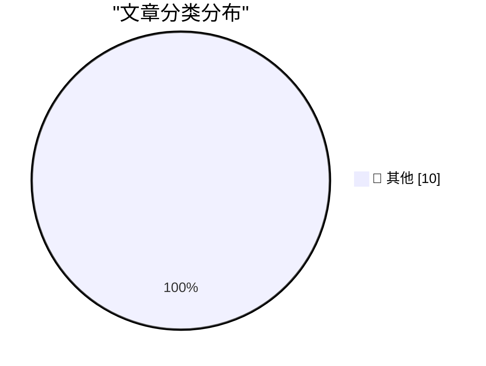

# 📰 AI 博客每日精选 — 2026-07-20

> 来自 Karpathy 推荐的 92 个顶级技术博客，AI 精选 Top 10

## 📝 今日看点

今日技术圈焦点呈现两极：一方面，对AI狂热的反思成为主流声音，业界开始担忧其对社会决策机制的潜在侵蚀；另一方面，基础工具链持续演进，以Rust为代表的高性能语言正重塑开发基础设施。同时，应用商店的安全与审核漏洞再次引发关注，凸显平台治理的持续挑战。

---

## 🏆 今日必读

🥇 **AI Mania Is Eviscerating Global Decision-Making**

[AI Mania Is Eviscerating Global Decision-Making](https://simonwillison.net/2026/Jul/19/ai-mania/#atom-everything) — simonwillison.net · 20 小时前 · 📝 其他

> AI Mania Is Eviscerating Global Decision-Making

🥈 **Claude Code uses Bun written in Rust now**

[Claude Code uses Bun written in Rust now](https://simonwillison.net/2026/Jul/19/claude-code-in-bun-in-rust/#atom-everything) — simonwillison.net · 21 小时前 · 📝 其他

> Claude Code uses Bun written in Rust now

🥉 **Impro is a handbook for running a cult**

[Impro is a handbook for running a cult](https://seangoedecke.com/impro/) — seangoedecke.com · 1 天前 · 📝 其他

> Impro is a handbook for running a cult

---

## 📊 数据概览

| 扫描源 | 抓取文章 | 时间范围 | 精选 |
|:---:|:---:|:---:|:---:|
| 75/92 | 2045 篇 → 18 篇 | 48h | **10 篇** |

### 分类分布

---

## 📝 其他

### 1. AI Mania Is Eviscerating Global Decision-Making

[AI Mania Is Eviscerating Global Decision-Making](https://simonwillison.net/2026/Jul/19/ai-mania/#atom-everything) — **simonwillison.net** · 20 小时前 · ⭐ 15/30

> AI Mania Is Eviscerating Global Decision-Making

---

### 2. Claude Code uses Bun written in Rust now

[Claude Code uses Bun written in Rust now](https://simonwillison.net/2026/Jul/19/claude-code-in-bun-in-rust/#atom-everything) — **simonwillison.net** · 21 小时前 · ⭐ 15/30

> Claude Code uses Bun written in Rust now

---

### 3. Impro is a handbook for running a cult

[Impro is a handbook for running a cult](https://seangoedecke.com/impro/) — **seangoedecke.com** · 1 天前 · ⭐ 15/30

> Impro is a handbook for running a cult

---

### 4. Paper

[Paper](https://paper.design/?utm_source=df) — **daringfireball.net** · 2 小时前 · ⭐ 15/30

> Paper

---

### 5. 9to5Mac Uncovers Dozens of Disguised Gambling Apps on the App Store in Brazil

[9to5Mac Uncovers Dozens of Disguised Gambling Apps on the App Store in Brazil](https://9to5mac.com/2026/07/17/investigation-reveals-dozens-of-disguised-gambling-apps-on-the-app-store-in-brazil/) — **daringfireball.net** · 7 小时前 · ⭐ 15/30

> 9to5Mac Uncovers Dozens of Disguised Gambling Apps on the App Store in Brazil

---

### 6. Book Review: A City on Mars - by Dr. Kelly Weinersmith and Zach Weinersmith ★★★★⯪

[Book Review: A City on Mars - by Dr. Kelly Weinersmith and Zach Weinersmith ★★★★⯪](https://shkspr.mobi/blog/2026/07/book-review-a-city-on-mars-by-dr-kelly-weinersmith-and-zach-weinersmith/) — **shkspr.mobi** · 1 天前 · ⭐ 15/30

> Book Review: A City on Mars - by Dr. Kelly Weinersmith and Zach Weinersmith ★★★★⯪

---

### 7. Fitting a regular expression to a list of words

[Fitting a regular expression to a list of words](https://www.johndcook.com/blog/2026/07/19/fitting-a-regex/) — **johndcook.com** · 5 小时前 · ⭐ 15/30

> Fitting a regular expression to a list of words

---

### 8. Sum of low squares

[Sum of low squares](https://www.johndcook.com/blog/2026/07/19/sum-of-low-squares/) — **johndcook.com** · 8 小时前 · ⭐ 15/30

> Sum of low squares

---

### 9. This Week in Package Management: 18 July 2026

[This Week in Package Management: 18 July 2026](https://nesbitt.io/2026/07/18/this-week-in-package-management.html) — **nesbitt.io** · 1 天前 · ⭐ 15/30

> This Week in Package Management: 18 July 2026

---

### 10. Reading List 07/18/26

[Reading List 07/18/26](https://www.construction-physics.com/p/reading-list-071826) — **construction-physics.com** · 1 天前 · ⭐ 15/30

> Reading List 07/18/26

---

*生成于 2026-07-20 01:17 | 扫描 75 源 → 获取 2045 篇 → 精选 10 篇*
*基于 [Hacker News Popularity Contest 2025](https://refactoringenglish.com/tools/hn-popularity/) RSS 源列表，由 [Andrej Karpathy](https://x.com/karpathy) 推荐*
*由「懂点儿AI」制作，欢迎关注同名微信公众号获取更多 AI 实用技巧 💡*
