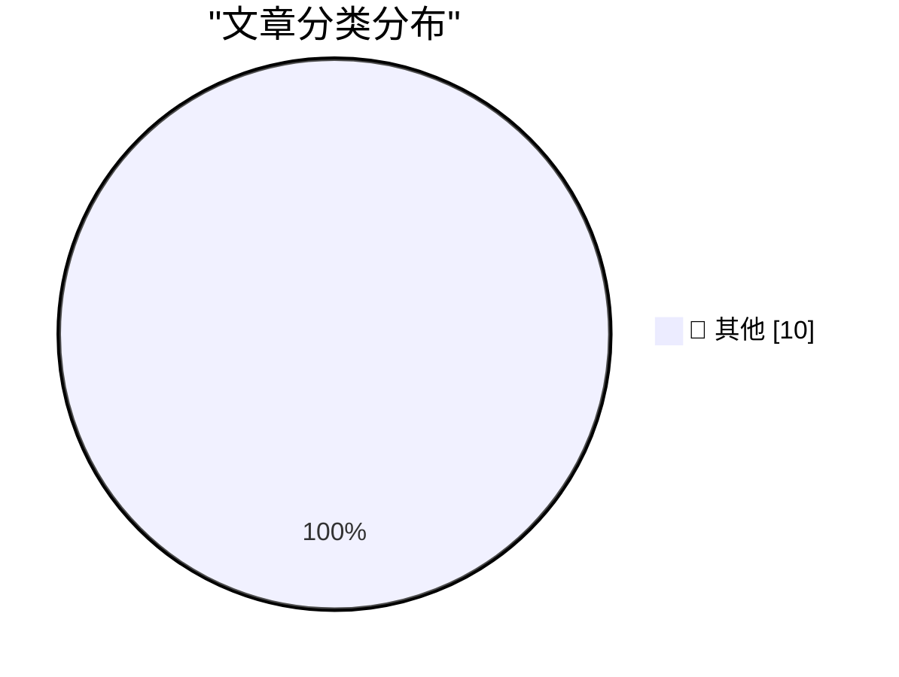

# 📰 AI 博客每日精选 — 2026-07-21

> 来自 Karpathy 推荐的 92 个顶级技术博客，AI 精选 Top 10

## 📝 今日看点

今日技术圈聚焦于AI竞争格局的演变与自动化工具的深化。中美在AI模型发展与数据政策上的博弈成为核心议题，凸显了技术主权与开源生态的紧张关系。同时，AI智能体正进一步渗透至身份管理等企业核心流程，推动自动化向更复杂的操作场景扩展。此外，逆向工程等传统技术门槛因AI辅助而大幅降低，催生了更广泛的创新与集成可能性。

---

## 🏆 今日必读

🥇 **逆向工程的成本如今已变得低廉**

[Reverse-engineering is cheap now](https://simonwillison.net/2026/Jul/20/cheap-reverse-engineering/#atom-everything) — simonwillison.net · 5 小时前 · 📝 其他

> AI编码智能体显著降低了家庭设备逆向工程与自动化的成本和技术门槛。过去，尽管技术上可行，但逆向工程家庭设备（如破解其未公开的API）的投入产出比（ROI）往往过低，且存在API不稳定、未来可能变更的风险。如今，借助编码智能体，程序员可以快速、低成本地完成这类任务，使得个人自动化项目变得切实可行。这标志着编写代码的成本已大幅降低，开启了个人设备自动化与集成的平民化时代。

💡 **为什么值得读**: 本文生动揭示了AI编码工具如何改变技术实践的可行性边界，对物联网开发者和技术爱好者极具启发性。

🥈 **谁在害怕中国模型？**

[Who’s Afraid of Chinese Models?](https://simonwillison.net/2026/Jul/20/afraid-of-chinese-models/#atom-everything) — simonwillison.net · 8 小时前 · 📝 其他

> 文章探讨了中美在AI大模型竞争中的政策困境与潜在解决方案。核心论点是，美国前沿AI实验室一方面使用未经许可的数据训练模型，另一方面却禁止他人对其模型进行知识蒸馏（distillation），这存在虚伪性。作者Ben Thompson提出一项政策建议：美国应通过立法，明确为训练模型收集数据属于合理使用，并禁止对使用此类数据训练的模型施加蒸馏限制。此举旨在帮助美国开源模型更有效地与中国模型竞争，打破当前因服务条款限制而导致的竞争劣势。

💡 **为什么值得读**: 该提案直指AI行业竞争与知识产权政策的核心矛盾，为理解全球AI格局提供了尖锐的政策视角。

🥉 **WorkOS MCP：让任意AI智能体管理你的身份验证平台**

[[Sponsor] WorkOS MCP: Manage Your Auth Platform From Any AI Agent](https://workos.com/blog/management-mcp-server?utm_source=daringfireball&amp;utm_medium=newsletter&amp;utm_campaign=q32026) — daringfireball.net · 1 小时前 · 📝 其他

> WorkOS推出了一款MCP（Model Context Protocol）服务器，旨在将身份验证（Auth）平台的管理任务从人工UI操作转变为可由AI智能体自动执行。该服务器向智能体开放了数百个与人工仪表盘同等的操作权限，支持运行时发现，并通过OAuth一键连接，使用范围限定的令牌而非主API密钥以确保安全。例如，智能体可以根据营销网站截图自动匹配并配置登录页面样式。其核心目标是：任何过去需要人工完成的身份验证配置任务，现在都可以交由智能体处理。

💡 **为什么值得读**: 该产品展示了AI智能体向企业级运维领域渗透的具体路径，对开发者和运维人员具有直接的实用参考价值。

---

## 📊 数据概览

| 扫描源 | 抓取文章 | 时间范围 | 精选 |
|:---:|:---:|:---:|:---:|
| 76/92 | 2387 篇 → 19 篇 | 48h | **10 篇** |

### 分类分布

---

## 📝 其他

### 1. 逆向工程的成本如今已变得低廉

[Reverse-engineering is cheap now](https://simonwillison.net/2026/Jul/20/cheap-reverse-engineering/#atom-everything) — **simonwillison.net** · 5 小时前 · ⭐ 15/30

> AI编码智能体显著降低了家庭设备逆向工程与自动化的成本和技术门槛。过去，尽管技术上可行，但逆向工程家庭设备（如破解其未公开的API）的投入产出比（ROI）往往过低，且存在API不稳定、未来可能变更的风险。如今，借助编码智能体，程序员可以快速、低成本地完成这类任务，使得个人自动化项目变得切实可行。这标志着编写代码的成本已大幅降低，开启了个人设备自动化与集成的平民化时代。

---

### 2. 谁在害怕中国模型？

[Who’s Afraid of Chinese Models?](https://simonwillison.net/2026/Jul/20/afraid-of-chinese-models/#atom-everything) — **simonwillison.net** · 8 小时前 · ⭐ 15/30

> 文章探讨了中美在AI大模型竞争中的政策困境与潜在解决方案。核心论点是，美国前沿AI实验室一方面使用未经许可的数据训练模型，另一方面却禁止他人对其模型进行知识蒸馏（distillation），这存在虚伪性。作者Ben Thompson提出一项政策建议：美国应通过立法，明确为训练模型收集数据属于合理使用，并禁止对使用此类数据训练的模型施加蒸馏限制。此举旨在帮助美国开源模型更有效地与中国模型竞争，打破当前因服务条款限制而导致的竞争劣势。

---

### 3. WorkOS MCP：让任意AI智能体管理你的身份验证平台

[[Sponsor] WorkOS MCP: Manage Your Auth Platform From Any AI Agent](https://workos.com/blog/management-mcp-server?utm_source=daringfireball&amp;utm_medium=newsletter&amp;utm_campaign=q32026) — **daringfireball.net** · 1 小时前 · ⭐ 15/30

> WorkOS推出了一款MCP（Model Context Protocol）服务器，旨在将身份验证（Auth）平台的管理任务从人工UI操作转变为可由AI智能体自动执行。该服务器向智能体开放了数百个与人工仪表盘同等的操作权限，支持运行时发现，并通过OAuth一键连接，使用范围限定的令牌而非主API密钥以确保安全。例如，智能体可以根据营销网站截图自动匹配并配置登录页面样式。其核心目标是：任何过去需要人工完成的身份验证配置任务，现在都可以交由智能体处理。

---

### 4. ‘谁在害怕中国模型？’

[‘Who’s Afraid of Chinese Models?’](https://stratechery.com/2026/whos-afraid-of-chinese-models/) — **daringfireball.net** · 8 小时前 · ⭐ 15/30

> 本文针对Kimi K3引发的热议，分析了美国开源权重模型面临的竞争困境。由于必须遵守美国前沿实验室的服务条款，美国开源模型在性能上不如中国替代品，并且只能通过中国实验室进行“蒸馏的再蒸馏”，间接获取技术。作者提出一个根本性质疑：知识蒸馏（distillation）究竟为何被视为有害？文章暗示，当前围绕蒸馏的禁令可能是一种不合理的限制，阻碍了西方开源模型的直接竞争力。核心观点是，西方开源模型开发者应能直接接触源头技术，而非绕道中国。

---

### 5. “昂贵”如今只是一种品牌策略

[Expensive Is Just a Brand Now](https://idiallo.com/blog/expensive-is-just-branding) — **idiallo.com** · 2 小时前 · ⭐ 15/30

> 文章批判了“廉价商品长期看更贵”这一经典说教，认为“昂贵”在现代消费中更多是一种品牌塑造而非质量保证。作者指出，该说教（如昂贵的靴子更耐穿）忽略了廉价商品质量已大幅提升的现实，以及富人同样频繁更换昂贵物品的事实。许多品牌通过营销将“昂贵”与“优质”强行绑定，但高价本身并不等同于更好的工艺或材料。结论是，消费者应警惕为“昂贵”这一品牌概念支付溢价，而非盲目相信其代表的内在价值。

---

### 6. 公共交通——别让我思考！

[Public Transport - Don't Make Me Think!](https://shkspr.mobi/blog/2026/07/public-transport-dont-make-me-think/) — **shkspr.mobi** · 13 小时前 · ⭐ 15/30

> 文章抨击了全球许多城市公共交通购票系统令人困惑的复杂性问题。作者基于一年内在十几个城市的亲身体验，指出部分城市的票务系统（涉及区域、App、复杂限制）如同卡夫卡式的官僚迷宫，严重缺乏以用户为中心的设计。这与经典的计算机系统设计原则“别让我思考”背道而驰。糟糕的购票体验构成了使用公共交通的主要障碍。文章呼吁公共交通系统应简化流程，让购票变得直观、无障碍。

---

### 7. 规则多面体的体积与表面积之比

[Volume to Area ratio for Regular Solids](https://www.johndcook.com/blog/2026/07/20/volume-area-regular-solids/) — **johndcook.com** · 10 小时前 · ⭐ 15/30

> 文章探讨了一个关于规则多面体的几何学统一性质。对于一个半径为r的球体，其体积V与表面积A的比值是V/A = r/3。令人惊讶的是，这一比例关系同样适用于所有规则多面体（柏拉图立体），只要其中的r定义为内切于该多面体的最大球体的半径。这一发现揭示了不同维度完美几何形体之间深刻的数学对称性。结论是，体积与表面积的这个简单比值（r/3）是球体与所有规则多面体共有的一个不变量。

---

### 8. 使用Grok 4.5解决国际象棋谜题

[Solving a chess puzzle with Grok 4.5](https://www.johndcook.com/blog/2026/07/20/grok-chess/) — **johndcook.com** · 10 小时前 · ⭐ 15/30

> 作者测试了Grok 4.5大型语言模型在解决复杂国际象棋谜题及生成相应Prolog代码方面的能力。此前，作者曾成功使用Claude或ChatGPT完成类似任务，但对Grok未抱期望。测试中，Grok 4.5被要求解决一个特定的国际象棋问题（文中提及但未展开），并生成Prolog代码来验证解法。结果显示，Grok 4.5表现出色，成功完成了任务。这表明Grok 4.5在逻辑推理和代码生成能力上已达到相当高的水平，足以处理专业的棋类逻辑谜题。

---

### 9. MCI世通公司的合并、破产与丑闻

[The MCI Worldcom merger, bankruptcy, and scandal](https://dfarq.homeip.net/the-mci-worldcom-merger-bankruptcy-and-scandal/?utm_source=rss&#038;utm_medium=rss&#038;utm_campaign=the-mci-worldcom-merger-bankruptcy-and-scandal) — **dfarq.homeip.net** · 14 小时前 · ⭐ 15/30

> 文章回顾了1997年MCI与WorldCom（世通公司）价值370亿美元的巨型合并案及其灾难性后果。这次合并本是两家大型电信公司为抗衡行业巨头AT&T而进行的战略尝试。然而，合并后的公司并未实现预期目标，反而陷入了严重的财务造假丑闻。通过做假账夸大利润，世通公司制造了美国历史上最大的会计欺诈案之一，最终导致其在2002年申请破产，成为当时美国最大的破产案。这一事件深刻影响了电信行业格局和公司治理监管。

---

### 10. OpenTK：现已新增互联网咨询与通知功能

[OpenTK: nu ook met Internetconsultaties & notificaties](https://berthub.eu/articles/posts/opentk-internetconsultaties/) — **berthub.eu** · 13 小时前 · ⭐ 15/30

> OpenTK是一个自2024年运营的项目，旨在透明化展示荷兰议会（Tweede Kamer）的所有动态，并向用户发送有用的电子邮件通知。项目诞生于作者（来自互联网领域）突然面临一项关于DNS的法规即将投票通过，却几乎无人知晓的困境。为了不让类似事件重演，他创建了OpenTK以提高立法过程的透明度。如今，该项目新增了针对“互联网咨询”议题的专门跟踪和通知功能。其核心目标是确保技术社区不再对影响自身的重大立法进程后知后觉。

---

*生成于 2026-07-21 01:13 | 扫描 76 源 → 获取 2387 篇 → 精选 10 篇*
*基于 [Hacker News Popularity Contest 2025](https://refactoringenglish.com/tools/hn-popularity/) RSS 源列表，由 [Andrej Karpathy](https://x.com/karpathy) 推荐*
*由「懂点儿AI」制作，欢迎关注同名微信公众号获取更多 AI 实用技巧 💡*
