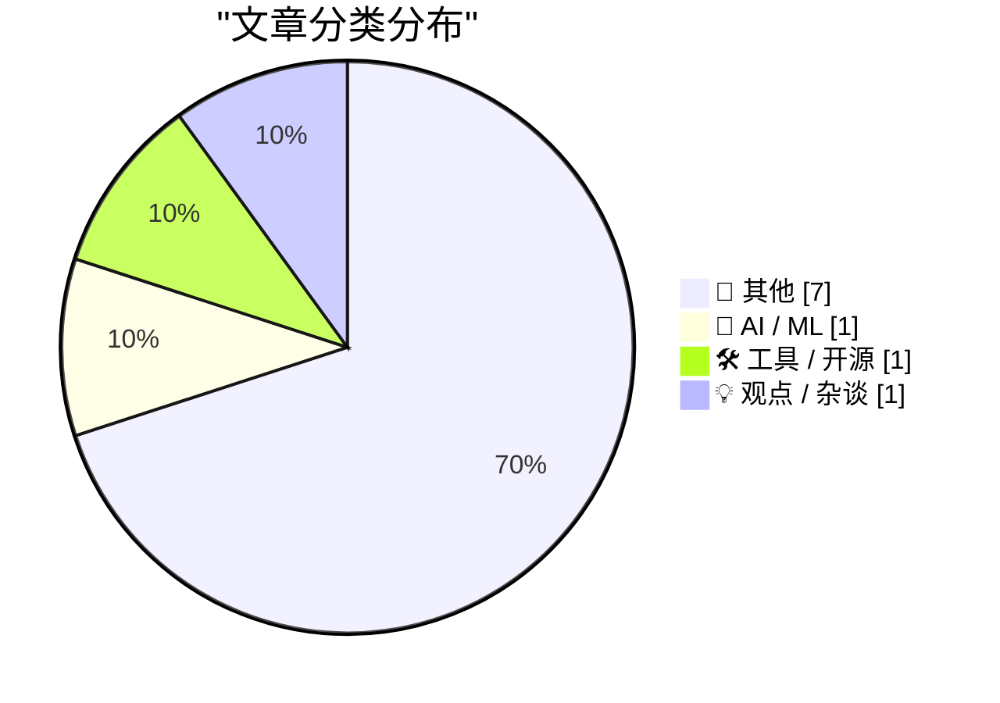
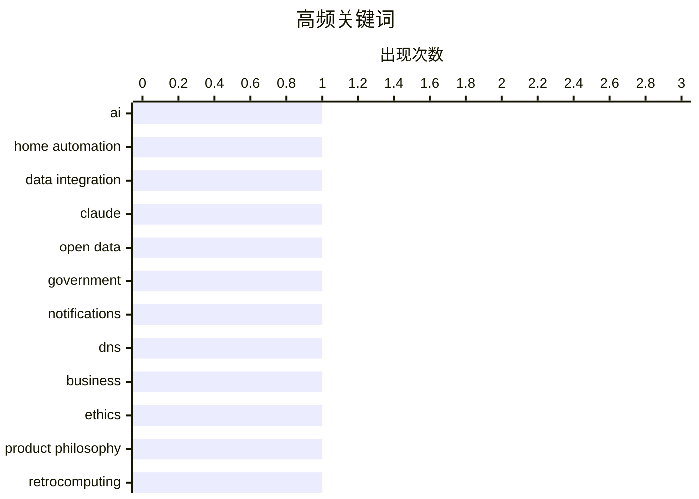

# 📰 AI 博客每日精选 — 2026-07-22

> 来自 Karpathy 推荐的 92 个顶级技术博客，AI 精选 Top 10

## 📝 今日看点

今日技术圈聚焦于AI向个人与本地化深度渗透，以及科技监管与开放生态的持续博弈。一方面，AI正从云端走向边缘，更深度地融入个人设备与家庭网络，实现本地化智能管理。另一方面，欧盟对科技巨头的强硬监管措施，凸显了在AI时代对互操作性与数据共享规则的激烈争夺。同时，关于企业目的与商业伦理的反思，也提示着技术发展背后的价值取向之争。

---

## 🏆 今日必读

🥇 **每周更新 513：用Claude整合家庭网络**

[Weekly Update 513: Clauding The Home Network](https://www.troyhunt.com/weekly-update-513/) — troyhunt.com · 17 小时前 · 🤖 AI / ML

> 文章展示了如何利用Claude AI整合UniFi、Home Assistant和Pi-Hole等家庭网络设备与服务的信息。核心方案是让AI处理来自不同系统的“噪音”数据，提炼出有价值的洞察。作者认为，这恰恰体现了AI的实际价值主张——从海量杂乱信息中提取有用信号。这种集成方案为家庭网络自动化与智能管理提供了一个具体的技术实现思路。

💡 **为什么值得读**: 为家庭网络自动化提供了一个将AI与现有硬件/软件栈（UniFi, Home Assistant, Pi-Hole）结合落地的具体案例，极具实践参考价值。

🏷️ AI, home automation, data integration, Claude

🥈 **OpenTK：现已支持互联网咨询与通知**

[OpenTK: nu ook met Internetconsultaties & notificaties](https://berthub.eu/articles/posts/opentk-internetconsultaties/) — berthub.eu · 1 天前 · 🛠 工具 / 开源

> OpenTK是一个旨在透明化荷兰议会（Tweede Kamer）议程的项目，现已新增互联网咨询和电子邮件通知功能。项目源于作者（来自互联网领域）突然面临一项关于DNS且即将表决的法律时的震惊，旨在防止公众因信息滞后而措手不及。其核心价值是提供及时的议会进程通知，提升立法透明度。该项目是公民科技（Civic Tech）的一个实践，帮助公众更好地参与和监督政治进程。

💡 **为什么值得读**: 展示了一个公民如何用技术工具（开源、通知）解决立法信息不对称问题，是公民科技和开放政府的生动案例。

🏷️ open data, government, notifications, DNS

🥉 **对企业而言，赚取（额外）金钱应该是附带发生的吗？**

[For a Business, Should Making (Extra) Money Be Incidental?](https://simone.org/business-money-incidental/) — simone.org · 12 小时前 · 💡 观点 / 杂谈

> 文章探讨了企业的核心目的，挑战了“利润最大化”的传统观念。作者提出，人类是欲望驱动的机器，而企业应该通过满足欲望而非剥削用户来帮助消散这些欲望。其核心论点是，商业成功和额外利润应是出色满足用户欲望后的自然结果，而非首要或唯一目标。这为企业提供了一种更具人文关怀和可持续性的价值观导向。

💡 **为什么值得读**: 提供了一个颠覆性的商业哲学视角，将企业目的从“赚钱”重新定义为“满足欲望”，对创业者和管理者具有启发意义。

🏷️ business, ethics, product philosophy

---

## 📊 数据概览

| 扫描源 | 抓取文章 | 时间范围 | 精选 |
|:---:|:---:|:---:|:---:|
| 75/92 | 2382 篇 → 26 篇 | 48h | **10 篇** |

### 分类分布



### 高频关键词



<details>
<summary>📈 纯文本关键词图（终端友好）</summary>

```
ai               │ ████████████████████ 1
home automation  │ ████████████████████ 1
data integration │ ████████████████████ 1
claude           │ ████████████████████ 1
open data        │ ████████████████████ 1
government       │ ████████████████████ 1
notifications    │ ████████████████████ 1
dns              │ ████████████████████ 1
business         │ ████████████████████ 1
ethics           │ ████████████████████ 1
```

</details>

### 🏷️ 话题标签

**ai**(1) · **home automation**(1) · **data integration**(1) · claude(1) · open data(1) · government(1) · notifications(1) · dns(1) · business(1) · ethics(1) · product philosophy(1) · retrocomputing(1) · basic(1) · debugging(1)

---

## 📝 其他

### 1. 10 REM"_(C2SLFF4

[10 REM"_(C2SLFF4](http://beej.us/blog/data/mystery-comment/) — **beej.us** · 1 天前 · ⭐ 16/30

> 这是一篇关于复古计算（retrocomputing）的探索文章，作者深入调查了一个困扰他许久的BASIC语言编程问题。文章很可能涉及对一段特定BASIC代码（以“10 REM”开头）的起源、含义或技术细节的考据。通过追根溯源，作者揭示了早期计算机编程中的某个谜团或趣闻。整个过程体现了对技术历史的细致考据和解决问题的执着精神。

🏷️ retrocomputing, BASIC, debugging

---

### 2. Nativ：在Mac上本地运行AI模型

[Nativ: Run AI models locally on your Mac](https://simonwillison.net/2026/Jul/21/nativ/#atom-everything) — **simonwillison.net** · 10 小时前 · ⭐ 15/30

> 文章介绍了Nativ，一个由MLX-VLM库开发者推出的全新macOS桌面应用程序。Nativ封装了MLX框架，允许用户在Mac上本地运行大型AI模型（包括视觉-语言模型）。它提供了类似LM Studio的聊天界面和本地API服务器，降低了在苹果芯片Mac上部署和测试本地AI模型的门槛。这使得开发者和个人用户无需依赖云端服务即可进行AI实验和应用开发。

---

### 3. 与Claude Code团队的Cat和Thariq的炉边谈话

[A Fireside Chat with Cat and Thariq from the Claude Code team](https://simonwillison.net/2026/Jul/21/cat-and-thariq/#atom-everything) — **simonwillison.net** · 12 小时前 · ⭐ 15/30

> 这是作者在AI工程师世界博览会上与Anthropic公司Claude Code团队两名成员（Cat Wu和Thariq Shihipar）的对话记录。讨论涵盖了Claude Code、Claude Tag、Fable、编码智能体安全性、评估（evals）、工具设计以及Anthropic内部如何使用这些工具等多个核心话题。对话深入探讨了AI辅助编程的前沿实践、挑战和公司内部的工作流。为外界了解Anthropic在AI编程领域的技术思路和产品哲学提供了宝贵的一手资料。

---

### 4. ★ 欧盟委员会：《给谷歌关于Android AI互操作性和谷歌搜索共享的指导》

[★ European Commission: ‘Guidance to Google for AI Interoperability on Android & Sharing of Google Search’](https://daringfireball.net/2026/07/ec_google_guidance_android_ai_and_search_sharing) — **daringfireball.net** · 2 小时前 · ⭐ 15/30

> 文章评论了欧盟委员会向谷歌发布的新指导方针，其范围之广令作者感到震惊。该指导旨在强制谷歌在Android系统上实现AI服务的互操作性，并可能要求其分享谷歌搜索的相关数据或访问权限。这是欧盟数字市场法案（DMA）框架下的最新监管动作，直接影响科技巨头的核心业务和生态系统控制权。此举标志着监管机构正试图深度介入大型平台的基础设施和算法层，以促进竞争。

---

### 5. [赞助] WorkOS MCP：让任何AI智能体管理你的身份验证平台

[[Sponsor] WorkOS MCP: Manage Your Auth Platform From Any AI Agent](https://workos.com/blog/management-mcp-server?utm_source=daringfireball&amp;utm_medium=newsletter&amp;utm_campaign=q32026) — **daringfireball.net** · 1 天前 · ⭐ 15/30

> WorkOS推出了一款MCP（Model Context Protocol）服务器，旨在让AI智能体能够直接管理身份验证（Auth）平台。该服务器将数百个原本需要通过人工操作UI完成的任务（如调试SSO、管理用户、调整认证策略、配置品牌化）暴露给AI智能体。智能体可以通过OAuth以限定范围的令牌连接，获得与仪表盘登录同等的访问权限。这标志着AI正从“使用工具”向“管理和配置核心IT系统”演进，自动化层级大幅提升。

---

### 6. “昂贵”如今只是一种品牌策略

[Expensive Is Just a Brand Now](https://idiallo.com/blog/expensive-is-just-branding) — **idiallo.com** · 1 天前 · ⭐ 15/30

> 文章批判性地分析了“昂贵等于质量好”这一常见消费叙事，认为“昂贵”在现代更多是一种品牌营销手段。作者以经典的“靴子寓言”（穷人买便宜靴子反而总花费更多）为例，指出其忽略了收入不平等、消费门槛和品牌溢价的现实。核心论点是，许多品牌利用这个故事来为高溢价辩护，而非真正提供与之匹配的长期价值或耐用性。消费者需要警惕将价格直接等同于品质的思维定式。

---

### 7. 多元主义：应对“dickovers”（2026年7月21日）

[Pluralistic: Dealing with dickovers (21 Jul 2026) dickovers](https://pluralistic.net/2026/07/21/dickovers/) — **pluralistic.net** · 16 小时前 · ⭐ 15/30

> 这是Cory Doctorow的每日博客“Pluralistic”的链接合集，主题是“应对dickovers”（可能指数字领域的恶意行为或剥削）。内容强调开放的Web平台至关重要，并包含多个科技政策与公民自由的链接：广播业的糟糕一周、国会与Wi-Fi的争议、EFF反对DRM法律、以及斯诺登和bunnie的智能手机智能保护套项目。文章一如既往地关注技术垄断、审查、隐私和用户权利等议题。

---

## 🤖 AI / ML

### 8. 每周更新 513：用Claude整合家庭网络

[Weekly Update 513: Clauding The Home Network](https://www.troyhunt.com/weekly-update-513/) — **troyhunt.com** · 17 小时前 · ⭐ 25/30

> 文章展示了如何利用Claude AI整合UniFi、Home Assistant和Pi-Hole等家庭网络设备与服务的信息。核心方案是让AI处理来自不同系统的“噪音”数据，提炼出有价值的洞察。作者认为，这恰恰体现了AI的实际价值主张——从海量杂乱信息中提取有用信号。这种集成方案为家庭网络自动化与智能管理提供了一个具体的技术实现思路。

🏷️ AI, home automation, data integration, Claude

---

## 🛠 工具 / 开源

### 9. OpenTK：现已支持互联网咨询与通知

[OpenTK: nu ook met Internetconsultaties & notificaties](https://berthub.eu/articles/posts/opentk-internetconsultaties/) — **berthub.eu** · 1 天前 · ⭐ 21/30

> OpenTK是一个旨在透明化荷兰议会（Tweede Kamer）议程的项目，现已新增互联网咨询和电子邮件通知功能。项目源于作者（来自互联网领域）突然面临一项关于DNS且即将表决的法律时的震惊，旨在防止公众因信息滞后而措手不及。其核心价值是提供及时的议会进程通知，提升立法透明度。该项目是公民科技（Civic Tech）的一个实践，帮助公众更好地参与和监督政治进程。

🏷️ open data, government, notifications, DNS

---

## 💡 观点 / 杂谈

### 10. 对企业而言，赚取（额外）金钱应该是附带发生的吗？

[For a Business, Should Making (Extra) Money Be Incidental?](https://simone.org/business-money-incidental/) — **simone.org** · 12 小时前 · ⭐ 17/30

> 文章探讨了企业的核心目的，挑战了“利润最大化”的传统观念。作者提出，人类是欲望驱动的机器，而企业应该通过满足欲望而非剥削用户来帮助消散这些欲望。其核心论点是，商业成功和额外利润应是出色满足用户欲望后的自然结果，而非首要或唯一目标。这为企业提供了一种更具人文关怀和可持续性的价值观导向。

🏷️ business, ethics, product philosophy

---

*生成于 2026-07-22 01:17 | 扫描 75 源 → 获取 2382 篇 → 精选 10 篇*
*基于 [Hacker News Popularity Contest 2025](https://refactoringenglish.com/tools/hn-popularity/) RSS 源列表，由 [Andrej Karpathy](https://x.com/karpathy) 推荐*
*由「懂点儿AI」制作，欢迎关注同名微信公众号获取更多 AI 实用技巧 💡*
