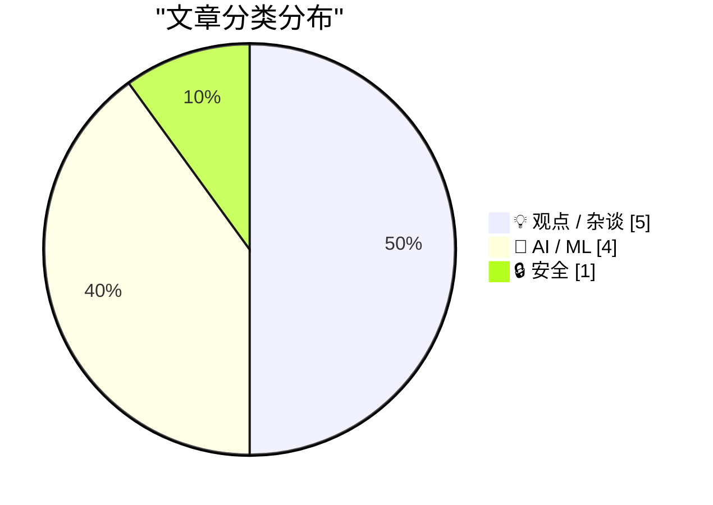
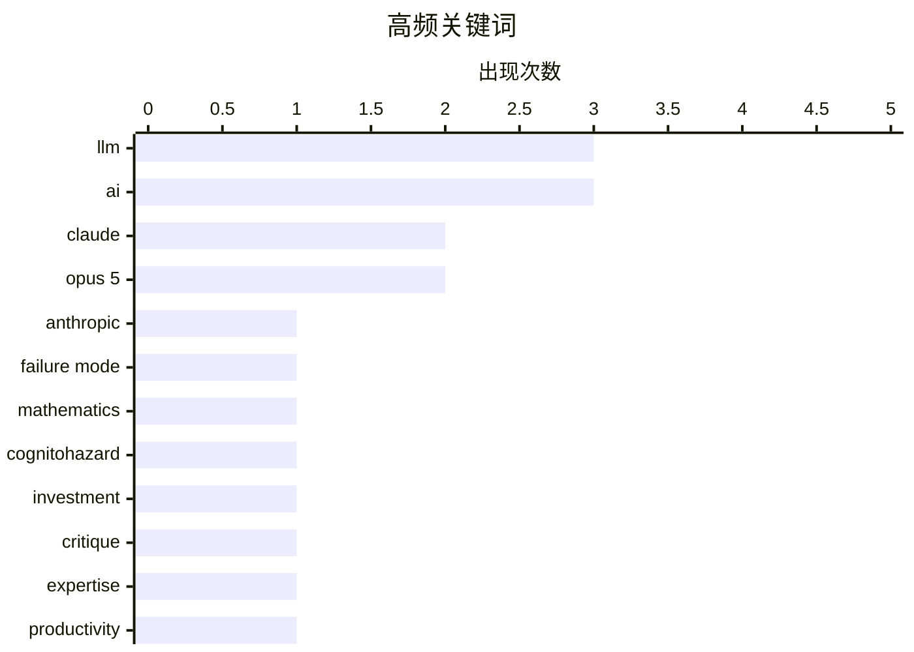

# 📰 AI 博客每日精选 — 2026-07-25

> 来自 Karpathy 推荐的 92 个顶级技术博客，AI 精选 Top 10

## 📝 今日看点

今日技术圈围绕AI的深度发展与现实挑战展开激烈讨论。一方面，大模型能力持续跃进，Claude Opus 5以更高性价比逼近前沿水平，并展现出卓越的安全性；另一方面，其逻辑脆弱性与生成内容的空洞本质也被尖锐揭露，提示工程的专业价值愈发凸显。与此同时，行业生态正经历阵痛，从开源社区对AI代码的排斥到科技巨头的商业模式争议，技术狂热与理性反思并存。

---

## 🏆 今日必读

🥇 **Claude Opus 5 模型发布**

[Introducing Claude Opus 5](https://simonwillison.net/2026/Jul/24/introducing-claude-opus-5/#atom-everything) — simonwillison.net · 1 小时前 · 🤖 AI / ML

> Anthropic 发布了新一代大语言模型 Claude Opus 5。该模型被描述为一个“深思熟虑且积极主动”的模型，其智能水平接近前沿的 Claude Fable 5，但价格仅为后者的一半。作者因故尚未对其进行深入测试，但市场反响积极。

💡 **为什么值得读**: 了解当前顶级大语言模型的最新进展和性价比变化。

🏷️ Claude, Opus 5, Anthropic, LLM

🥈 **大语言模型在雅可比猜想反证上表现滑稽**

[LLMs break down in funny ways when told the Jacobian Conjecture counterargument](https://minimaxir.com/2026/07/jacobian-conjecture/) — minimaxir.com · 1 天前 · 🤖 AI / ML

> 文章探讨了大语言模型在处理特定复杂逻辑论证时的脆弱性。当被要求处理“雅可比猜想”的一个已知反证时，多个主流模型（如 GPT-4、Claude 等）的推理链条会以各种有趣的方式崩溃。这揭示了即使是先进的 AI 模型，在面对精心设计的认知陷阱（可称为“机器认知危害”）时，其逻辑一致性仍可能失效。

💡 **为什么值得读**: 通过一个具体案例，直观揭示当前大语言模型在深层逻辑推理上的根本性缺陷。

🏷️ LLM, failure mode, mathematics, cognitohazard

🥉 **多元视角：AI 唯我论者与 AI 犬儒主义者**

[Pluralistic: AI solipsists and AI cynics (24 Jul 2026)](https://pluralistic.net/2026/07/24/supplemental-income/) — pluralistic.net · 14 小时前 · 🤖 AI / ML

> 文章讨论了关于 AI 投资的两种对立但可能并存的观点。AI 唯我论者相信 AI 技术本身有效并投资，而 AI 犬儒主义者则可能不相信 AI 的技术能力，但仍认为其是好的投资标的。核心观点在于，驱动 AI 投资热潮的不一定是技术信仰，更可能是资本对垄断利润和监管套利的追逐。

💡 **为什么值得读**: 跳出技术优劣的争论，从资本和社会的视角理解当前 AI 狂热的深层动因。

🏷️ AI, investment, critique

---

## 📊 数据概览

| 扫描源 | 抓取文章 | 时间范围 | 精选 |
|:---:|:---:|:---:|:---:|
| 76/92 | 2395 篇 → 34 篇 | 48h | **10 篇** |

### 分类分布



### 高频关键词



<details>
<summary>📈 纯文本关键词图（终端友好）</summary>

```
llm           │ ████████████████████ 3
ai            │ ████████████████████ 3
claude        │ █████████████░░░░░░░ 2
opus 5        │ █████████████░░░░░░░ 2
anthropic     │ ███████░░░░░░░░░░░░░ 1
failure mode  │ ███████░░░░░░░░░░░░░ 1
mathematics   │ ███████░░░░░░░░░░░░░ 1
cognitohazard │ ███████░░░░░░░░░░░░░ 1
investment    │ ███████░░░░░░░░░░░░░ 1
critique      │ ███████░░░░░░░░░░░░░ 1
```

</details>

### 🏷️ 话题标签

**llm**(3) · **ai**(3) · **claude**(2) · opus 5(2) · anthropic(1) · failure mode(1) · mathematics(1) · cognitohazard(1) · investment(1) · critique(1) · expertise(1) · productivity(1) · coding(1) · openai(1) · apple(1) · podcast(1) · writing(1) · quality(1) · privacy(1) · california(1)

---

## 💡 观点 / 杂谈

### 1. 大语言模型奖励专业知识

[LLMs reward expertise](https://seangoedecke.com/llms-reward-expertise/) — **seangoedecke.com** · 1 天前 · ⭐ 24/30

> 大语言模型将每个人变成了“通才”，能完成许多领域的初级任务，但这掩盖了与 LLM 高效协作所需的专业技能。真正的专家能提出更精准的问题、进行更有效的提示工程、并批判性地评估和迭代输出结果。因此，LLMs 实际上放大了专业知识（如领域知识、批判性思维、问题分解能力）的价值，而非使其贬值。

🏷️ LLM, expertise, productivity, coding

---

### 2. The Talk Show 播客：‘一场由爱国主义和金色油漆维系起来的骗局’

[The Talk Show: ‘A Scam Held Together With Patriotism and Golden Paint’](https://daringfireball.net/thetalkshow/2026/07/23/ep-452) — **daringfireball.net** · 9 小时前 · ⭐ 24/30

> 本期播客节目讨论了多个科技热点事件。重点包括 OpenAI 的 ChatGPT/Codex “原生”应用迁移灾难、苹果 OS 27 测试版中的 Siri AI、macOS 27 Golden Gate，以及年度热门手机 Trump T1。嘉宾 Quinn Nelson 对这些事件进行了分析和评论。

🏷️ OpenAI, Apple, AI, podcast

---

### 3. 你读过自己写的文章吗？

[Have you read it?](https://idiallo.com/byte-size/have-you-read-your-own-article) — **idiallo.com** · 17 小时前 · ⭐ 24/30

> 文章指出了 AI 生成内容质量低下的一个核心原因：作者本人也是第一次读。当文章缺乏真知灼见时，读者产生的疑问作者同样无法解答，因为作者（AI）只是在组合信息，并未真正理解或拥有这些“见解”。好的观点可以超越 AI 的写作风格缺陷，但缺乏作者真实思考和认知过程的内容本质上是空洞的。

🏷️ AI, writing, quality

---

### 4. Codeberg 的分歧

[Codeberg Divides](https://lucumr.pocoo.org/2026/7/24/codeberg-divides/) — **lucumr.pocoo.org** · 1 天前 · ⭐ 24/30

> 开源托管平台 Codeberg 近期修改条款，禁止主要由生成式 AI 编写的项目。作者认为，Codeberg 作为一个民主社团有权做出此决定，但民主程序不保证决策的明智性或包容性。此举可能排斥依赖 AI 的开发者，并引发关于开源社区如何定义“人类创造力”和“贡献”的深层争论。虽然旨在对抗 GitHub，但此政策可能削弱其竞争力。

🏷️ generative AI, open source, policy, Codeberg

---

### 5. 付费内容：Oracle 黑粉指南（第二部分）

[Premium: The Hater’s Guide To Oracle (Part 2)](https://www.wheresyoured.at/premium-the-haters-guide-to-oracle-part-2/) — **wheresyoured.at** · 8 小时前 · ⭐ 23/30

> 这是系列文章的第二部分，旨在解构 Oracle 公司在科技行业中的强大“神话”。文章将挑战公众普遍认为的 Oracle“利润极高”和“持续增长”的印象，通过深入分析其商业模式、财务策略和市场行为，揭示其光环背后的另一面。

🏷️ Oracle, business, enterprise software

---

## 🤖 AI / ML

### 6. Claude Opus 5 模型发布

[Introducing Claude Opus 5](https://simonwillison.net/2026/Jul/24/introducing-claude-opus-5/#atom-everything) — **simonwillison.net** · 1 小时前 · ⭐ 26/30

> Anthropic 发布了新一代大语言模型 Claude Opus 5。该模型被描述为一个“深思熟虑且积极主动”的模型，其智能水平接近前沿的 Claude Fable 5，但价格仅为后者的一半。作者因故尚未对其进行深入测试，但市场反响积极。

🏷️ Claude, Opus 5, Anthropic, LLM

---

### 7. 大语言模型在雅可比猜想反证上表现滑稽

[LLMs break down in funny ways when told the Jacobian Conjecture counterargument](https://minimaxir.com/2026/07/jacobian-conjecture/) — **minimaxir.com** · 1 天前 · ⭐ 26/30

> 文章探讨了大语言模型在处理特定复杂逻辑论证时的脆弱性。当被要求处理“雅可比猜想”的一个已知反证时，多个主流模型（如 GPT-4、Claude 等）的推理链条会以各种有趣的方式崩溃。这揭示了即使是先进的 AI 模型，在面对精心设计的认知陷阱（可称为“机器认知危害”）时，其逻辑一致性仍可能失效。

🏷️ LLM, failure mode, mathematics, cognitohazard

---

### 8. 多元视角：AI 唯我论者与 AI 犬儒主义者

[Pluralistic: AI solipsists and AI cynics (24 Jul 2026)](https://pluralistic.net/2026/07/24/supplemental-income/) — **pluralistic.net** · 14 小时前 · ⭐ 25/30

> 文章讨论了关于 AI 投资的两种对立但可能并存的观点。AI 唯我论者相信 AI 技术本身有效并投资，而 AI 犬儒主义者则可能不相信 AI 的技术能力，但仍认为其是好的投资标的。核心观点在于，驱动 AI 投资热潮的不一定是技术信仰，更可能是资本对垄断利润和监管套利的追逐。

🏷️ AI, investment, critique

---

### 9. 引用 Boris Cherny 的观点

[Quoting Boris Cherny](https://simonwillison.net/2026/Jul/25/boris-cherny/#atom-everything) — **simonwillison.net** · 23 分钟前 · ⭐ 23/30

> 引用了 Boris Cherny 对 Claude Opus 5 模型安全性的评价。他认为，相比各种评测分数，最令人兴奋的是 Opus 5 是目前最抗提示注入攻击的模型。根据 Anthropic 的系统卡片数据，在多项提示注入评估和红队测试中，成功对 Opus 5 进行提示注入非常困难。

🏷️ Claude, Opus 5, prompt injection, security

---

## 🔒 安全

### 10. 多元视角：加州的隐私障碍赛

[Pluralistic: California's privacy obstacle course (23 Jul 2026)](https://pluralistic.net/2026/07/23/drop-a-dime/) — **pluralistic.net** · 1 天前 · ⭐ 24/30

> 文章批评了加州隐私保护法规在执行过程中设置的复杂流程，将其比作一场“障碍赛”。这些流程究竟是出于恶意还是无能（或兼而有之）阻碍了公民有效行使隐私权利。例如，用户需要经历繁琐步骤才能获取或删除个人数据，这实质上削弱了法律的本意。

🏷️ privacy, California, regulation

---

*生成于 2026-07-25 01:06 | 扫描 76 源 → 获取 2395 篇 → 精选 10 篇*
*基于 [Hacker News Popularity Contest 2025](https://refactoringenglish.com/tools/hn-popularity/) RSS 源列表，由 [Andrej Karpathy](https://x.com/karpathy) 推荐*
*由「懂点儿AI」制作，欢迎关注同名微信公众号获取更多 AI 实用技巧 💡*
