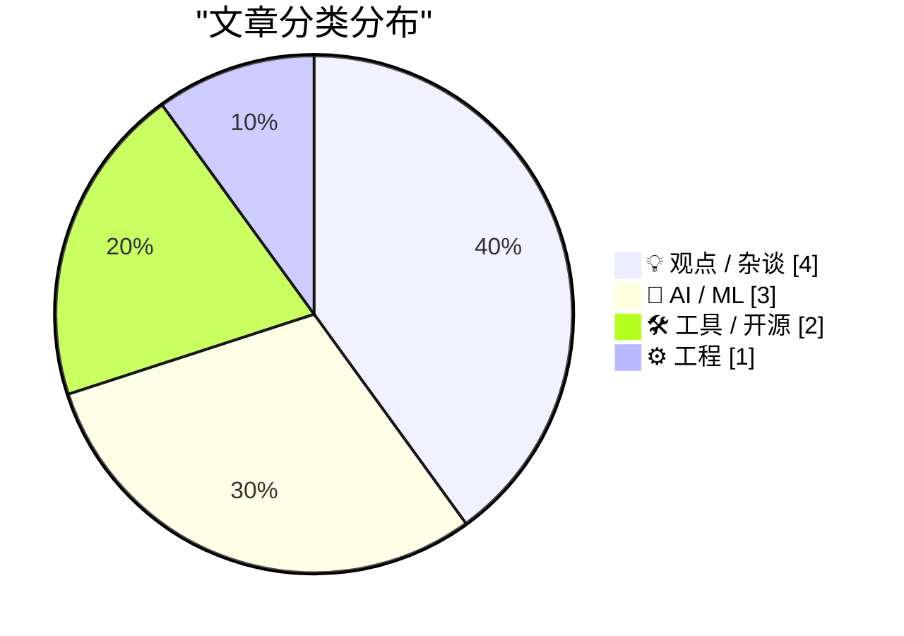
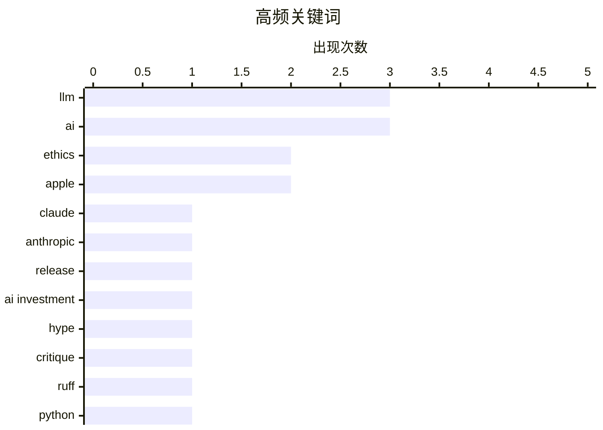

# 📰 AI 博客每日精选 — 2026-07-26

> 来自 Karpathy 推荐的 92 个顶级技术博客，AI 精选 Top 10

## 📝 今日看点

今日技术圈的核心焦点仍被人工智能的狂热与争议所主导。一方面，巨头持续推出更强、更经济的模型，加剧了商业化竞争；另一方面，业内对AI炒作带来的决策扭曲与内容质量危机展开了深刻反思。与此同时，开发者工具生态正通过更严格的规则与快速的迭代，来应对日益复杂的软件质量挑战。

---

## 🏆 今日必读

🥇 **Claude Opus 5 模型发布**

[Introducing Claude Opus 5](https://simonwillison.net/2026/Jul/24/introducing-claude-opus-5/#atom-everything) — simonwillison.net · 1 天前 · 🤖 AI / ML

> Anthropic 发布了新的 Claude Opus 5 大语言模型。该模型被描述为“一个深思熟虑且积极主动的模型”，其智能水平接近前沿的 Claude Fable 5，但价格仅为后者的一半。作者因外出活动尚未对其进行详细测试，但初步市场反响积极。这表明 Anthropic 正致力于在保持高性能的同时，提供更具成本效益的模型选项。

💡 **为什么值得读**: 了解 Claude 系列最新旗舰模型的核心优势与定价策略，把握大模型市场的最新竞争动态。

🏷️ Claude, LLM, Anthropic, release

🥈 **多元视角：AI 唯我论者与 AI 犬儒主义者（2026年7月24日）**

[Pluralistic: AI solipsists and AI cynics (24 Jul 2026)](https://pluralistic.net/2026/07/24/supplemental-income/) — pluralistic.net · 1 天前 · 💡 观点 / 杂谈

> 文章探讨了围绕人工智能投资的两种对立但可能并存的观点：AI 唯我论（相信 AI 有效）和 AI 犬儒主义（不相信 AI 有效）。核心论点是，即使不相信 AI 技术本身能“工作”，人们也可能因其巨大的市场炒作和资本流动而认为它是一个好的投资标的。这揭示了当前 AI 热潮中投资逻辑与技术现实之间的脱节。作者暗示，驱动投资的往往不是技术效用，而是市场叙事和资本博弈。

💡 **为什么值得读**: 提供了一个跳出技术本身、从资本与市场心理角度审视当前 AI 狂潮的批判性视角。

🏷️ AI investment, ethics, hype, critique

🥉 **Ruff v0.16.0 发布**

[Ruff v0.16.0](https://simonwillison.net/2026/Jul/25/ruff/#atom-everything) — simonwillison.net · 1 小时前 · 🛠 工具 / 开源

> Astral 团队发布了 Python 代码检查与格式化工具 Ruff 的重大更新版本 v0.16.0。新版本将默认启用的检查规则从之前的 59 条大幅增加到 413 条，导致许多未固定依赖版本的 CI 构建因新规则而失败。这一变化体现了 Ruff 向更严格、更全面的代码质量保障迈进。开发者需要关注并适配此次更新，以避免构建中断。

💡 **为什么值得读**: Python 开发者需及时了解这一关键工具的重大变更，以避免 CI/CD 流程意外中断并提升代码规范。

🏷️ Ruff, Python, linter, CI

---

## 📊 数据概览

| 扫描源 | 抓取文章 | 时间范围 | 精选 |
|:---:|:---:|:---:|:---:|
| 74/92 | 2018 篇 → 30 篇 | 48h | **10 篇** |

### 分类分布



### 高频关键词



<details>
<summary>📈 纯文本关键词图（终端友好）</summary>

```
llm           │ ████████████████████ 3
ai            │ ████████████████████ 3
ethics        │ █████████████░░░░░░░ 2
apple         │ █████████████░░░░░░░ 2
claude        │ ███████░░░░░░░░░░░░░ 1
anthropic     │ ███████░░░░░░░░░░░░░ 1
release       │ ███████░░░░░░░░░░░░░ 1
ai investment │ ███████░░░░░░░░░░░░░ 1
hype          │ ███████░░░░░░░░░░░░░ 1
critique      │ ███████░░░░░░░░░░░░░ 1
```

</details>

### 🏷️ 话题标签

**llm**(3) · **ai**(3) · **ethics**(2) · apple(2) · claude(1) · anthropic(1) · release(1) · ai investment(1) · hype(1) · critique(1) · ruff(1) · python(1) · linter(1) · ci(1) · openai(1) · siri(1) · ai writing(1) · content quality(1) · regulation(1) · risk(1)

---

## 💡 观点 / 杂谈

### 1. 多元视角：AI 唯我论者与 AI 犬儒主义者（2026年7月24日）

[Pluralistic: AI solipsists and AI cynics (24 Jul 2026)](https://pluralistic.net/2026/07/24/supplemental-income/) — **pluralistic.net** · 1 天前 · ⭐ 25/30

> 文章探讨了围绕人工智能投资的两种对立但可能并存的观点：AI 唯我论（相信 AI 有效）和 AI 犬儒主义（不相信 AI 有效）。核心论点是，即使不相信 AI 技术本身能“工作”，人们也可能因其巨大的市场炒作和资本流动而认为它是一个好的投资标的。这揭示了当前 AI 热潮中投资逻辑与技术现实之间的脱节。作者暗示，驱动投资的往往不是技术效用，而是市场叙事和资本博弈。

🏷️ AI investment, ethics, hype, critique

---

### 2. 你读过自己写的文章吗？

[Have you read it?](https://idiallo.com/byte-size/have-you-read-your-own-article) — **idiallo.com** · 1 天前 · ⭐ 24/30

> 文章分析了 AI 生成文章质量低下的一个根本原因：作者和读者都是第一次阅读该内容。当文章缺乏真知灼见时，其缺陷（如逻辑混乱、事实错误）会暴露无遗，因为作者在创作时并未真正理解和消化材料，只是机械组合。好的观点可以超越形式缺陷，但 AI 文章往往缺乏这种由内而外的洞察力。结论是，没有经过作者自身思考与理解的内容，无法有效传递知识或引发共鸣。

🏷️ AI writing, content quality, LLM

---

### 3. 多元视角：苹果的机器人回购（2026年7月25日）

[Pluralistic: Apple's robo-repo (25 Jul 2026)](https://pluralistic.net/2026/07/25/cruel-cruelty-oh-cruelty/) — **pluralistic.net** · 13 小时前 · ⭐ 24/30

> 文章批判了苹果公司大规模的股票回购行为。核心论点是，这类“机器人回购”实质上是将风险溢价私有化（利润归股东），而将其社会成本（如研发投入不足、供应链压力、税收规避）社会化。这加剧了经济不平等，并可能损害公司的长期创新能力和更广泛的经济健康。作者认为这是一种将公司财富从公共领域向私人股东转移的机制。

🏷️ Apple, AI, regulation, risk

---

### 4. ‘AI 狂热正在摧毁全球决策能力’

[‘AI Mania Is Eviscerating Global Decision-Making’](https://ludic.mataroa.blog/blog/ai-mania-is-eviscerating-global-decision-making/) — **daringfireball.net** · 6 小时前 · ⭐ 23/30

> 文章通过一位《财富》500 强高管的匿名案例，揭示了 AI 狂热对企业和全球决策层的负面影响。核心论点是，对 AI 不切实际的承诺和炒作，迫使企业高管为了迎合市场叙事和董事会压力，做出缺乏技术依据的巨额投资承诺。这导致决策过程被恐惧、从众心理和营销话术绑架，而非基于实际效用和风险评估。最终，这种集体非理性正在侵蚀商业乃至全球层面的理性决策基础。

🏷️ AI, decision-making, ethics

---

## 🤖 AI / ML

### 5. Claude Opus 5 模型发布

[Introducing Claude Opus 5](https://simonwillison.net/2026/Jul/24/introducing-claude-opus-5/#atom-everything) — **simonwillison.net** · 1 天前 · ⭐ 27/30

> Anthropic 发布了新的 Claude Opus 5 大语言模型。该模型被描述为“一个深思熟虑且积极主动的模型”，其智能水平接近前沿的 Claude Fable 5，但价格仅为后者的一半。作者因外出活动尚未对其进行详细测试，但初步市场反响积极。这表明 Anthropic 正致力于在保持高性能的同时，提供更具成本效益的模型选项。

🏷️ Claude, LLM, Anthropic, release

---

### 6. The Talk Show 播客：‘一场由爱国主义和金色油漆维系起来的骗局’

[The Talk Show: ‘A Scam Held Together With Patriotism and Golden Paint’](https://daringfireball.net/thetalkshow/2026/07/23/ep-452) — **daringfireball.net** · 1 天前 · ⭐ 24/30

> 本期播客邀请 Quinn Nelson 讨论了多项科技热点。话题包括 OpenAI 的 ChatGPT/Codex “原生”应用迁移的失败案例、Apple OS 27 测试版中的 Siri AI、MacOS 27 Golden Gate，以及年度热门手机 Trump T1。讨论以批判和调侃的视角审视这些产品或事件背后的营销、技术问题与社会现象。

🏷️ OpenAI, Apple, Siri, AI

---

### 7. 在 RTX 3090 上评测 Qwen 3.6 35B MoE（激活参数量 3B）模型

[Benchmarking Qwen 3.6 35B MoE (3B active) on an RTX 3090](https://www.gilesthomas.com/2026/07/benchmarking-qwen-3-6-35b-moe-rtx-3090) — **gilesthomas.com** · 1 天前 · ⭐ 24/30

> 作者在拥有 24GB VRAM 的双 RTX 3090 显卡上，对通义千问 Qwen 3.6 35B MoE（混合专家）模型进行了实际部署与评测。由于显存限制，需要使用 4 位量化版本，且无法获得巨大的上下文窗口。评测过程涉及模型加载、推理速度等实践细节。这为资源有限的个人开发者或研究者运行大型 MoE 模型提供了宝贵的实践经验参考。

🏷️ LLM, benchmark, Qwen, GPU

---

## 🛠 工具 / 开源

### 8. Ruff v0.16.0 发布

[Ruff v0.16.0](https://simonwillison.net/2026/Jul/25/ruff/#atom-everything) — **simonwillison.net** · 1 小时前 · ⭐ 24/30

> Astral 团队发布了 Python 代码检查与格式化工具 Ruff 的重大更新版本 v0.16.0。新版本将默认启用的检查规则从之前的 59 条大幅增加到 413 条，导致许多未固定依赖版本的 CI 构建因新规则而失败。这一变化体现了 Ruff 向更严格、更全面的代码质量保障迈进。开发者需要关注并适配此次更新，以避免构建中断。

🏷️ Ruff, Python, linter, CI

---

### 9. 软件包管理周报：2026年7月25日

[This Week in Package Management: 25 July 2026](https://nesbitt.io/2026/07/25/this-week-in-package-management.html) — **nesbitt.io** · 14 小时前 · ⭐ 22/30

> 这是一份关于软件包管理领域的周期性行业动态汇总。内容涵盖了过去一周内各类编程语言生态（如 npm、PyPI、Cargo、RubyGems 等）中的重要发布、安全通告和热点文章。其目的是为开发者和系统维护者提供一个高效的信息入口，帮助他们跟踪依赖管理工具、仓库安全及社区最佳实践的最新变化。

🏷️ package management, newsletter, security

---

## ⚙️ 工程

### 10. 成为林纳斯·托瓦兹

[Being Linux Torvalds](http://antirez.com/news/171) — **antirez.com** · 13 小时前 · ⭐ 21/30

> 文章分析了林纳斯·托瓦兹在创造 Linux 内核时所处的独特情境与个人特质。核心观点是，Linux 的成功不仅是托瓦兹个人才华的结果，更是特定历史时机（如 386 架构普及、Minix 存在局限）、他已有的相关知识储备（研究过 Minix 源码、懂计算机架构）以及一个“刚好足够”的可行目标（为 386 写一个最小化可用的 Unix 内核）共同作用的产物。结论是，伟大创造往往诞生于个人能力与时代机遇的精准交汇点，而非纯粹的超人天赋。

🏷️ Linus Torvalds, Linux, open source, history

---

*生成于 2026-07-26 00:39 | 扫描 74 源 → 获取 2018 篇 → 精选 10 篇*
*基于 [Hacker News Popularity Contest 2025](https://refactoringenglish.com/tools/hn-popularity/) RSS 源列表，由 [Andrej Karpathy](https://x.com/karpathy) 推荐*
*由「懂点儿AI」制作，欢迎关注同名微信公众号获取更多 AI 实用技巧 💡*
