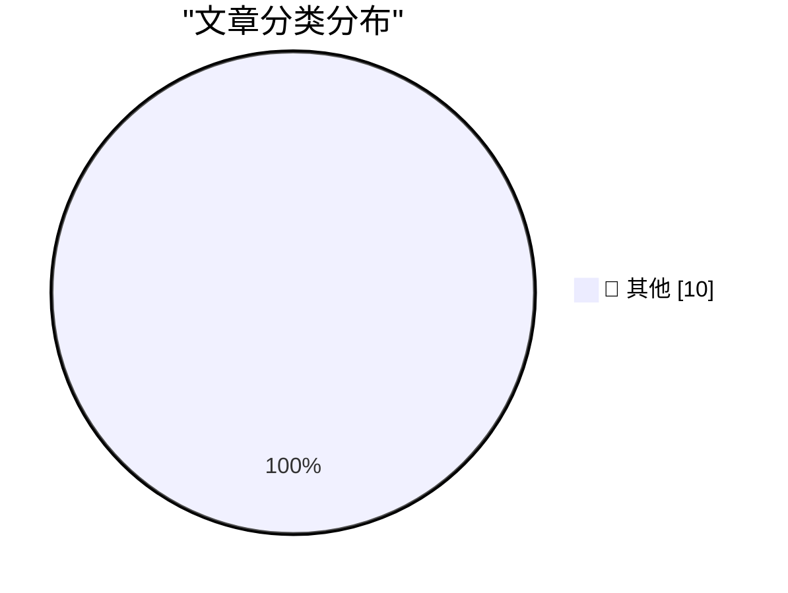

# 📰 AI 博客每日精选 — 2026-07-27

> 来自 Karpathy 推荐的 92 个顶级技术博客，AI 精选 Top 10

## 📝 今日看点

今日技术圈聚焦于两大核心议题：人工智能的深远影响与全球科技巨头的监管博弈。一方面，对“AI狂热”侵蚀全球决策的反思引发深度讨论；另一方面，欧盟对谷歌开出巨额反垄断罚单，凸显数字市场竞争白热化。同时，从加密货币中继市场的欺诈风险到开源领袖的思考，安全、开源与伦理问题持续成为技术演进的伴随焦点。

---

## 🏆 今日必读

🥇 **An Inside Look at the Relay Market Powering Token Resellers and Fraud**

[An Inside Look at the Relay Market Powering Token Resellers and Fraud](https://simonwillison.net/2026/Jul/26/relay-market/#atom-everything) — simonwillison.net · 5 小时前 · 📝 其他

> An Inside Look at the Relay Market Powering Token Resellers and Fraud

🥈 **Ruff v0.16.0**

[Ruff v0.16.0](https://simonwillison.net/2026/Jul/25/ruff/#atom-everything) — simonwillison.net · 1 天前 · 📝 其他

> Ruff v0.16.0

🥉 **‘AI Mania Is Eviscerating Global Decision-Making’**

[‘AI Mania Is Eviscerating Global Decision-Making’](https://ludic.mataroa.blog/blog/ai-mania-is-eviscerating-global-decision-making/) — daringfireball.net · 1 天前 · 📝 其他

> ‘AI Mania Is Eviscerating Global Decision-Making’

---

## 📊 数据概览

| 扫描源 | 抓取文章 | 时间范围 | 精选 |
|:---:|:---:|:---:|:---:|
| 75/92 | 2018 篇 → 20 篇 | 48h | **10 篇** |

### 分类分布

---

## 📝 其他

### 1. An Inside Look at the Relay Market Powering Token Resellers and Fraud

[An Inside Look at the Relay Market Powering Token Resellers and Fraud](https://simonwillison.net/2026/Jul/26/relay-market/#atom-everything) — **simonwillison.net** · 5 小时前 · ⭐ 15/30

> An Inside Look at the Relay Market Powering Token Resellers and Fraud

---

### 2. Ruff v0.16.0

[Ruff v0.16.0](https://simonwillison.net/2026/Jul/25/ruff/#atom-everything) — **simonwillison.net** · 1 天前 · ⭐ 15/30

> Ruff v0.16.0

---

### 3. ‘AI Mania Is Eviscerating Global Decision-Making’

[‘AI Mania Is Eviscerating Global Decision-Making’](https://ludic.mataroa.blog/blog/ai-mania-is-eviscerating-global-decision-making/) — **daringfireball.net** · 1 天前 · ⭐ 15/30

> ‘AI Mania Is Eviscerating Global Decision-Making’

---

### 4. EU Fines Google $1 Billion for DMA Competition Violations, Including Making Search Results More Useful

[EU Fines Google $1 Billion for DMA Competition Violations, Including Making Search Results More Useful](https://digital-markets-act.ec.europa.eu/commission-fines-google-eur890-million-breaches-digital-markets-act-2026-07-23_en) — **daringfireball.net** · 1 天前 · ⭐ 15/30

> EU Fines Google $1 Billion for DMA Competition Violations, Including Making Search Results More Useful

---

### 5. Being Linux Torvalds

[Being Linux Torvalds](http://antirez.com/news/171) — **antirez.com** · 1 天前 · ⭐ 15/30

> Being Linux Torvalds

---

### 6. Why $550 Million Medical Debt only Cost $5.5 Million

[Why $550 Million Medical Debt only Cost $5.5 Million](https://idiallo.com/byte-size/550-million-only-cost-5-million) — **idiallo.com** · 6 小时前 · ⭐ 15/30

> Why $550 Million Medical Debt only Cost $5.5 Million

---

### 7. Pluralistic: Apple's robo-repo (25 Jul 2026)

[Pluralistic: Apple's robo-repo (25 Jul 2026)](https://pluralistic.net/2026/07/25/cruel-cruelty-oh-cruelty/) — **pluralistic.net** · 1 天前 · ⭐ 15/30

> Pluralistic: Apple's robo-repo (25 Jul 2026)

---

### 8. Book Review: Dungeon Crawler Carl by Matt Dinniman ★★⯪☆☆

[Book Review: Dungeon Crawler Carl by Matt Dinniman ★★⯪☆☆](https://shkspr.mobi/blog/2026/07/book-review-dungeon-crawler-carl-by-matt-dinniman/) — **shkspr.mobi** · 13 小时前 · ⭐ 15/30

> Book Review: Dungeon Crawler Carl by Matt Dinniman ★★⯪☆☆

---

### 9. Some Quick Thoughts on EMF Camp 2026

[Some Quick Thoughts on EMF Camp 2026](https://shkspr.mobi/blog/2026/07/some-quick-thoughts-on-emf-camp-2026/) — **shkspr.mobi** · 1 天前 · ⭐ 15/30

> Some Quick Thoughts on EMF Camp 2026

---

### 10. Permutation roots

[Permutation roots](https://www.johndcook.com/blog/2026/07/26/permutation-roots/) — **johndcook.com** · 4 小时前 · ⭐ 15/30

> Permutation roots

---

*生成于 2026-07-27 01:18 | 扫描 75 源 → 获取 2018 篇 → 精选 10 篇*
*基于 [Hacker News Popularity Contest 2025](https://refactoringenglish.com/tools/hn-popularity/) RSS 源列表，由 [Andrej Karpathy](https://x.com/karpathy) 推荐*
*由「懂点儿AI」制作，欢迎关注同名微信公众号获取更多 AI 实用技巧 💡*
