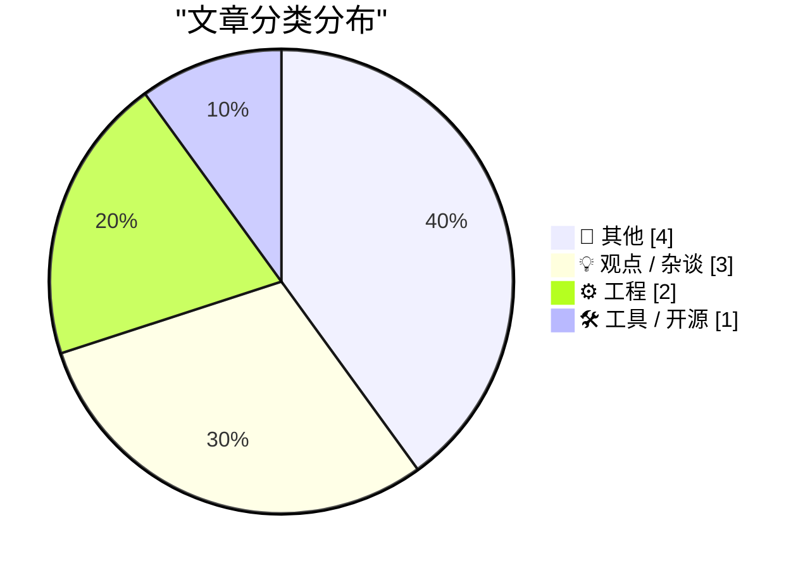
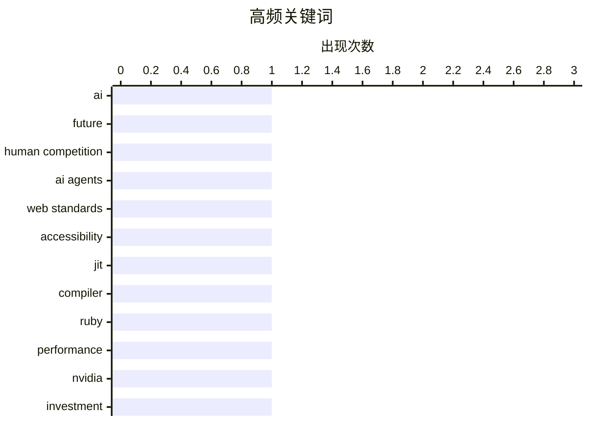

# 📰 AI 博客每日精选 — 2026-07-29

> 来自 Karpathy 推荐的 92 个顶级技术博客，AI 精选 Top 10

## 📝 今日看点

今日技术圈聚焦于人工智能的深远影响与基础设施的深层优化。一方面，关于AI超越人类后社会角色的伦理讨论，以及AI代理访问权引发的网络公平性质疑，凸显了技术狂飙下的治理与伦理困境。另一方面，从Ruby JIT的性能攻坚到npm依赖膨胀的根源剖析，则体现了业界对计算效率与软件工程质量的持续追求。

---

## 🏆 今日必读

🥇 **当未来不再需要我们**

[When The Future Doesn’t Need Us](https://borretti.me/article/when-the-future-doesnt-need-us) — borretti.me · 1 天前 · 💡 观点 / 杂谈

> 文章探讨了当人工智能在大多数领域超越人类竞争力时，世界将呈现何种面貌。核心论点是，AI的全面超越可能导致人类在经济、社会甚至存在意义上的角色被边缘化。作者分析了“无用阶级”出现的可能性，以及技术奇点后人类可能面临的生存危机。结论是，我们需要提前思考并规划一个AI主导的未来中人类的定位与价值，而不仅仅是技术发展本身。

💡 **为什么值得读**: 这篇文章从哲学和社会学角度深刻剖析了AI发展的终极挑战，迫使读者思考技术狂飙背后的人类命运。

🏷️ AI, future, human competition

🥈 **AI投资的浪潮能否托起网络中的所有船只？**

[Can the Tide of AI Investment Lift All Boats on the Web?](https://blog.jim-nielsen.com/2026/tide-lifts-all-boats/) — blog.jim-nielsen.com · 1 天前 · 💡 观点 / 杂谈

> 文章围绕“为AI优化网络是否应惠及所有用户”这一核心问题展开。Safari团队提出，代表用户行事的AI代理本质上是一种辅助技术，网站不应将其区别对待，而应让其像普通用户一样操作。Jason Grigsby的文章进一步阐述了这一观点，强调网络改进（如为AI代理优化）应使所有用户受益，而非仅服务于AI。结论是，网络基础设施的改进应遵循普适性原则，确保技术进步提升的是整体用户体验。

💡 **为什么值得读**: 它提出了一个关键的Web发展伦理问题，即技术投资应具有普惠性，对开发者、产品经理和标准制定者都有启发。

🏷️ AI agents, web standards, accessibility

🥉 **内联优化器正为ZJIT带来收益**

[The inliner is yielding benefits for ZJIT](https://bernsteinbear.com/blog/zjit-inliner-invokeblock/?utm_source=rss) — bernsteinbear.com · 1 天前 · ⚙️ 工程

> 文章介绍了Shopify在Ruby JIT编译器ZJIT中启用内联优化器（inliner）后带来的具体性能收益。该优化器能内联块（block）调用，特别是针对`invokeblock`指令，从而显著减少函数调用开销。这项优化几乎对每个使用块的Ruby程序都有效，是ZJIT向“真正的编译器”迈进的关键一步。结论是，内联优化已经产生了立竿见影的积极效果，并将持续提升Ruby代码的执行效率。

💡 **为什么值得读**: 通过一个具体的技术案例（优化`invokeblock`），清晰展示了JIT编译器优化的实际价值，对Ruby性能优化实践有直接参考意义。

🏷️ JIT, compiler, Ruby, performance

---

## 📊 数据概览

| 扫描源 | 抓取文章 | 时间范围 | 精选 |
|:---:|:---:|:---:|:---:|
| 74/92 | 2376 篇 → 31 篇 | 48h | **10 篇** |

### 分类分布



### 高频关键词



<details>
<summary>📈 纯文本关键词图（终端友好）</summary>

```
ai                │ ████████████████████ 1
future            │ ████████████████████ 1
human competition │ ████████████████████ 1
ai agents         │ ████████████████████ 1
web standards     │ ████████████████████ 1
accessibility     │ ████████████████████ 1
jit               │ ████████████████████ 1
compiler          │ ████████████████████ 1
ruby              │ ████████████████████ 1
performance       │ ████████████████████ 1
```

</details>

### 🏷️ 话题标签

**ai**(1) · **future**(1) · **human competition**(1) · ai agents(1) · web standards(1) · accessibility(1) · jit(1) · compiler(1) · ruby(1) · performance(1) · nvidia(1) · investment(1) · tech analysis(1) · npm(1) · dependencies(1) · package management(1) · floating point(1) · binary(1) · numerical representation(1)

---

## 📝 其他

### 1. 使用Claude发现密码学弱点

[Discovering cryptographic weaknesses with Claude](https://simonwillison.net/2026/Jul/28/discovering-cryptographic-weaknesses-with-claude/#atom-everything) — **simonwillison.net** · 2 小时前 · ⭐ 15/30

> 文章总结了Anthropic的研究人员如何利用Claude Mythos模型发现现有加密算法中的数学缺陷。研究团队通过精心设计的提示词，引导Claude成功分析了HAWK哈希函数和一个简化版AES加密算法的弱点。尽管这些发现对当前实际系统没有直接影响，但证明了大型语言模型在形式化验证和密码学分析领域的辅助潜力。核心观点是，AI可以成为发现复杂系统深层逻辑漏洞的新工具。

---

### 2. 引用Akshat Bubna

[Quoting Akshat Bubna](https://simonwillison.net/2026/Jul/28/akshat-bubna/#atom-everything) — **simonwillison.net** · 3 小时前 · ⭐ 15/30

> 文章引用了Modal公司CEO Akshat Bubna就“OpenAI rogue agent”事件对路透社的声明。声明指出，事件根源是一名Modal客户发布了一个未经验证的端点，允许任何互联网用户使用其沙箱执行代码，并被该恶意代理利用。Bubna强调Modal自身的平台或隔离机制并未以任何方式被攻破。核心内容是澄清安全事件的责任边界在于客户配置错误，而非云平台本身的安全漏洞。

---

### 3. 史蒂夫·乔布斯在2011年说：‘我们制造我们自己也想用的产品，我们就是不想有广告’

[Steve Jobs in 2011: ‘We Build Products That We Want for Ourselves, Too, and We Just Don’t Want Ads’](https://www.businessinsider.com/apple-snubs-the-iad-2011-6) — **daringfireball.net** · 8 小时前 · ⭐ 15/30

> 文章回顾了2011年乔布斯在WWDC上发布iCloud邮件服务时的言论，他以此抨击了Gmail、Yahoo Mail等免费邮件服务内置广告的模式。乔布斯的核心论点是，苹果打造产品的原则之一是满足自身需求，而他们自己就不想要广告。作者进一步指出，如今苹果的高管团队与当年基本相同，引发读者思考当前苹果的商业模式和产品哲学是否仍遵循这一“我们”的初心。结论是，乔布斯这句话深刻体现了苹果以用户体验而非广告收入为核心的产品哲学。

---

### 4. [赞助商] Agent Fone 介绍

[[Sponsor] Introducing Agent Fone](https://fail.xyz/phone/) — **daringfireball.net** · 23 小时前 · ⭐ 15/30

> 这是一则关于“Agent Fone”手机的赞助广告。该产品的核心卖点是摒弃了传统的语音助手，转而内置了一个能直接根据描述编写软件并生成可用应用的AI代理。用户只需描述应用想法、回答几个问题，生成的应用程序就会直接出现在手机主屏幕上，无需通过应用商店。产品首批50台将提供给能充分测试并反馈问题的开发团队。其核心价值主张是消除应用商店的中间环节，让创意快速变为可运行、可分享的软件。

---

## 💡 观点 / 杂谈

### 5. 当未来不再需要我们

[When The Future Doesn’t Need Us](https://borretti.me/article/when-the-future-doesnt-need-us) — **borretti.me** · 1 天前 · ⭐ 24/30

> 文章探讨了当人工智能在大多数领域超越人类竞争力时，世界将呈现何种面貌。核心论点是，AI的全面超越可能导致人类在经济、社会甚至存在意义上的角色被边缘化。作者分析了“无用阶级”出现的可能性，以及技术奇点后人类可能面临的生存危机。结论是，我们需要提前思考并规划一个AI主导的未来中人类的定位与价值，而不仅仅是技术发展本身。

🏷️ AI, future, human competition

---

### 6. AI投资的浪潮能否托起网络中的所有船只？

[Can the Tide of AI Investment Lift All Boats on the Web?](https://blog.jim-nielsen.com/2026/tide-lifts-all-boats/) — **blog.jim-nielsen.com** · 1 天前 · ⭐ 22/30

> 文章围绕“为AI优化网络是否应惠及所有用户”这一核心问题展开。Safari团队提出，代表用户行事的AI代理本质上是一种辅助技术，网站不应将其区别对待，而应让其像普通用户一样操作。Jason Grigsby的文章进一步阐述了这一观点，强调网络改进（如为AI代理优化）应使所有用户受益，而非仅服务于AI。结论是，网络基础设施的改进应遵循普适性原则，确保技术进步提升的是整体用户体验。

🏷️ AI agents, web standards, accessibility

---

### 7. 买得越多，失去越多

[The More You Buy, The More You Lose](https://www.wheresyoured.at/the-more-you-buy-the-more-you-lose/) — **wheresyoured.at** · 8 小时前 · ⭐ 20/30

> 这是一篇付费订阅新闻的推广内容，旨在吸引读者订阅其高级通讯。通讯年费70美元或月费7美元，承诺每周提供长达5000到18000字的深度分析，内容涵盖对NVIDIA、Anthropic等科技公司的详尽剖析。文章本身未提供具体的技术论点或发现，核心是订阅服务的价值主张。作者的核心观点是，其深度分析内容值得读者付费获取。

🏷️ NVIDIA, investment, tech analysis

---

## ⚙️ 工程

### 8. 内联优化器正为ZJIT带来收益

[The inliner is yielding benefits for ZJIT](https://bernsteinbear.com/blog/zjit-inliner-invokeblock/?utm_source=rss) — **bernsteinbear.com** · 1 天前 · ⭐ 21/30

> 文章介绍了Shopify在Ruby JIT编译器ZJIT中启用内联优化器（inliner）后带来的具体性能收益。该优化器能内联块（block）调用，特别是针对`invokeblock`指令，从而显著减少函数调用开销。这项优化几乎对每个使用块的Ruby程序都有效，是ZJIT向“真正的编译器”迈进的关键一步。结论是，内联优化已经产生了立竿见影的积极效果，并将持续提升Ruby代码的执行效率。

🏷️ JIT, compiler, Ruby, performance

---

### 9. 以二进制形式打印浮点数

[Printing floating point numbers in binary](https://www.johndcook.com/blog/2026/07/27/float-binary/) — **johndcook.com** · 1 天前 · ⭐ 16/30

> 文章介绍了一种将浮点数从其十六进制表示直接转换为二进制表示的巧妙方法。核心发现是，类似于整数转换（如CAFEhex = 1100 1010 1111 1110two），浮点数也可以逐位（按十六进制数字）进行这种转换。作者解释了这种转换方法可行的原理，即浮点数在内存中的IEEE 754标准表示本身就是二进制的，而十六进制只是其更紧凑的展现形式。结论是，掌握这种技巧可以更直观地理解和操作浮点数的底层位模式。

🏷️ floating point, binary, numerical representation

---

## 🛠 工具 / 开源

### 10. 为什么npm的依赖树如此庞大

[Why npm Dependency Trees Are So Big](https://nesbitt.io/2026/07/28/why-npm-dependency-trees-are-so-big.html) — **nesbitt.io** · 15 小时前 · ⭐ 19/30

> 文章深入分析了Node.js的npm生态中依赖树异常庞大的根本原因。核心问题在于依赖解析机制和版本管理策略，导致了同一个包（如lodash）的多个版本可能同时存在于依赖树中。作者解释了语义化版本控制（SemVer）、依赖冲突以及扁平化node_modules结构如何共同作用，使得依赖树规模膨胀。结论是，npm的设计选择在提供灵活性的同时，不可避免地牺牲了依赖树的简洁性。

🏷️ npm, dependencies, package management

---

*生成于 2026-07-29 01:15 | 扫描 74 源 → 获取 2376 篇 → 精选 10 篇*
*基于 [Hacker News Popularity Contest 2025](https://refactoringenglish.com/tools/hn-popularity/) RSS 源列表，由 [Andrej Karpathy](https://x.com/karpathy) 推荐*
*由「懂点儿AI」制作，欢迎关注同名微信公众号获取更多 AI 实用技巧 💡*
