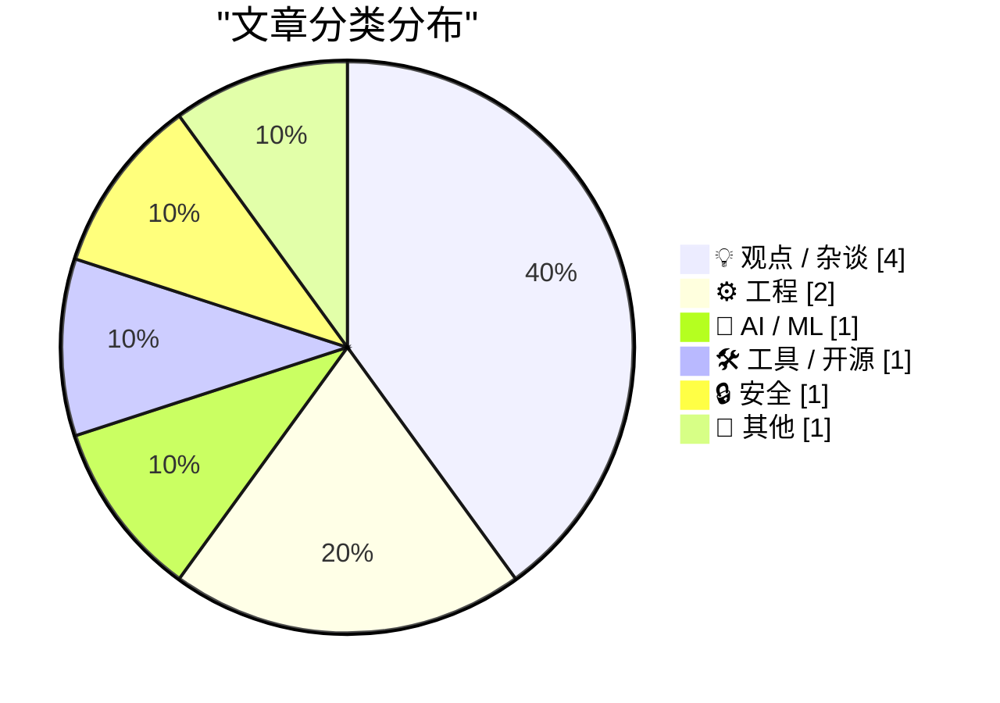
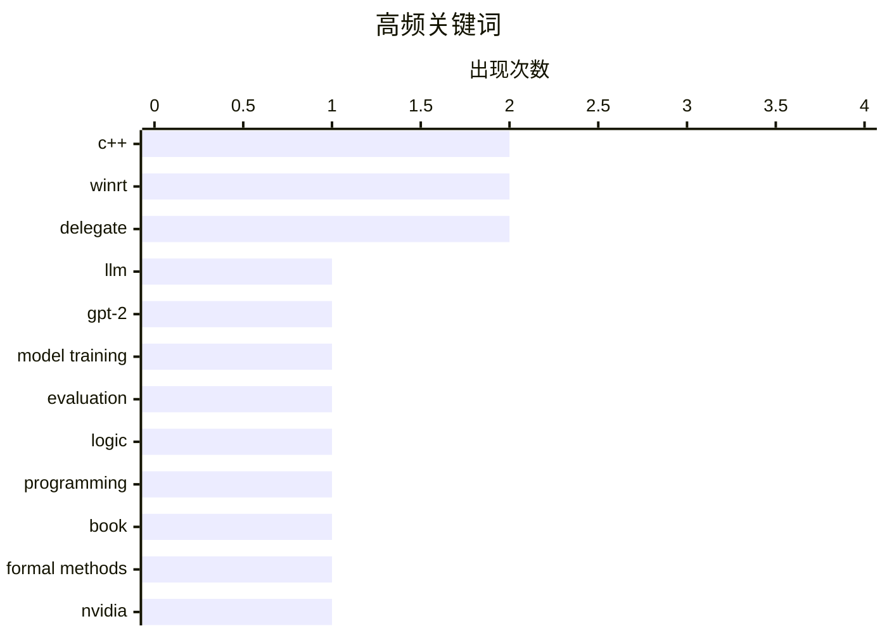

# 📰 AI 博客每日精选 — 2026-07-30

> 来自 Karpathy 推荐的 92 个顶级技术博客，AI 精选 Top 10

## 📝 今日看点

今日技术圈聚焦于人工智能基础模型构建的实践挑战与工程领域的深度优化。开发者通过对比实验，揭示了大规模语言模型训练中预训练权重与指令微调的关键作用。同时，从npm依赖治理到C++/WinRT异常安全的系列教程，反映出业界对系统复杂性和代码健壮性的持续关注。此外，将密码学密钥映射至物理媒介的创新思路，展现了安全方案设计的另类探索。

---

## 🏆 今日必读

🥇 **为何OpenAI的GPT-2权重优于我的模型？**

[Why do OpenAI's GPT-2 weights beat mine?](https://www.gilesthomas.com/2026/07/why-do-openai-gpt2-weights-beat-mine-1-intro) — gilesthomas.com · 9 小时前 · 🤖 AI / ML

> 作者在从头训练LLM项目后，发现其模型在遵循指令能力上不如OpenAI原始的GPT-2 small权重。评估基于《Build a Large Language Model (from Scratch)》第7章的指令微调代码进行。作者通过对比训练过程和模型性能，试图找出导致这一差距的具体原因。核心问题在于复现过程中某些关键细节或超参数设置可能与原始实现存在差异。

💡 **为什么值得读**: 对于希望深入理解模型复现细节、指令微调技术难点以及开源与原始模型性能差异根源的实践者，本文提供了一个具体而深入的案例剖析。

🏷️ LLM, GPT-2, model training, evaluation

🥈 **《程序员逻辑学》正式完成**

[Logic for Programmers is Done](https://buttondown.com/hillelwayne/archive/logic-for-programmers-is-done/) — buttondown.com/hillelwayne · 9 小时前 · 💡 观点 / 杂谈

> Hillel Wayne宣布其著作《Logic for Programmers》已达到1.0版本并已出版纸质书。该书旨在为程序员提供逻辑学相关的知识。读者可通过其官方网站、亚马逊或Leanpub获取完整电子书及更新。早期电子书购买者可在Leanpub免费下载最终版。

💡 **为什么值得读**: 这本书系统性地将逻辑学知识与编程实践相结合，是提升开发者底层思维和问题分析能力的宝贵资源。

🏷️ logic, programming, book, formal methods

🥉 **买得越多，失去越多**

[The More You Buy, The More You Lose](https://www.wheresyoured.at/the-more-you-buy-the-more-you-lose/) — wheresyoured.at · 1 天前 · 💡 观点 / 杂谈

> 文章推广作者的高级付费通讯订阅服务，年费70美元或月费7美元。订阅者每周可获得一篇篇幅在5000到18000字之间的深度分析通讯。内容涵盖对NVIDIA、Anthropic等科技公司的详尽剖析。

💡 **为什么值得读**: 适合希望获得关于NVIDIA、Anthropic等前沿科技公司深度、长篇分析内容，并愿意为此付费的读者。

🏷️ NVIDIA, Anthropic, industry analysis, newsletter

---

## 📊 数据概览

| 扫描源 | 抓取文章 | 时间范围 | 精选 |
|:---:|:---:|:---:|:---:|
| 74/92 | 2020 篇 → 33 篇 | 48h | **10 篇** |

### 分类分布



### 高频关键词



<details>
<summary>📈 纯文本关键词图（终端友好）</summary>

```
c++            │ ████████████████████ 2
winrt          │ ████████████████████ 2
delegate       │ ████████████████████ 2
llm            │ ██████████░░░░░░░░░░ 1
gpt-2          │ ██████████░░░░░░░░░░ 1
model training │ ██████████░░░░░░░░░░ 1
evaluation     │ ██████████░░░░░░░░░░ 1
logic          │ ██████████░░░░░░░░░░ 1
programming    │ ██████████░░░░░░░░░░ 1
book           │ ██████████░░░░░░░░░░ 1
```

</details>

### 🏷️ 话题标签

**c++**(2) · **winrt**(2) · **delegate**(2) · llm(1) · gpt-2(1) · model training(1) · evaluation(1) · logic(1) · programming(1) · book(1) · formal methods(1) · nvidia(1) · anthropic(1) · industry analysis(1) · newsletter(1) · npm(1) · dependencies(1) · javascript(1) · package management(1) · exception(1)

---

## 💡 观点 / 杂谈

### 1. 《程序员逻辑学》正式完成

[Logic for Programmers is Done](https://buttondown.com/hillelwayne/archive/logic-for-programmers-is-done/) — **buttondown.com/hillelwayne** · 9 小时前 · ⭐ 23/30

> Hillel Wayne宣布其著作《Logic for Programmers》已达到1.0版本并已出版纸质书。该书旨在为程序员提供逻辑学相关的知识。读者可通过其官方网站、亚马逊或Leanpub获取完整电子书及更新。早期电子书购买者可在Leanpub免费下载最终版。

🏷️ logic, programming, book, formal methods

---

### 2. 买得越多，失去越多

[The More You Buy, The More You Lose](https://www.wheresyoured.at/the-more-you-buy-the-more-you-lose/) — **wheresyoured.at** · 1 天前 · ⭐ 21/30

> 文章推广作者的高级付费通讯订阅服务，年费70美元或月费7美元。订阅者每周可获得一篇篇幅在5000到18000字之间的深度分析通讯。内容涵盖对NVIDIA、Anthropic等科技公司的详尽剖析。

🏷️ NVIDIA, Anthropic, industry analysis, newsletter

---

### 3. 不拍照的摄影师

[The Photographer Who Takes No Pictures](https://simone.org/intent/) — **simone.org** · 1 天前 · ⭐ 17/30

> 作者讲述了2012年的一次旅行如何彻底改变了他与摄影的关系。其摄影理念从精心摆拍转变为捕捉真实有意义的瞬间。核心动机从寻求外部验证转向为了深度参与和体验当下。文章反思了在社交媒体时代，摄影行为本身如何影响我们对真实经历的感知。

🏷️ photography, digital culture, personal reflection

---

### 4. 克莱夫·辛克莱：一个美国人的视角

[Clive Sinclair: a US perspective](https://dfarq.homeip.net/clive-sinclair-a-us-perspective/?utm_source=rss&#038;utm_medium=rss&#038;utm_campaign=clive-sinclair-a-us-perspective) — **dfarq.homeip.net** · 14 小时前 · ⭐ 16/30

> 一位美国作者提名克莱夫·辛克莱爵士为历史上对计算机普及贡献最大的人，尽管作者本人从未使用过辛克莱的电脑。文章在辛克莱诞辰日（7月30日）之际，从美国视角回顾了这位英国发明家的历史地位。肯定了辛克莱在降低计算机成本、推动个人电脑进入家庭方面的开创性作用。

🏷️ computing history, Clive Sinclair, personal computer

---

## ⚙️ 工程

### 5. 用C++/WinRT制作敏捷的Windows运行时委托（第8部分）

[Making an agile version of a Windows Runtime delegate in C++/WinRT, part 8](https://devblogs.microsoft.com/oldnewthing/20260729-00/?p=112570) — **devblogs.microsoft.com/oldnewthing** · 11 小时前 · ⭐ 17/30

> 这是关于在C++/WinRT中创建敏捷委托系列教程的第八部分。本部分专注于Lambda表达式捕获中可能隐藏的异常问题。探讨了在异步或跨线程场景下，捕获的变量生命周期管理不当所引发的异常安全风险。提供了处理这类问题的具体编程实践和模式。

🏷️ C++, WinRT, delegate, exception

---

### 6. 用C++/WinRT制作敏捷的Windows运行时委托（第7部分）

[Making an agile version of a Windows Runtime delegate in C++/WinRT, part 7](https://devblogs.microsoft.com/oldnewthing/20260728-00/?p=112568) — **devblogs.microsoft.com/oldnewthing** · 1 天前 · ⭐ 17/30

> 系列教程的第七部分，继续深入探讨异常安全性的实现。在前文基础上，进一步研究在委托创建和调用过程中保证强异常安全保证的复杂情况。分析了资源获取、状态回滚以及在WinRT组件模型中处理异常的最佳实践。

🏷️ C++, WinRT, delegate, exception safety

---

## 🤖 AI / ML

### 7. 为何OpenAI的GPT-2权重优于我的模型？

[Why do OpenAI's GPT-2 weights beat mine?](https://www.gilesthomas.com/2026/07/why-do-openai-gpt2-weights-beat-mine-1-intro) — **gilesthomas.com** · 9 小时前 · ⭐ 23/30

> 作者在从头训练LLM项目后，发现其模型在遵循指令能力上不如OpenAI原始的GPT-2 small权重。评估基于《Build a Large Language Model (from Scratch)》第7章的指令微调代码进行。作者通过对比训练过程和模型性能，试图找出导致这一差距的具体原因。核心问题在于复现过程中某些关键细节或超参数设置可能与原始实现存在差异。

🏷️ LLM, GPT-2, model training, evaluation

---

## 🛠 工具 / 开源

### 8. 为何npm依赖树如此庞大

[Why npm Dependency Trees Are So Big](https://nesbitt.io/2026/07/28/why-npm-dependency-trees-are-so-big.html) — **nesbitt.io** · 1 天前 · ⭐ 20/30

> 文章探讨了Node.js的npm包管理器依赖树体积庞大的根本原因。开篇以“两个版本的lodash走进一棵树”的幽默比喻切入问题。分析了npm的依赖解析机制、语义化版本控制以及包重复安装等现象。指出了依赖嵌套和版本冲突是导致树结构膨胀的主要技术因素。

🏷️ npm, dependencies, JavaScript, package management

---

## 🔒 安全

### 9. 密码学密钥与扑克牌组

[Cryptographic Keys and Decks of Cards](https://www.johndcook.com/blog/2026/07/28/keys-and-cards/) — **johndcook.com** · 1 天前 · ⭐ 17/30

> 文章探讨了利用扑克牌排列顺序存储密码学密钥的物理安全方案。一副52张的标准扑克牌可以存储225比特数据，因为⌊log₂(52!)⌋ = 225。该方法将密钥的熵映射到牌序这种易于人工记忆和隐藏的载体上。当需要存储更大密钥时，则需要扩展牌组的数量或采用其他编码方式。

🏷️ cryptography, key storage, combinatorics, entropy

---

## 📝 其他

### 10. 引用D. Richard Hipp

[Quoting D. Richard Hipp](https://simonwillison.net/2026/Jul/29/d-richard-hipp/#atom-everything) — **simonwillison.net** · 4 小时前 · ⭐ 15/30

> 引用了SQLite创始人D. Richard Hipp的一段论述，对比了SQL出现前后数据查询方式的变革。他指出，过去需要雇佣昂贵的COBOL程序员编写专用代码来查询大型数据集。SQL的诞生极大地简化了这一过程，通过一种简单的声明式语言，就能自动生成之前需要大量人力编写的代码。这本质上是一场提升数据访问效率和降低成本的范式转移。

---

*生成于 2026-07-30 01:16 | 扫描 74 源 → 获取 2020 篇 → 精选 10 篇*
*基于 [Hacker News Popularity Contest 2025](https://refactoringenglish.com/tools/hn-popularity/) RSS 源列表，由 [Andrej Karpathy](https://x.com/karpathy) 推荐*
*由「懂点儿AI」制作，欢迎关注同名微信公众号获取更多 AI 实用技巧 💡*
