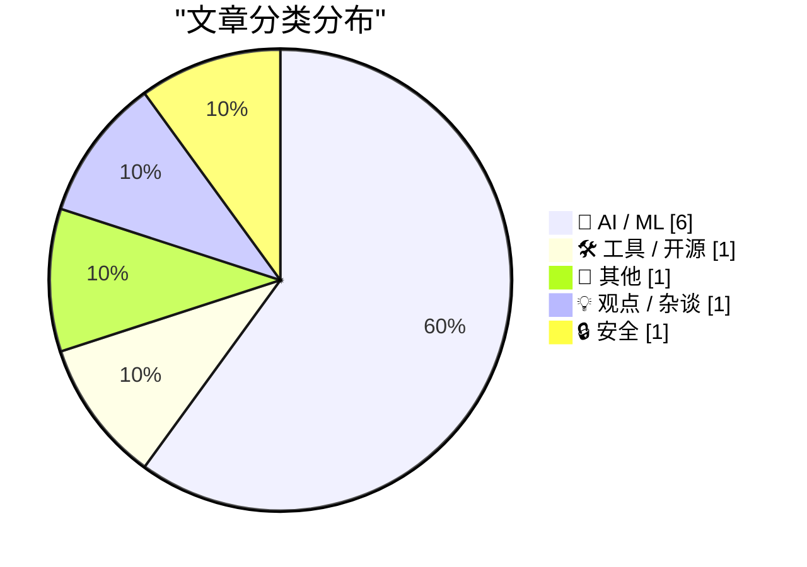
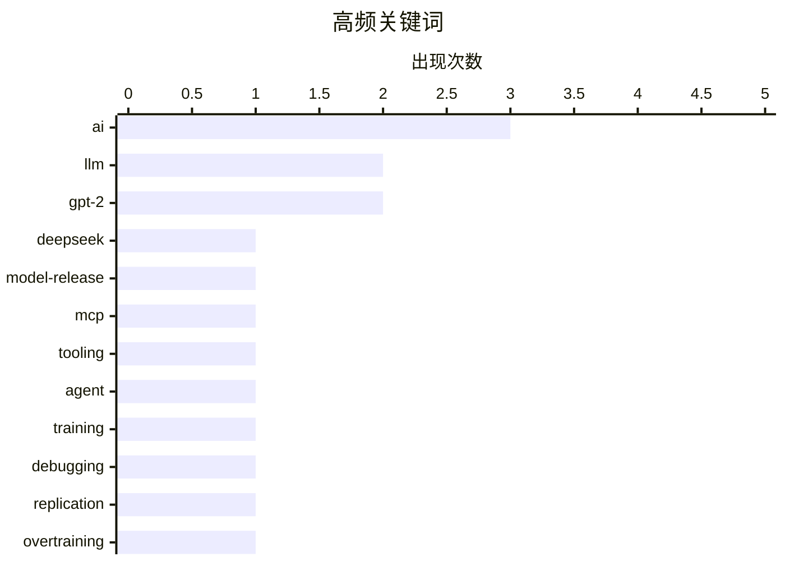

# 📰 AI 博客每日精选 — 2026-08-01

> 来自 Karpathy 推荐的 92 个顶级技术博客，AI 精选 Top 10

## 📝 今日看点

今日技术圈聚焦于AI领域的深度演进与成本反思。大模型持续迭代，智能体能力与数学推理成为突破重点，同时业界开始警惕其日益攀升的实用成本。另一方面，固态电池等前沿硬件技术因能解决根本性瓶颈，持续吸引全球研发热潮。

---

## 🏆 今日必读

🥇 **DeepSeek-V4-Flash-0731：显著增强智能体能力的最新版本**

[deepseek-ai/DeepSeek-V4-Flash-0731](https://simonwillison.net/2026/Jul/31/deepseek-v4-flash-0731/#atom-everything) — simonwillison.net · 1 小时前 · 🤖 AI / ML

> DeepSeek发布了其V4系列的最新成员DeepSeek-V4-Flash-0731，该模型在智能体能力上得到实质性增强。模型参数量为3040亿，在Hugging Face上占用167GB存储空间，但其性能表现远超其规模预期。根据Artificial Analysis的排名，它在性能上超越了参数量达4280亿的MiniMax M3模型，同时输入成本仅为每百万tokens 0.14美元。这表明DeepSeek-V4-Flash-0731在效率与性能之间取得了卓越的平衡，是一款高性价比的模型。

💡 **为什么值得读**: 本文揭示了DeepSeek最新模型如何以更小的参数量和更低的成本实现超越更大模型的性能，为关注大模型效率与性价比的技术决策者提供了关键参考。

🏷️ LLM, DeepSeek, model-release

🥈 **无状态MCP重燃我的兴趣（并催生了mcp-explorer和datasette-mcp）**

[Stateless MCP has recaptured my interest (and inspired mcp-explorer and datasette-mcp)](https://simonwillison.net/2026/Jul/31/stateless-mcp/#atom-everything) — simonwillison.net · 1 小时前 · 🛠 工具 / 开源

> 文章聚焦于Model Context Protocol (MCP) 2.0规范（即2026-07-28版本）的发布，这是该协议自推出以来最重大的变更。新规范的核心是引入了“无状态MCP”概念，这一变化重新激发了作者对MCP协议的个人兴趣。作者为此开发了mcp-explorer和datasette-mcp两个工具来探索新协议。MCP 2.0的发布标志着该协议在设计与功能上的一个关键转折点，旨在提升模型的上下文处理能力。

💡 **为什么值得读**: 通过一线开发者的亲身实践，本文清晰地解读了MCP 2.0这一重大技术变革的核心价值及其带来的新可能性，是了解模型上下文协议前沿动态的绝佳窗口。

🏷️ MCP, tooling, agent

🥉 **为何OpenAI的GPT-2权重优于我的？第二部分：Bug修复**

[Why do OpenAI's GPT-2 weights beat mine?  Part two: the bugfix](https://www.gilesthomas.com/2026/07/why-do-openai-gpt2-weights-beat-mine-2-the-bugfix) — gilesthomas.com · 1 天前 · 🤖 AI / ML

> 作者正在探究其复现的GPT-2风格模型在指令跟随评估上为何逊色于OpenAI原版权重。在撰写初步实验结果时，作者使用ChatGPT作为“编辑委员会”检查文章，意外发现ChatGPT指出了一个关键的代码Bug。这个Bug可能导致模型训练过程中的权重更新出现偏差。这一发现凸显了即使在进行严谨的技术研究时，借助外部工具进行交叉验证也能发现自身忽略的关键问题。

💡 **为什么值得读**: 文章生动展示了一个“无心插柳”的技术调试过程，揭示了AI辅助工具在复杂代码审查中的实用价值，对任何进行模型复现的研究者都有启发。

🏷️ GPT-2, training, debugging, replication

---

## 📊 数据概览

| 扫描源 | 抓取文章 | 时间范围 | 精选 |
|:---:|:---:|:---:|:---:|
| 73/92 | 2001 篇 → 37 篇 | 48h | **10 篇** |

### 分类分布



### 高频关键词



<details>
<summary>📈 纯文本关键词图（终端友好）</summary>

```
ai            │ ████████████████████ 3
llm           │ █████████████░░░░░░░ 2
gpt-2         │ █████████████░░░░░░░ 2
deepseek      │ ███████░░░░░░░░░░░░░ 1
model-release │ ███████░░░░░░░░░░░░░ 1
mcp           │ ███████░░░░░░░░░░░░░ 1
tooling       │ ███████░░░░░░░░░░░░░ 1
agent         │ ███████░░░░░░░░░░░░░ 1
training      │ ███████░░░░░░░░░░░░░ 1
debugging     │ ███████░░░░░░░░░░░░░ 1
```

</details>

### 🏷️ 话题标签

**ai**(3) · **llm**(2) · **gpt-2**(2) · deepseek(1) · model-release(1) · mcp(1) · tooling(1) · agent(1) · training(1) · debugging(1) · replication(1) · overtraining(1) · evaluation(1) · modeling(1) · mathematics(1) · discovery(1) · autonomous agents(1) · prompt engineering(1) · solid-state battery(1) · energy storage(1)

---

## 🤖 AI / ML

### 1. DeepSeek-V4-Flash-0731：显著增强智能体能力的最新版本

[deepseek-ai/DeepSeek-V4-Flash-0731](https://simonwillison.net/2026/Jul/31/deepseek-v4-flash-0731/#atom-everything) — **simonwillison.net** · 1 小时前 · ⭐ 26/30

> DeepSeek发布了其V4系列的最新成员DeepSeek-V4-Flash-0731，该模型在智能体能力上得到实质性增强。模型参数量为3040亿，在Hugging Face上占用167GB存储空间，但其性能表现远超其规模预期。根据Artificial Analysis的排名，它在性能上超越了参数量达4280亿的MiniMax M3模型，同时输入成本仅为每百万tokens 0.14美元。这表明DeepSeek-V4-Flash-0731在效率与性能之间取得了卓越的平衡，是一款高性价比的模型。

🏷️ LLM, DeepSeek, model-release

---

### 2. 为何OpenAI的GPT-2权重优于我的？第二部分：Bug修复

[Why do OpenAI's GPT-2 weights beat mine?  Part two: the bugfix](https://www.gilesthomas.com/2026/07/why-do-openai-gpt2-weights-beat-mine-2-the-bugfix) — **gilesthomas.com** · 1 天前 · ⭐ 26/30

> 作者正在探究其复现的GPT-2风格模型在指令跟随评估上为何逊色于OpenAI原版权重。在撰写初步实验结果时，作者使用ChatGPT作为“编辑委员会”检查文章，意外发现ChatGPT指出了一个关键的代码Bug。这个Bug可能导致模型训练过程中的权重更新出现偏差。这一发现凸显了即使在进行严谨的技术研究时，借助外部工具进行交叉验证也能发现自身忽略的关键问题。

🏷️ GPT-2, training, debugging, replication

---

### 3. 为何OpenAI的GPT-2权重优于我的？第三部分：测试过拟合

[Why do OpenAI's GPT-2 weights beat mine?  Part three: testing overtraining](https://www.gilesthomas.com/2026/07/why-do-openai-gpt2-weights-beat-mine-3-overtraining) — **gilesthomas.com** · 23 小时前 · ⭐ 26/30

> 作者训练的部分GPT-2风格模型在测试集上的交叉熵损失甚至优于OpenAI原版小模型，但在指令微调评估上却表现更差。作者将最可能的原因指向了“过拟合”（overtraining），即模型在预训练阶段过度记忆了训练数据，损害了其后续微调时的泛化能力。为了验证这一理论，作者设计实验来测试不同训练阶段的模型在指令任务上的表现。本文是作者系统性排查性能差距根源的深入探索，旨在揭示预训练策略对下游任务适应性的潜在影响。

🏷️ GPT-2, overtraining, evaluation, modeling

---

### 4. AI模型需要“精神支持”才能做出发现

[AI models need moral support to make discoveries](https://seangoedecke.com/ai-models-need-moral-support/) — **seangoedecke.com** · 1 天前 · ⭐ 25/30

> 文章探讨了AI在解决长期数学难题方面能力的最新进展，指出2026年相关成果已呈现“井喷”之势。作者提出一个核心观点：AI模型需要“道德支持”（或“精神支持”），即研究者对模型能力的坚定信念和积极预期，才能突破瓶颈做出真正创新。这种支持体现在为模型提供探索的自由度、容忍失败并鼓励非常规的思考路径。作者认为，将AI视为具有潜力的合作伙伴而非单纯工具，是激发其发现能力的关键。

🏷️ AI, mathematics, LLM, discovery

---

### 5. AI短语手册

[The AI Phrasebook](https://nesbitt.io/2026/07/31/the-ai-phrasebook.html) — **nesbitt.io** · 15 小时前 · ⭐ 24/30

> 文章标题“我们家里就有自主智能体”是一句反讽，暗示当前所谓的“自主智能体”技术可能名不副实或尚未达到预期。内容极简，仅此一句话，旨在引发读者对“自主智能体”这一热门概念实际成熟度与落地情况的反思。它批判了业界对AI代理体能力的过度宣传与炒作。

🏷️ AI, autonomous agents, prompt engineering

---

### 6. 马克·扎克伯格：‘AI未来属于所有人’

[Mark Zuckerberg: ‘The AI Future Is for Everyone’](https://www.wsj.com/opinion/the-ai-future-is-for-everyone-a0c24e20?st=T6AAwM) — **daringfireball.net** · 1 天前 · ⭐ 23/30

> 本文转述了马克·扎克伯格在《华尔街日报》专栏文章中的核心观点，他宣称我们正处在历史的关键时刻，未来几年人们将能使用超越人类能力的超级智能。他认为这种超级智能将帮助人们在创造、商业、学习、健康、人际关系和职业发展等方面取得非凡成就。扎克伯格试图描绘一个AI普惠化的乐观未来图景，强调其技术将让所有人受益。

🏷️ AI, Meta, strategy, opinion

---

## 🛠 工具 / 开源

### 7. 无状态MCP重燃我的兴趣（并催生了mcp-explorer和datasette-mcp）

[Stateless MCP has recaptured my interest (and inspired mcp-explorer and datasette-mcp)](https://simonwillison.net/2026/Jul/31/stateless-mcp/#atom-everything) — **simonwillison.net** · 1 小时前 · ⭐ 26/30

> 文章聚焦于Model Context Protocol (MCP) 2.0规范（即2026-07-28版本）的发布，这是该协议自推出以来最重大的变更。新规范的核心是引入了“无状态MCP”概念，这一变化重新激发了作者对MCP协议的个人兴趣。作者为此开发了mcp-explorer和datasette-mcp两个工具来探索新协议。MCP 2.0的发布标志着该协议在设计与功能上的一个关键转折点，旨在提升模型的上下文处理能力。

🏷️ MCP, tooling, agent

---

## 📝 其他

### 8. 为何所有人都在尝试制造固态电池？

[Why Is Everyone Trying to Build a Solid-State Battery?](https://www.construction-physics.com/p/why-is-everyone-trying-to-build-a) — **construction-physics.com** · 1 天前 · ⭐ 24/30

> 文章核心主题是剖析固态电池技术成为全球研发焦点的根本原因。固态电池用固态材料取代传统锂离子电池中的液态电解质，这有望同时解决能量密度、安全性和充电速度三大瓶颈。更高的能量密度意味着更长的电动汽车续航，固态电解质不易燃爆可提升安全性，而更快的离子传导率能实现超快充电。因此，固态电池被视为下一代储能技术的制高点，吸引众多企业和资本竞相投入。

🏷️ solid-state battery, energy storage, technology

---

## 💡 观点 / 杂谈

### 9. 高级版：AI正变得过于昂贵

[Premium: AI Is Getting Way Too Expensive](https://www.wheresyoured.at/premium-ai-is-getting-way-too-expensive/) — **wheresyoured.at** · 9 小时前 · ⭐ 24/30

> 文章指出，当前关于AI的讨论多集中于其理论上的就业影响或生产力收益，却忽略了一个迫在眉睫的实践问题：AI的使用成本正在变得过高。作者认为，不断攀升的API调用费用、算力成本和模型训练开销，正在侵蚀AI宣称带来的经济效益，可能阻碍其广泛普及。成本问题已成为比能力问题更现实的 Adoption 障碍。

🏷️ AI cost, LLM economics, business model

---

## 🔒 安全

### 10. 购买电视流媒体棒前请先阅读本文

[Read This Before You Buy That TV Streaming Stick](https://krebsonsecurity.com/2026/07/read-this-before-you-buy-that-tv-streaming-stick/) — **krebsonsecurity.com** · 1 天前 · ⭐ 23/30

> 文章揭露了廉价通用电视流媒体盒子存在的严重安全和欺诈风险。除了已知的将其用户网络连接秘密出租给陌生人的风险外，一项新的突破性分析发现，这些设备还普遍伪装成移动手机，在AI生成的网站上点击广告。这是其庞大欺诈操作的一部分，旨在欺骗在线商户和广告网络。安全专家已就此警告多年，但新发现的风险维度更为复杂和隐蔽。

🏷️ IoT, security, privacy, streaming

---

*生成于 2026-08-01 01:07 | 扫描 73 源 → 获取 2001 篇 → 精选 10 篇*
*基于 [Hacker News Popularity Contest 2025](https://refactoringenglish.com/tools/hn-popularity/) RSS 源列表，由 [Andrej Karpathy](https://x.com/karpathy) 推荐*
*由「懂点儿AI」制作，欢迎关注同名微信公众号获取更多 AI 实用技巧 💡*
