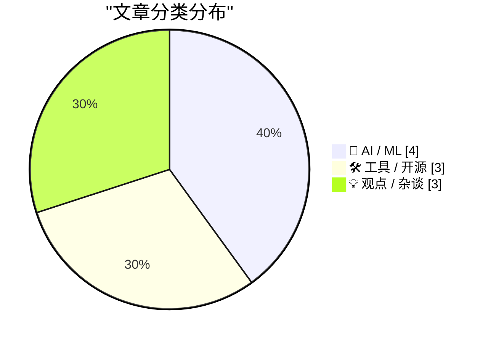
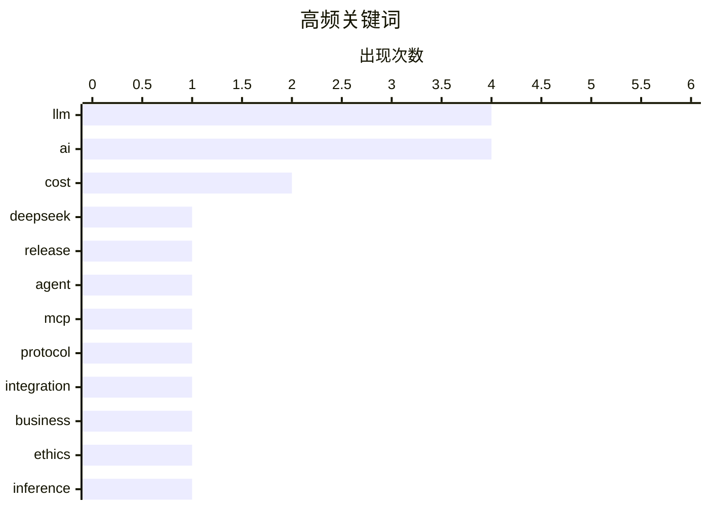

# 📰 AI 博客每日精选 — 2026-08-02

> 来自 Karpathy 推荐的 92 个顶级技术博客，AI 精选 Top 10

## 📝 今日看点

今日技术圈聚焦于AI模型的实用化转向与成本反思。一方面，模型迭代呈现“轻量化”与“效率优先”趋势，新模型在控制参数规模的同时强化智能体能力，且业界选型标准正从纯粹追求智能转向重视生成速度。另一方面，围绕AI的讨论日益务实，企业夸大宣传与实际应用成本飙升成为备受关注的现实矛盾。同时，开发工具生态持续演进，重要协议更新正推动着基础设施的改进。

---

## 🏆 今日必读

🥇 **DeepSeek-V4-Flash-0731：参数更少，性能更强的智能体模型**

[deepseek-ai/DeepSeek-V4-Flash-0731](https://simonwillison.net/2026/Jul/31/deepseek-v4-flash-0731/#atom-everything) — simonwillison.net · 1 天前 · 🤖 AI / ML

> 文章介绍了DeepSeek最新发布的V4系列模型DeepSeek-V4-Flash-0731，该模型显著增强了智能体能力。模型参数量为3040亿，在Hugging Face上占用167GB存储，但其性能表现远超其参数量级。根据Artificial Analysis的评测，它在性能上超越了参数量达4280亿的MiniMax M3模型，同时输入成本仅为每百万tokens 0.14美元。这表明该模型在效率与成本之间取得了出色的平衡，是一款高性价比的智能体基础模型。

💡 **为什么值得读**: 该文揭示了当前大模型领域‘小模型实现大性能’的重要趋势，为开发者在模型选型时提供了极具性价比的新选择。

🏷️ LLM, DeepSeek, release, agent

🥈 **无状态MCP重燃我的兴趣（并催生了mcp-explorer和datasette-mcp）**

[Stateless MCP has recaptured my interest (and inspired mcp-explorer and datasette-mcp)](https://simonwillison.net/2026/Jul/31/stateless-mcp/#atom-everything) — simonwillison.net · 1 天前 · 🛠 工具 / 开源

> 文章聚焦于Model Context Protocol（MCP）发布2.0版本（即2026-07-28规范）这一重大更新。此次更新引入了无状态（Stateless）设计，这是MCP协议自推出以来最重大的变更，彻底改变了协议的工作方式。无状态设计简化了客户端与工具服务器之间的交互，作者因此重新燃起了对MCP的兴趣，并基于此开发了mcp-explorer和datasette-mcp两个新工具。MCP 2.0的发布标志着该协议在设计与实用性上迈入了新阶段。

💡 **为什么值得读**: 对于关注AI应用开发与工具集成的开发者而言，了解MCP协议这一根本性变革将直接影响未来AI代理系统的架构设计。

🏷️ MCP, protocol, AI, integration

🥉 **多元主义：企业为何在AI问题上撒谎（2026年8月1日）**

[Pluralistic: Why businesses lie about AI (01 Aug 2026)](https://pluralistic.net/2026/08/01/dare-snot/) — pluralistic.net · 12 小时前 · 🤖 AI / ML

> 文章核心探讨了企业界在人工智能（AI）问题上普遍存在不实宣传的现象及其深层原因。作者指出，许多关于AI效益（如取代工作岗位或提升生产力）的讨论往往基于理论推测，而非现实。企业夸大AI能力的行为，部分源于取悦管理层或迎合市场期望，这种“哄老板开心”的文化可能导致决策失误甚至走向破产。文章通过一系列链接和案例，揭示了AI炒作背后的商业动机与潜在风险。其核心观点在于，应警惕脱离实际的AI叙事，避免被夸大宣传所误导。

💡 **为什么值得读**: 该文犀利地剖析了AI热潮中的浮夸风气，为读者提供了批判性视角，有助于在纷繁的AI宣传中保持清醒。

🏷️ AI, business, ethics

---

## 📊 数据概览

| 扫描源 | 抓取文章 | 时间范围 | 精选 |
|:---:|:---:|:---:|:---:|
| 77/92 | 2410 篇 → 35 篇 | 48h | **10 篇** |

### 分类分布



### 高频关键词



<details>
<summary>📈 纯文本关键词图（终端友好）</summary>

```
llm         │ ████████████████████ 4
ai          │ ████████████████████ 4
cost        │ ██████████░░░░░░░░░░ 2
deepseek    │ █████░░░░░░░░░░░░░░░ 1
release     │ █████░░░░░░░░░░░░░░░ 1
agent       │ █████░░░░░░░░░░░░░░░ 1
mcp         │ █████░░░░░░░░░░░░░░░ 1
protocol    │ █████░░░░░░░░░░░░░░░ 1
integration │ █████░░░░░░░░░░░░░░░ 1
business    │ █████░░░░░░░░░░░░░░░ 1
```

</details>

### 🏷️ 话题标签

**llm**(4) · **ai**(4) · **cost**(2) · deepseek(1) · release(1) · agent(1) · mcp(1) · protocol(1) · integration(1) · business(1) · ethics(1) · inference(1) · performance(1) · gpt-2(1) · model training(1) · overtesting(1) · economics(1) · governance(1) · policy(1) · decision-making(1)

---

## 🤖 AI / ML

### 1. DeepSeek-V4-Flash-0731：参数更少，性能更强的智能体模型

[deepseek-ai/DeepSeek-V4-Flash-0731](https://simonwillison.net/2026/Jul/31/deepseek-v4-flash-0731/#atom-everything) — **simonwillison.net** · 1 天前 · ⭐ 25/30

> 文章介绍了DeepSeek最新发布的V4系列模型DeepSeek-V4-Flash-0731，该模型显著增强了智能体能力。模型参数量为3040亿，在Hugging Face上占用167GB存储，但其性能表现远超其参数量级。根据Artificial Analysis的评测，它在性能上超越了参数量达4280亿的MiniMax M3模型，同时输入成本仅为每百万tokens 0.14美元。这表明该模型在效率与成本之间取得了出色的平衡，是一款高性价比的智能体基础模型。

🏷️ LLM, DeepSeek, release, agent

---

### 2. 多元主义：企业为何在AI问题上撒谎（2026年8月1日）

[Pluralistic: Why businesses lie about AI (01 Aug 2026)](https://pluralistic.net/2026/08/01/dare-snot/) — **pluralistic.net** · 12 小时前 · ⭐ 25/30

> 文章核心探讨了企业界在人工智能（AI）问题上普遍存在不实宣传的现象及其深层原因。作者指出，许多关于AI效益（如取代工作岗位或提升生产力）的讨论往往基于理论推测，而非现实。企业夸大AI能力的行为，部分源于取悦管理层或迎合市场期望，这种“哄老板开心”的文化可能导致决策失误甚至走向破产。文章通过一系列链接和案例，揭示了AI炒作背后的商业动机与潜在风险。其核心观点在于，应警惕脱离实际的AI叙事，避免被夸大宣传所误导。

🏷️ AI, business, ethics

---

### 3. 我现在（主要）根据速度而非智能来选择模型

[I'm (mostly) picking models on speed now, not intelligence](https://martinalderson.com/posts/speed-vs-intelligence/?utm_source=rss&amp;utm_medium=rss&amp;utm_campaign=feed) — **martinalderson.com** · 1 小时前 · ⭐ 25/30

> 作者提出了一个模型选型的新范式转变：首次将每日驱动模型的选择标准，从纯粹的“原始智能”转向了“每秒生成的token数”（tok/s）。文章探讨了为何约100 tok/s的生成速度可能成为新的性能基准（类似于Web时代的100ms响应标准），并分析了速度提升在何处会达到收益递减的临界点。同时，作者预测了基于速度与价格的模型市场竞争将日趋激烈。结论是，对于许多实际应用，响应速度已成为比模型绝对智能水平更关键的体验指标。

🏷️ LLM, inference, performance, cost

---

### 4. 为何OpenAI的GPT-2权重比我的好？第三部分：测试过度训练

[Why do OpenAI's GPT-2 weights beat mine?  Part three: testing overtraining](https://www.gilesthomas.com/2026/07/why-do-openai-gpt2-weights-beat-mine-3-overtraining) — **gilesthomas.com** · 1 天前 · ⭐ 24/30

> 这是作者系列文章的第三部分，旨在探究其自训练的GPT-2风格模型在指令微调评估上表现不如原始OpenAI小模型的原因。作者训练出的模型在测试集的交叉熵损失上甚至优于原版，但在下游任务评估中却落后。本文重点测试了最可能的假设：过度训练（overtraining）。通过设计实验对比不同训练阶段的模型权重，作者分析了训练过程对模型泛化能力和指令跟随能力的具体影响。文章旨在通过实证方法，定位自训练模型与官方模型在性能差距上的技术根源。

🏷️ GPT-2, model training, overtesting, LLM

---

## 🛠 工具 / 开源

### 5. 无状态MCP重燃我的兴趣（并催生了mcp-explorer和datasette-mcp）

[Stateless MCP has recaptured my interest (and inspired mcp-explorer and datasette-mcp)](https://simonwillison.net/2026/Jul/31/stateless-mcp/#atom-everything) — **simonwillison.net** · 1 天前 · ⭐ 25/30

> 文章聚焦于Model Context Protocol（MCP）发布2.0版本（即2026-07-28规范）这一重大更新。此次更新引入了无状态（Stateless）设计，这是MCP协议自推出以来最重大的变更，彻底改变了协议的工作方式。无状态设计简化了客户端与工具服务器之间的交互，作者因此重新燃起了对MCP的兴趣，并基于此开发了mcp-explorer和datasette-mcp两个新工具。MCP 2.0的发布标志着该协议在设计与实用性上迈入了新阶段。

🏷️ MCP, protocol, AI, integration

---

### 6. 软件包管理周报：2026年8月1日

[This Week in Package Management: 1 August 2026](https://nesbitt.io/2026/08/01/this-week-in-package-management.html) — **nesbitt.io** · 15 小时前 · ⭐ 23/30

> 这是一份定期发布的行业动态汇总，覆盖整个软件包管理生态的最新信息。内容包括但不限于各主流包管理器（如npm、pip、Cargo等）的重要新版本发布、安全公告（advisories）以及相关技术文章。其目的是为开发者提供一个高效的信息入口，快速了解包管理领域的关键更新、安全漏洞和最佳实践。本周报的核心价值在于其全面性和时效性，帮助社区成员保持技术栈的现代性与安全性。

🏷️ package management, security, ecosystem

---

### 7. 为我的Mac Studio配置25 Gbps Thunderbolt以太网

[Getting 25 Gbps Thunderbolt Ethernet on my Mac Studio](https://www.jeffgeerling.com/blog/2026/getting-25g-ethernet-mac-thunderbolt/) — **jeffgeerling.com** · 1 天前 · ⭐ 21/30

> 作者分享了将Mac Studio的内置10Gb以太网升级至25Gb Thunderbolt以太网的实际经验。原本的10Gb连接已能满足4K视频剪辑和约1GB/秒的备份速度，但作者为了追求更高性能，升级了家庭机架中的网络交换机和存储设备。文章详细记录了升级所需的硬件（如Thunderbolt转25Gb以太网适配器）、配置步骤、遇到的挑战以及最终的测速结果。整个过程展示了如何突破Mac内置接口限制，实现超高速网络连接，以满足极致的专业工作流需求。

🏷️ macOS, networking, hardware

---

## 💡 观点 / 杂谈

### 8. 高级内容：AI正变得过于昂贵

[Premium: AI Is Getting Way Too Expensive](https://www.wheresyoured.at/premium-ai-is-getting-way-too-expensive/) — **wheresyoured.at** · 1 天前 · ⭐ 24/30

> 文章将讨论焦点从AI的理论能力（如取代工作或提升生产力）转向了一个更实际的问题：AI的使用成本正在急剧上升。作者指出，当前关于AI利弊的许多讨论过于理论化，而忽视了其日益增长的运营开销对企业和个人用户造成的现实压力。成本因素可能成为阻碍AI广泛部署和实现其理论效益的关键瓶颈。本文的核心是呼吁业界关注并讨论AI经济可行性的挑战。

🏷️ AI, cost, economics, LLM

---

### 9. AI：给决策者的考量建议

[AI: Considerations for people who make decisions](https://berthub.eu/articles/posts/ai-for-decision-makers/) — **berthub.eu** · 1 天前 · ⭐ 24/30

> 文章基于作者向荷兰政府服务提供商网络和科学与创新咨询委员会所做的两次演讲内容整理而成，旨在为处于决策位置的领导者提供关于AI政策的实用见解。内容并非讨论AI技术细节，而是聚焦于决策者制定AI政策时需要权衡的关键因素，如伦理、社会影响、监管与创新平衡等。作者分享了与这两个高级别团体交流后提炼出的核心观点，以帮助决策者更明智地引导AI的发展与应用。其核心是搭建技术现实与政策制定之间的桥梁。

🏷️ AI, governance, policy, decision-making

---

### 10. 苹果公司2026财年第三季度财报

[Apple Q3 2026 Results](https://sixcolors.com/post/2026/07/apple-announces-record-q3-results/) — **daringfireball.net** · 8 小时前 · ⭐ 21/30

> 文章报道了苹果公司公布的2026财年第三季度创纪录的业绩。该季度总营收达1094亿美元，同比增长16%。其中，iPhone营收增长22%，Mac营收增长10.4%，服务营收增长12%，可穿戴设备营收增长6%，仅iPad营收下降了6%。此次财报电话会议是蒂姆·库克作为CEO主持的第90次也是最后一次会议。文章还链接了其他媒体对库克15年CEO任期的回顾与分析。核心信息展示了苹果在库克任期末期依然保持强劲的财务增长势头。

🏷️ Apple, earnings, finance

---

*生成于 2026-08-02 01:06 | 扫描 77 源 → 获取 2410 篇 → 精选 10 篇*
*基于 [Hacker News Popularity Contest 2025](https://refactoringenglish.com/tools/hn-popularity/) RSS 源列表，由 [Andrej Karpathy](https://x.com/karpathy) 推荐*
*由「懂点儿AI」制作，欢迎关注同名微信公众号获取更多 AI 实用技巧 💡*
