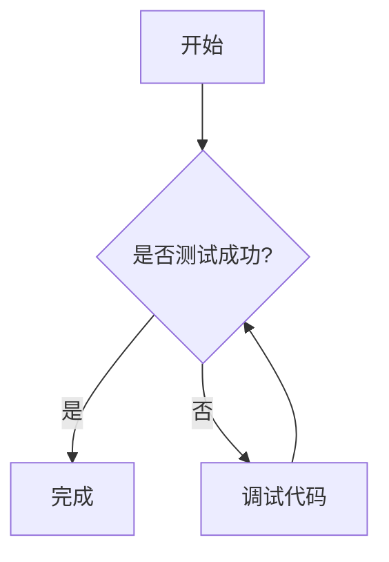

## 🚀 功能测试：代码、公式与图表

这篇文章旨在测试博客对代码高亮、数学公式和流程图的渲染支持，同时验证复制按钮功能。

### 1. 代码高亮 (Highlight.js)

```python
# Python Quick Sort
def quick_sort(arr):
    if len(arr) <= 1:
        return arr
    pivot = arr[len(arr) // 2]
    left = [x for x in arr if x < pivot]
    middle = [x for x in arr if x == pivot]
    right = [x for x in arr if x > pivot]
    return quick_sort(left) + middle + quick_sort(right)

print(quick_sort([3,6,8,1,2,1]))
```

### 2. 数学公式 (KaTeX)

行内公式示例：

在直角三角形中，$a^2 + b^2 = c^2$，其中 $c$ 是斜边。

块级公式示例 (洛伦兹力)：

$$
\mathbf{F} = q(\mathbf{E} + \mathbf{v} \times \mathbf{B})
$$

### 3. Mermaid 流程图



### 4. 测试复制按钮

上面的 Python 代码块在页面渲染后应显示一个快速复制按钮（如果前端 JS 已集成此功能）。

---

💡 小提示：可以修改代码块或公式来验证渲染和复制功能是否生效。
